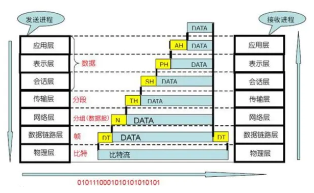

# HTML

## HTML5 有什么新特性？

### 1.增加了语义化标签

总是使用 div 标签对语义来说是不清晰的  
所以 html5 规范了这一点

- `<hrader></header>` 头部区域标签，块级标签
- `<footer></footer>` 底部区域标签，块级标签
- `<nav></nav>` 导航区域标签，块级标签
- `<time></time>` 时间区域标签，内联标签
- `<article></article>` 文章段落标签，块级标签
- `<aside></aside>` 侧边栏区域标签，块级标签
- `<mark></mark>` 标记记号标签，内联标签
- `

` 单词翻译: 摘要，h5 官方文档描述：定义 details 元素的标题，块级标签
- `<detailes></detailes>` 单词翻译：细节，h5 官方文档描述：定义元素的细节，块级标签
- `<section></section>` 单词翻译：部分，h5 官方文档描述：定义 section，块级标签

### 2.新的表单类型

- `<input type="email" />` e-mail 地址的输入域
- `<input type="number" />` 数字输入域
- `<input type="url" />` URL 地址的输入域
- `<input type="range" />` range 类型显示为滑动条，默认 value 值是 1~100 的限定范围，也可以通过 min 属性和 max 属性自定义范围`<input type="range" name="points" min="1" max="10" />`
- `<input type="search" />` 用于搜索域
- `<input type="color" />` 用于定义选择颜色
- `<input type="tel" />` 电话号码输入域
- `<input type="date" />` date 类型为时间选择器

以及一些表单的新属性

- placehoder 属性，简短的提示在用户输入值前会显示在输入域上。即我们常见的输入框默认提示，在用户输入后消失
- required 属性，是一个 boolean 属性。要求填写的输入域不能为空
- pattern 属性，描述了一个正则表达式用于验证 `<input>` 元素的值。
- min 和 max 属性，设置元素最小值与最大值。
- step 属性，为输入域规定合法的数字间隔。
- height 和 width 属性，用于 image 类型的 `<input>` 标签的图像高度和宽度。
- autofocus 属性，是一个 boolean 属性。规定在页面加载时，域自动地获得焦点。
- multiple 属性 ，是一个 boolean 属性。规定 `<input>` 元素中可选择多个值

### 3.视频和音频

视频`<video>`和音频`<audio>`

### 4.Canvas 绘图

canvas 元素用于在网页上绘制图形，canvas 标签本身只是个图型容器，需要使用 javaScript 脚本来绘制图形

    <canvas id="mycanvas" width="600" height="400"></canvas>

    var myCanvas = document.getElementById('mycanvas');
    var canvas2d = myCanvas.getContext('2d');

    canvas2d.moveTo(100, 100);  // 线条起始位置
    canvas2d.lineTo(400, 100);  // 线条结束位置
    canvas2d.strokeStyle = '#CD5C5C'    // 线条颜色
    canvas2d.lineWidth = 5；    // 定义线宽
    canvas2d.font = '20px Arial'; // 定义字体大小和字体类型
    canvas2d.fillText('Canvas绘图demo', 400, 100)   // 设置绘制的文本和位置
    canvas2d.stroke();

moveTo(x,y) 定义线条开始坐标  
lineTo(x,y) 定义线条结束坐标  
lineWidth 设置线宽  
fillText()设置绘制的文本和位置  
stroke()执行绘画

### 5.SVG

可伸缩的矢量图形，SVG 也是一种使用 XML 描述 2D 图形的语言  
在 SVG 中，每个被绘制的图形均被视为对象。如果 SVG 对象的属性发生变化，那么浏览器能够自动重现图形

 

svg 图形的样式和 css 有些不同，fill 是定义图形填充色，stroke 描边色，stroke-width 是线宽  
如果我们要对 svg 图形操作，那么我们该怎么做呢？

 

其实很简单，只需要 document.getElementById() 获取需要操作的 svg 图形节点，然后针对该 svg 图形的属性去操作就可以了  
对 svg 图形属性的操作可以用 getAttribute() 和 setAttribute()

### 6.拖放（drag 和 drop）

在 h5 之前实现拖拽功能，其实用的是一种模拟方式  
鼠标 onmousedown 时，获取当前的一些信息，然后在 onmousemove 时不断更新推拽对象的 left 和 top 值，最后在 onmouseup 时对推拽对象彻底赋值，并进行释放后一系列的程序操作

现在 h5 出来后呢，不在需要模拟了，因为它已经有标准的事件 api 了

### 7. 地理定位

通过 getCurrentPosition()获取一系列定位信息  
getCurrentPosition()有两个回调函数参数，获取地理位置成功的回调和失败的回调

### 8.离线存储

通过创建 cache manifest 文件，可以创建 web 应用的离线版本

 

如果要启用应用程序缓存，必须在文档的 `<html>` 标签中包含 manifest 属性：每个指定了 manifest 的页面在用户对其访问时都会被缓存

如果未指定 manifest 属性，则页面不会被缓存

### 9.Web 存储

如果说离线存储是对 web 的资源文件存储，那么 web 存储就是对应用程序里的数据做存储了  
web 存储提供了两个存储方式：

- localStorage，没有时间限制的数据存储
- sessionStorage，就是网页还没有关闭的情况下的存储，网页窗口关闭，则数据销毁

在之前，这些都是由 cookie 完成的  
但是 cookie 不适合大量数据的存储，因为它们由每个对服务器的请求来传递，这使得 cookie 速度很慢而且效率也不高

### 10.WebSocket

WebSocket 是 HTML5 开始提供的一种在单个 TCP 连接上进行全双工通讯的协议

 

WebSocket 使得客户端和服务器之间的数据交换变得更加简单，允许服务端主动向客户端推送数据  
在 WebSocket API 中，浏览器和服务器只需要完成一次握手，浏览器和服务器之间就形成了一条快速通道，并进行双向数据传输

### 11.Web Workers

web worker 是运行在后台的 JavaScript，独立于其他脚本，不会影响页面的性能  
您可以继续做任何愿意做的事情：点击、选取内容等等，而此时 web worker 在后台运行

 

关于 web worker 的应用大概分为三个部分：

- 创建 web worker 文件，worker 文件是一个单独的 js 文件，写好逻辑后，通过 postMessage()方法吧数据发送出去
- 调用页面创建 worker 对象，var w = new Worker("worker 文件路径")，然后通过实例对象调用 onmessage 事件进行监听，并获取 worker 文件里返回的数据
- 终止 web worker，当我们的 web worker 创建后会持续的监听它，需要中止的时候则使用实例上的方法 w.terminate()

---

## 谈一谈元素属性 href 和 src 的区别？

##### 字面区别

##### href

Hypertext Reference  
 超文本 &nbsp;&nbsp;引用或参照

##### src

Source 资源

_英文字面上看来，好像是差不多意思_

    
    <a href="smile.png">笑一下</a>

这段代码带来的区别是什么呢？

- img 会直接把图片渲染在页面上，src 引用的资源直接成为了当前文档的一部分，因为它把资源下载了下来并绑定在文档上，浏览器遇到这个属性会先下载这个资源并编译，执行完了之后才会进行下一步  
  就像汽车加油，加完了才能走
   

- 而 a 标签不会渲染图片，需要点击 a 标签，才能在另一个地址看到图片  
  href 建立了一个通道，这个通道联系着其他资源

##### 主要使用场景

#### href

- link
- a

#### src

- img
- style
- script
- input
- iframe

 

> href 建立超链接，通过通道联系引用资源  
> src 会把资源下载下来，代替当前元素，嵌入到文档中

---

## 什么是 DOM 和 BOM？

- #### DOM 文档对象模型

把文档当做一个对象来看待  
这个对象主要定义了处理网页内容的方法和接口

- #### BOM 浏览器对象模型

指的是把浏览器当做一个对象来对待  
这个对象主要定义了与浏览器交互的方法和接口

 

BOM 的核心是 window  
而 window 有 location 对象、navigator 对象、screen 对象等子对象

 

并且 DOM 的最根本对象 document 对象也是 BOM 的 window 对象的子对象

---

## 什么是标签语义化

##### 为什么要使用语义化标签？

我用 DIV+CSS 也能做出来一样的效果，确实单纯看效果两者并没有什么区别

但是页面不止是给人看的，机器也要看爬虫也要看，网页结构更清晰方便开发维护

#### 语义化标签有什么好处？

- 签语义化有助于构架良好的 HTML 结构，有利于搜索引擎的建立索引、抓取  
  简单来说，试想在 H1 标签中匹配到的关键词和在 div 中匹配到的关键词搜索引擎会吧那个结果放在面。
- 利于不同设备的解析（屏幕阅读器，盲人阅读器等）满是 div 的页面这些设备如何区分那些是主要内容优先阅读？
- 利于构建清晰的机构，有利于团队的开发、维护

##### 写语义化代码应该注意什么？

- 尽可能少的使用无语义的标签 div 和 span；在语义不明显时，既可以使用 div 或者 p 时，尽量用 p, 因为 p 在默认情况下有上下间距，对兼容特殊终端有利
- 不要使用纯样式标签，如：b、font、u 等，改用 css 设置  
  需要强调的文本，可以包含在 strong 或者 em 标签中（浏览器预设样式，能用 CSS 指定就不用他们）strong 默认样式是加粗（不要用 b），em 是斜体（不用 i）
- 使用表格时，标题要用 caption，表头用 thead，主体部分用 tbody 包围，尾部用 tfoot 包围  
  表头和一般单元格要区分开，表头用 th，单元格用 td
- 表单域要用 fieldset 标签包起来，并用 legend 标签说明表单的用途  
  每个 input 标签对应的说明文本都需要使用 label 标签，并且通过为 input 设置 id 属性  
   在 lable 标签中设置 for= someld 来让说明文本和相对应的 input 关联起来

##### 那么常见的语义化标签有哪些呢？

- `<h1>`~`<h6>` ，作为标题使用，并且依据重要性递减
- `
`段落标记，不要再使用   来换行了
- `<ul>`、`<ol>`、`<li>`、`<ul>`无序列表
- `<dl>`、`<dt>`、`<dd>`、`<dl>` 就是“定义列表”
- `<em>`、`<strong>`、`<em>`是用作强调、`<strong>` 是用作重点强调
- `<table>`、`<thead>`、`<tbody>`、`<td>`、`<th>`、`<caption>` 就是用来做表格不要用来布局

##### HTML5 新增了哪些语义化标签？

---

## doctype 的作用

在开始学习前端之前，你总会需要创建一个 HTML

 

_在 HTML 标签之前，还有一个你可能不会注意到的 <!DOCTYPE> 标记。虽然它不显眼，但我们需要知道它为什么存在_

HTML 文件中，<!DOCTYPE>是必须的，需要放到整个文档的顶部  
格式为 `<!DOCTYPE html>` ，它存在的意义在于阻止浏览器在渲染文档时进入混杂模式(Quirks Mode)

 

也就是说 `<!DOCTYPE html>` 这一文档类型可以确保浏览器尽可能地使用遵循规范的模式来渲染  
而不是使用某些不符合规范的渲染模式

##### 混杂模式和标准模式

很久很久以前，web 页面主要运行在两类浏览器：网景的 Navigator 和微软的 IE

 

后来 W3C 制定了 web 规范之后，为了保证现有页面可用，各大浏览器不能立马使用新规范

 

于是，浏览器厂商们引入了两种模式来区别对待符合新标准的站点和旧的遗留站点：混杂模式（Quirks Mode）和标准模式 （Standards Mode）

在过渡阶段还存在一种接近标准模式（Almost Standards Mode）

- 混杂模式，也成为怪异模式，会兼容 Navigator 4 和 IE 5 的非标准行为
- 近标准模式会兼容少数的混杂行为，可以理解为过渡模式
- 标准模式只兼容符合标准描述的行为

##### 标准类型下的 “怪异” 行为

我们应该都遇到过这个问题  
div 里面如果装着一个 img，div 就会被无故撑高几个像素

 

这的确非常奇怪  
其实这个现象只有标准模式才会有

> 近标准模式和标准模式之间的唯一区别在于是否对 img 元素给定行高(line-height)和基线(baseline)

_这一现象虽然怪异，但也是标准对于文本对齐的一种规范处理_

 

由于标准模式指定了默认的 baseline 对齐方式导致了这一问题  
所以想要解决也很简单，给 img 标签指定 vertical-align: middle 即可

---

## 块级标签都有哪些？

# CSS

## 伪类和伪元素有什么区别？

#### _伪类和伪元素都是用来修饰不在文档树中的部分_

### 伪类

伪类存在的意义是为了通过选择器找到那些不存在 DOM 树中的信息以及不能被常规 CSS 选择器获取到的信息

- 获取不存在与 DOM 树中的信息

  比如 a 标签的:link、visited 等，这些信息不存在与 DOM 树结构中，只能通过 CSS 选择器来获取

- 获取不能被常规 CSS 选择器获取的信息

  比如：要获取第一个子元素，我们无法用常规的 CSS 选择器获取，但可以通过 `:first-child` 来获取到

### 伪元素

伪元素用于创建一些不在文档树中的元素，并为其添加样式  
比如说，我们可以通过 `:before` 来在一个元素前增加一些文本，并为这些文本添加样式  
虽然用户可以看到这些文本，但是这些文本实际上不在文档树中

 

常见的伪元素有：`::before`，`::after`，`::first-line`，`::first-letter`，`::selection`、`::placeholder` 等

> 因此，伪类与伪元素的区别在于：有没有创建一个文档树之外的元素。

#### ::after 和:after 的区别

在实际的开发工作中，我们会看到有人把伪元素写成:after  
这实际是 CSS2 与 CSS3 新旧标准的规定不同而导致的

 

CSS2 中的伪元素使用 1 个冒号，在 CSS3 中，为了区分伪类和伪元素，规定伪元素使用 2 个冒号

所以，对于 CSS2 标准的老伪元素，比如 `:first-line`，`:first-letter`，`:before`，`:after`，写一个冒号浏览器也能识别

但对于 CSS3 标准的新伪元素，比如 `::selection`，就必须写 2 个冒号了

---

## 为什么要清除浮动？如何清除？

浮动会让元素脱离文档流，背景并没有被撑开，这就是我们说的文档塌陷  
此外还影响父元素的同级元素，最终造成了页面文档流混乱

### 如何解决这个问题呢？

- ##### 1.在浮动元素的末尾添加一个空元素标签，clear:both 即可

      浮动
      浮动
      浮动
      浮动
      浮动
      浮动
      浮动
      浮动
      浮动
      浮动
      浮动
      

- ##### 2.父元素添加 overflow:hidden 或者 overflow:auto

  限定内容溢出元素框的情况，会计算出浮动流的高度

      div{
      	overflow:hidden;
      }

- ##### 3.给父元素添加浮动，但是会影响布局

      div{
      	float:left; // 或者 right
      }

- ##### 4.使用伪元素，相当于给文档添加了虚拟元素（这也是最推荐的清楚浮动方法）

  相当于在容器末尾添加了空元素

      

      ...
      

      .clearfix::after{
      	content:'',
      	display:block;
      	clearfix:both;
      }

> 记忆：浮动，就是儿子飘了（float），老子管不住了（儿子高度为空）  
> 清除浮动的思路就是：  
> 1、给儿子介绍个对象，让他不要乱跑了，对象添加 clear:both  
> 2、把儿子锁在家里，bfc，给老子设置 overflow，或者老子飘出去逮儿子，一起浮动  
> 3、使用伪元素，给儿子介绍网恋对象（实际不存在，是老子装的）

---

## 不同选择器的权重怎么算的

- !important
- 行内样式
- ID 选择器，权重：100
- clas、属性选择器和伪类选择器，权重：10
  > 属性选择器指的是：根据元素的属性及属性值来选择元素，比如 button 的 type 属性等
  > 伪类选择器 :active :focus 等选项
- 标签选择器和伪元素选择器，权重：1
  > 伪元素选择器 :before :after

#### 它们之间的关系是

!important > 行内样式 > ID 选择器 > 类选择器 | 属性选择器 | 伪类选择器 > 元素选择器

### 这里要注意的是：

#### 1、不推荐使用 !important

因为`!important`根本没有结构与上下文可言，并且很多时候权重的问题  
就是因为不知道在哪里定义了一个`!important`而导致的

 

那么我们知道尽量不要使用`!important`,也应该知道如何覆盖它

 

虽然它的权重最高，但是 id 加上 `!important`是可以覆盖 class 的 `!important`

#### 2、行内样式总覆盖任何外部样式表样式，但会被!important 覆盖

#### 3、联合组成，没有一个选择器属性高

 

这句要怎么理解呢？

 

无论多少个 class 组成的选择器，都没有一个 ID 选择器权重高  
无论多少个 ID 组成的选择器，都没有行内样式权重高  
无论多少个元素组成的选择器，都没有一个 class 选择器权重高

#### 4、元素上的选择器不同的时候，计算权重高的则生效

    .test #test{ }   // class 10 + id 100 = 110
    .test #test span{}   // class 10 + id 100 + span 1 = 111
    .test #test .sonClass{}   // class 10+ id 100 + class 10 = 120 //生效

#### 5、权重相同时，与元素距离近的选择器生效

    #content h1 { // css样式表中
      padding: 5px;
    }
    

#### 最后总结建议：

- 避免使用 `!important`
- 利用 id 增加选择器权重
- 减少选择器的个数（避免层层嵌套）

---

## 前端几大经典布局的实现方案？

## toB 和 toC 的区别

---

## 移动端布局的几大方案？

#### 1、media（主流)

适合 Pc 端移动端用一套项目  
像京东这种，pc 端移动端是不一样的，那就不适合用这种

#### 2、rem（主流)

针对移动端有单独设计

#### 3、flex

部分布局可以用 flex

#### 4、vh/vw

通过调整视口百分比，跟百分比类似，也称为百分比布局

---

## css 的 display 可以取什么值？说说他们的作用

- inline（默认）–内联
- none–隐藏
- block–块显示
- table–表格显示
- list-item–项目列表
- inline-block

---

## CSS3 有哪些新特性？

- RGBA 和透明度
- background-image：background-origin(content-box/padding-box/border-box) background-size background-repeat
- word-wrap（对长的不可分割单词换行）word-wrap：break-word
- 文字阴影：text-shadow： 5px 5px 5px #FF0000;（水平阴影，垂直阴影，模糊距离，阴影颜色）
- font-face 属性：定义自己的字体
- 圆角（边框半径）：border-radius 属性用于创建圆角
- 边框图片：border-image: url(border.png) 30 30 round
- 盒阴影：box-shadow: 10px 10px 5px #888888
- 媒体查询：定义两套 css，当浏览器的尺寸变化时会采用不同的属性

---

## 常见的兼容性问题

- #### 不同浏览器的标签默认的 margin 和 padding 不一样

  \*{margin:0;padding:0;}

- #### IE6 双边距 bug

  块属性标签 float 后，又有横行的 margin 情况下，在 IE6 显示 margin 比设置的大  
  hack：display:inline; 将其转化为行内属性

- #### 获取属性的不同

  IE 下，可以使用获取常规属性的方法来获取自定义属性，也可以使用 getAttribute() 获取自定义属性  
  Firefox 下，只能使用 getAttribute() 获取自定义属性  
  解决方法:统一通过 getAttribute() 获取自定义属性

- #### Chrome 中文界面下默认会将小于 12px 的文本强制按照 12px 显示
  可通过加入 CSS 属性 -webkit-text-size-adjust: none; 解决

---

## flex 布局和传统布局的区别？什么时候用 flex

flex 是一种弹性布局，任何一个容器都可以指定为 flex 布局，行内元素也可以

当一个元素被设为 flex 布局后，子元素的 float、clear、vertical-align 均失效

#### 基本概念

采用 flex 布局的元素，成为 flex 容器  
它里面的所有子元素，都是容器成员

 

flex 容器有两根轴，水平主轴和交叉纵轴

该布局模型的目的是提供一种更加高效的方式来对容器中的条目进行布局、对齐和分配空间

#### 容器属性

- flex-direction 决定主轴方向，是横轴为主还是纵轴为主
- flex-wrap 决定项目在一条轴上的换行情况
- flex-flow 是 direction 和 wrap 的简写，默认是 row nowrap
- flex-content 决定项目在主轴上的对齐方式
- align-content 决定多根轴线的对齐方式，如果只有一根轴线，该属性无效（就是对多行项目才会生效）
- align-items 决定项目在交叉轴上的对齐方式（不管对单行还是多行都生效）

#### 项目属性

- order 项目排序，数值越小越靠前
- flex-grow 默认为 0，不放大，如果都为 1，则均等分空间
- flex-shrink 默认为 1，空间不足，则缩小；为 0 则不缩小
- flex-basis 在分配多余空间之前，项目占据主轴的空间，默认 auto
- flex 是 grow、shrink、basis 的缩写，默认 0 1 auto
- align-self 允许单个项目对齐方式，可覆盖 align-items

---

## opacity 兼容处理？

> 上面的操作也已经实现的 VSCODE 远程开发的基础步骤

---

## 介绍一下 postion 属性

- static（默认）：按照正常文档流进行排列
- relative（相对定位）：不脱离文档流，参考自身静态位置通过 top、bottom、left、right 定位
- absolute（绝对定位）：参考距其最近一个不为 static 的父级元素通过 top、bottom、left, right 定位
- fixed(固定定位)：所固定的参照对像是可视窗口

---

## inline-block 的使用场景？

---

## CSS 中 link 和 import 的区别

- link 属于 HTML 标签，@import 是 CSS 提供的
- 页面被加载的时候 link 就会被加载，而 @import 需要等到页面加载完才会加载
- import 只能在 IE5 以上使用，link 是 HTML 标签，无兼容问题
- link 的权重高于 @import

---

## filter 还能做哪些事？

通过添加源可以加快软件下载，同时更多的源也提供更丰富的软件

如果下载速度可以就不用配置了

---

## 盒子水平垂直居中的方案？

这个问题在项目中很常见，开始我用的什么。。 
后来 css3 出现，我尝试用什么。。。 
后来我在博客上看到了还有什么什么技术。。于是尝试使用。。 

---

- flex 布局，子元素 margin

      .box {
      	display: flex;
      	width: 100px;
      	height: 100px;
      	background-color: pink;
      }

      .box-center{
      	margin: auto;
      	background-color: greenyellow;
      }

- flex 布局，主轴纵轴

      .box {
        display: flex;
        width: 100px;
        height: 100px;
        background-color: pink;
        justify-content: center;
        align-items: center;
      }

      .box-center{
        background-color: greenyellow;
      }

- 绝对定位（子元素需要宽高）

      .box {
        position: relative;
        height: 100px;
        width: 100px;
        background-color: pink;
      }

      .box-center{
        position: absolute;
        left: 0;
        right: 0;
        bottom: 0;
        top: 0;
        margin: auto;
        width: 50px;
        height: 50px;
        background-color: greenyellow;
      }

---

## 说一说盒模型吧

可以认为每个 html 标签都是一个方块，然后这个方块又包着几个小方块，如同盒子一层层的包裹着  
这就是所谓的盒模型

#### 盒模型分为 IE 盒模型和 W3C 标准盒模型

- ##### W3C 标准盒模型

属性 width,height 只包含内容 content，不包含 border 和 padding

- ##### IE 盒模型

属性 width,height 包含 border 和 padding，指的是 content+padding+border

> 在 ie8+浏览器中使用哪个盒模型可以由 box-sizing(CSS 新增的属性)控制，默认值为 content-box，即标准盒模型

> 如果将 box-sizing 设为 border-box 则用的是 IE 盒模型  
> 如果在 ie6,7,8 中 DOCTYPE 缺失会触发 IE 模式

盒子的大小为 content+padding+border 即内容的(width)+内边距的再加上边框，而不是加上 margin

 

> css 的盒模型由 content(内容)、padding(内边距)、border(边框)、margin(外边距)组成

但盒子的大小由 content+padding+border 这几部分决定，把 margin 算进去的那是盒子占据的位置，而不是盒子的大小！

 

我们在编写页面代码时应尽量使用标准的 W3C 模型（需在页面中声明 DOCTYPE 类型），这样可以避免多个浏览器对同一页面的不兼容。

 

因为若不声明 DOCTYPE 类型，IE 浏览器会将盒子模型解释为 IE 盒子模型，FireFox 等会将其解释为 W3C 盒子模型

 

若在页面中声明了 DOCTYPE 类型，所有的浏览器都会把盒模型解释为 W3C 盒模型

---

## 隐藏页面中某个元素有几种方法？

我们来总结一下思路，规划为三类：

- 完全隐藏：元素没有渲染，不占据空间
- 视觉隐藏：屏幕中看不见，但是占据空间
- 语义隐藏：读屏软件不可读，但正常占据空间

### 完全隐藏

#### display 属性

设置为 none 即可

#### hidden 属性

HTML5 新增属性，相当于 display:none

    

### 视觉隐藏

#### 用 position 或者 margin，将元素移除可视区域

    left:-9999999px;

    margin-left:-999999px

#### 利用 transform

- 缩放

      transform: scale(0);
      height: 0;

- 移动

      transform: translateX(-99999px);
      height: 0;

- 设置其大小为 0

      height:0;
      width:0;
      font-size:0; 或者 overflow:hidden

- 透明度为 0

      opacity:0;

- visibility 属性

      visibility:hidden;

- 层级覆盖

      position:relative;
      z-index:-999;

### 读屏软件不可读，占据空间

    

---

## BFC 的理解？

Block fomatting context  
直译过来就是，块级格式化上下文  
什么意思？

 

我们都知道，页面是由 css 布局和若干个 BOX 组成的

元素类型和 display 属性，决定了 Box 的类型  
而不同的 Box 又会参与不同的 fomatting context

 

Fomatting Context 是一个独立的渲染区域，有自己的一套渲染规则  
规定了内部元素该如何定位，以及它们之间的相互作用  
通俗来讲，BFC 就是一个容器，里面装的都是块级元素

### 怎样可以创建出一个 BFC？

- float 浮动元素
- overflow：hidden|auto|scroll 不为 visible
- display：table-cell|table-caption|inline-block|flex
- position：absolute|fixed
- 根元素

### BFC 的特性有哪些？

> 思考：了解 BFC 有什么用？

- #### 相邻元素 margin 重叠

      <body>
        
为了联盟！！

        
为了部落！！

      </body>

      p {
        width: 200px;
        line-height: 100px;
        background: #ccc;
        text-align: center;
        margin: 100px;
      }

这中间竟然不是 200px 而变成了 100px？？！

如何解决这样的问题？
只要在一个 p 外面包裹一层容器，并触发它的 BFC 即可，让它们不属于同一个 BFC

    
ABC

    

      
abc

    

    .wrap{
      overflow:hidden;
    }

- #### 父子元素 margin 重叠

    .box{
      width:100px;
      height:100px;
      background:#ccc;
    }
    .wrap {
      background:yellow;
    }
    .wrap h1{
      background:pink;
      margin:40px;
    }

    <body>
    
box

    

      <h1>h1</h1>
    

    </body>

注意看 h1 和 wrap 父子元素，margin 值效果完全不对  
而且两个 div 的间距此时为 40px，不应该是 0 吗？

 

解决的方法就是，给或者给 wrap 添加 overflow:hidden  
或者给 wrap 添加一个 border 即可

- #### BFC 不会重叠浮动元素

      box1{
       height: 100px;
       width: 100px;
       float: left;
       background: lightblue;
      }
      box2{width: 200px;
       height: 200px;
       background: #eee;
      }

      <body>
      
我是一个左浮动的元素

      
喂喂喂!大家不要生气嘛，生气会犯嗔戒的。悟空你也太调皮了，
      我跟你说过叫你不要乱扔东西，你怎么又……你看，我还没说完你就把棍子给扔掉了!
      月光宝盒是宝物，你把它扔掉会污染环境，要是砸到小朋友怎么办，就算砸不到小朋友，
      砸到花花草草也是不对的。

      </body>

为什么是这样？

而不是我们以为的这样呢？  
解决的办法就是给右侧的 box2 加上一个 overflow:hidden，使其单独成为一个 BFC

- #### BFC 可以清除浮动

我们知道，当容器内的元素都浮动了，就会脱离文档流  
此时包裹他们的父级容器如果不清除浮动，就会失去宽高，都变成了 0

 

要解决这个办法，通常就是给父元素添加一个 overflow:hidden 即可

  	
  	<body>
  	

  	  

  	  

  	

  	</body>

---

## CSS 怎么画出一个三角形

## 旋转动画怎么做？

---

## rem 和 em 的区别

##### 区别

- rem:基于 html 元素字体大小
- em：根据使用它的元素大小决定（其实不是根据父元素，是因为继承了父元素，所以造成误解）

##### 深刻理解

> 他们都是灵活可以扩展的单位  
> 你使用 1rem 或者 1em ，其实都可以被浏览器翻译成 16px-160px 以及其他任何值

浏览器使用 px，那 1px 就显示为 1px

- rem：如果默认根元素字体为 16px，那你的 10rem 就会渲染成 160px
- em：如果一个 div 有 18px 字体大小，那此时你的元素 10em 就是 180px

浏览器默认虽然是 16px，但是浏览器的这个默认参数，用户是可以自己改变的
它支持 9-72px 之间的任何值！！

> html 根元素 继承的就是 浏览器设置的字体大小！除非重写一个具体单位来覆盖
> 所以表面上 rem 根据的是 html 根元素的字体大小，但实际可能是来自浏览器的设置大小

如果我们使用 rem，请确保无论用户如何设置自己的浏览器，我们都要显示正常

---

# JavaScript

## 复制一个数组有哪些方法？哪个方法最好

## cdn 的作用和原理？

## 响应式的浏览器原理？

## 正则表达式的使用程度

## 如何实现一个数组去重？

- #### 利用 ES6 新增的 Set

      function uniq(array){
        return [...new Set(array)];
      }

      uniq([1,2,3,5,3,2])

- #### 利用 indexOf

      function uniq(array){
        var result = [];
        for(var i = 0;i<arr.length;i++){
          if(result.indexOf(array[i])===-1){
            // 如果 result 中没有 array[i]，则添加到数组中
            result.push(array[i])
          }
        }
        return result;
      }

- #### 利用 includes

      function uniq(array){
        var result = [];
        for(var i = 0;i<array.length;i++){
          if(!result.includes(array[i])){
            // 如果 result 中没有 array[i]，则添加到数组中
            result.push(array[i])
          }
        }
        return result;
      }

## 手写 promise 的实现

---

## 异步加载 JS 脚本的方式有哪些？

#### async 或者 defer

#### 它们两个的区别在于：

- defer 要等到整个页面在内存中正常渲染结束（DOM 结构完全生成，以及其他脚本执行完成）  
  在 window.onload 之前执行
- async 一旦下载完，渲染引擎就会中断，执行整个 js 脚本，执行完后再继续页面渲染
- 如果有多个 defer 脚本，它们会按照在页面中出现的顺序来执行
- 多个 async 脚本不能保证加载顺序

 

async 是 HTML5 新增的属性，用法是：

    

defer 是 HTML4 的，用法如下：

    

---

## 了解 ES6 中的 Set 和 Map 吗？

https://juejin.im/post/5ee71e92f265da76f65329fe

---

## 说一下原型链吧（proto，prototype）

先来说一下构造函数

##### 构造函数

> 每个构造函数(constructor)都有一个原型对象(prototype)  
> 原型对象都包含一个指向构造函数的指针, 而实例(instance)都包含一个指向原型对象的内部指针.

_看一个例子_

 

person1 和 person2 都是 Person 的实例  
这两个实例都有一个 constructor （构造函数）属性，该属性（是一个指针）指向 Person 即：

    console.log(person1.constructor == Person) //true
    console.log(person2.constructor == Person) //true

### prototype

每个构造函数都有一个 prototype 属性，指向调用该构造函数而创建的实例的原型  
也就是这个例子中的 person1 和 person2 的原型

### proto

这是每一个 JavaScript 对象(除了 null )都具有的一个属性，叫 proto  
这个属性会指向该对象的原型

    function Person() {}
    var person1 = new Person()
    console.log(person1.__proto__ === Person.prototype) // true

### constructor

每个原型都有一个 constructor 属性指向关联的构造函数

    function Person() {}
    var person1 = new Person()
    console.log(Person === Person.prototype.constructor) // true
    console.log(person1.__proto__ === Person.prototype) // true

当读取实例的属性时，如果找不到，就会查找与对象关联的原型中的属性  
如果还查不到，就去找原型的原型，一直找到最顶层为止

> 这个查找的过程，就叫做原型链

---

## 了解 vue-lazyloader 吗

---

## 如何判断一个类型是数组？instanceOf 实现？

---

https://juejin.im/post/5b0b9b9051882515773ae714

## 提交表单有哪些常用方法？应用层通信层发生了哪些过程？

---

## let、const 及 var 的区别？

> 这个问题，涉及到变量提升

    console.log(a);  // undefined
    var a = 1;

上述代码就是一个变量提升  
 在声明变量之前，我们就可以使用它

这段代码可以翻译为：

    var a
    console.log(a)
    a = 10

好了，不仅变量可以提升  
 函数也会提升

    console.log(a)  // f a(){}
    function a(){}
    var a = 1

看了上面两个例子，我们差不多知道 var 存在的问题了  
接下来我们来看 let 和 const

    var a = 1
    let b = 1
    const c = 1
    console.log(window.b)  //undefined
    console.log(window.c)  //undefined

    function test(){
      console.log(a)
      let a
    }
    test()

我们发现，使用了 let 和 const 后  
变量不会被挂载到 window 上
这就和 var 有了明显的区别

---

## new 的实现原理是什么？

- 1、创建一个空对象，构造函数中的 this 指向这个空对象
- 2、这个新对象被执行【原型】连接
- 3、执行构造函数方法，属性和方法被添加到 this 引用对象中
- 4、如果构造函数中没有返回其他对象，那么返回 this，即创建的这个 this 新对象，否则返回构造函数返回的对象

---

## 如何正确判断 this 指向？

#### 记住一句话，谁调用它，this 就指向谁

仅仅记住这句话就能明确判断么？并不能。。。

 

我们可以按照以下顺序来判断：

- #### 全局环境中的 this

无论是否处于严格模式下，只要在全局执行中（任何函数体外部）  
this 都指向全局对象 window

 

node 环境下，无论是否处于严格模式，全局执行环境中，this 都是空对象{}

- #### 是否 new 绑定

如果使用了 new ，并且构造函数中没有返回 function 或者 object，那么 this 指向这个新对象

    function Super(age){
      this.age = age;
    }
    let instance = new Super('26');
    console.log(instance.age) // 26

    构造函数返回值不是 function 或 object。 newSuper() 返回的是 this 对象。

 

    function Super(age){
      this.age = age;
      let obj = {a:'2'};
      return obj;
    }

    let instance = new Super('hello');
    console.log(instance); //{a:'2'}
    console.log(instance.age);  //undefined

    构造函数返回值是function 或object，newSuper()是返回的是Super种返回的对象

- #### 函数是否通过 call、apply 调用，或者使用了 bind 绑定，如果是，那么 this 绑定的就是制定的对象（显式绑定）

    function info(){
      console.log(this.age);
    }
    var person = {
      age:20,
      info
    }
    var age = 28;
    var info = person.info;
    info.call(person); //20
    info.apply(person); //20
    info.bind(person)(); //20

注意：这里存在一种特殊情况  
如果 call、apply、bind 传入的第一个参数是 undefined 或者 null  
this 指向的是全局对象

- #### 隐式绑定，函数的调用是在某个对象上触发，典型的为 xxx.fn()

    function info(){
      console.log(this.age);
    }
    var person = {
      age:20,
      info
    }
    var age = 28;
    person.info(); //20; 执行了隐式转换

- #### 箭头函数没有自己的 this，继承的是上下文绑定的 this

    let obj = {
      age:20,
      info:function(){
        return()=>{
          console.log(this.age) // this 继承的是外层上下文绑定的 this
        }
      }
    }

    let person = {age:28};
    let info = obj.info();
    info(); //20

    let info2 = obj.info.call(person);
    info(); //28

---

## 关于内存泄漏

### 什么是内存泄漏？

程序的运行需要内存。只要程序提出要求，操作系统或者运行时（runtime）就必须供给内存

 

对于持续运行的服务进程（daemon），必须及时释放不再用到的内存  
否则，内存占用越来越高，轻则影响系统性能:变慢，延迟大等 ，重则导致进程崩溃

不再用到的内存，没有及时释放，就叫做内存泄漏（memory leak)

### 内存泄漏的识别方法

- 1、使用快捷键 F12  或者 Ctrl+Shift+J  打开 Chrome 浏览器的「开发者工具」

- 2、选择  Performance(老版为 Timeline)  选项卡，在 Capture  选项中，只勾选 Memory

- 3、设置完成后，点击最左边的 Record  按钮，然后就可以访问网页了

- 4、 打开一个网站，当网页加载完成后，点击 Stop，等待分析结果

- 5、然后在 Chart View  上寻找内存急速下降的部分，查看对应的 Event Log，可以从中找到 GC 的日志

 

### 内存泄露的常见原因及处理方式

##### 1. 意外的全局变量

    function foo(){
      bar=2
      console.log('bar没有被声明!')
    }

bar 在 foo 函数内，bar 并没有被声明，js 默认它会全局变量  
这样页面只要不关闭，它就不会被释放

使用严格模式可以避免

##### 2、dom 清空时，还存在引用

很多时候，为了方便存取，经常会将 DOM 结点暂时存储到数据结构中  
但是在不需要该 DOM 节点时，忘记解除对它的引用，则会造成内存泄露

    var element = {
      shotCat: document.getElementById('shotCat')
    };

    document.body.removeChild(document.getElementById('shotCat'));

如果 element 没有被回收，这里移除了 shotCat 节点也是没用的，shotCat 节点依然留存在内存中

 

与此类似情景还有: DOM 节点绑定了事件, 但是在移除的时候没有解除事件绑定,那么仅仅移除 DOM 节点也是没用的

##### 3、定时器中的内存泄漏

    var someResource = getData();
    setInterval(function() {
        var node = document.getElementById('Node');
        if(node) {
            node.innerHTML = JSON.stringify(someResource));
        }
    }, 1000);

> 如果没有清除定时器，那么 someResource 就不会被释放，如果刚好它又占用了较大内存，就会引发性能问题  
> 但是 setTimeout，它计时结束后它的回调里面引用的对象占用的内存是可以被回收的

##### 4、不规范地使用闭包

    function foo() {
      var a = {};
      function bar() {
        console.log(a);
      };
      a.fn = bar;
      return bar;
    };

bar 和 a 形成了相互循环引用  
可能有人说 bar 里不使用 console.log(a) 不就没有引用了吗就不会造成内存泄露了  
NONONO，bar 作为一个闭包，即使它内部什么都没有，foo 中的所有变量都还是隐式地被 bar 所引用

 

即使 bar 内什么都没有还是造成了循环引用，那真正的解决办法就是，不要将 a.fn = bar

### 避免内存泄漏要注意以下几点

- 减少不必要的全局变量，或者生命周期较长的对象，及时对无用的数据进行垃圾回收(即赋值为 null)
- 注意程序逻辑，避免“死循环”之类的
- 避免创建过多的对象 原则：不用了的东西要记得及时归还
- 减少层级过多的引用

---

## 解构赋值和拓展运算符

---

## null 和 undefined 有什么区别

- undefined 声明了变量，但没有赋值，它存在，但没有值  
  调用函数时，应该提供的参数没有提供，该参数就是 undefined
- null 没有值，根本就不存在，没有任何可读的东西  
  作为函数的参数，表示该函数的参数不是对象
   

    var a ;

声明了，但没有赋值，此时 a 就是 undefined

    

##### 用 typeof 判断类型，会看到两者的区别

    typeof(null)  //object
    typeof(undefined)  //undefined

##### 和数字相加的区别

- undefined + 数字 = NaN
- null + 数字 = 数字

即在数字情况时，undefined 是 NaN，null 是 0

---

## 事件委托是什么？主要解决什么问题？

什么是事件委托？
就是把元素的一个响应事件，比如 click、keydown 等函数  
委托到另一个元素上

 

通俗来讲，比如我要给一个元素绑定事件  
我可以把事件绑定到它的父元素或者更外层元素上

 

当事件响应时，通过冒泡机制触发它外部的元素身上的事件去执行

 

本质上利用了浏览器事件的冒泡机制  
因为事件在冒泡过程中会传到父节点，父节点可以通过事件对象获取到目标节点

### 事件委托有什么好处？

#### 1、减少内存消耗

假如现在我们有一个列表，很多很多的列表项  
我们想在点击一个列表项的时候触发一个事件

    <ul id="list">
      <li>item 1</li>
      <li>item 2</li>
      <li>item 3</li>
      ......
      <li>item n</li>
    </ul>

我如果手动给每一个列表都绑定事件，对内存开销来说是非常大的

 

为了不消耗那么多性能  
我们应该把事件绑定在它的父级 ul 上，当事件触发时，去匹配判断目标元素  
这样就可以减少内存消耗，提升效率

#### 2、动态绑定事件

很多时候，我们通过 AJAX 对列表项增加或者删除了  
那么每次 DOM 改变，都需要重新绑定事件

 

如果我们使用事件委托，就不再这么麻烦了  
因为事件绑定的是父层，我操作列表项增删，并不影响事件绑定

 

所以动态绑定可以节省很多重复性的工作

 

jQuery 中的 `$.on` 就是这么一个原理

    ('.parent').on('click', 'a', function (){})

a 元素的点击事件其实代理在了 parent 上

### 基本实现

    <ul id="list">
      <li>item 1</li>
      <li>item 2</li>
      <li>item 3</li>
      ......
      <li>item n</li>
    </ul>

目标：把 列表项 li 的事件委托在它的父元素 #list 上

    // 给父层元素绑定事件
    document.getElementById('list').addEventListener('click', function (e) {
      // 兼容性处理
      var event = e || window.event;
      var target = event.target || event.srcElement;
      // 判断是否匹配目标元素
      if (target.nodeName.toLocaleLowerCase === 'li') {
        console.log('the content is: ', target.innerHTML);
      }
    });

http://www.zhangyunling.com/564.html

---

## 了解数据类型判断吗？

- ### typeof

对于原始类型来说，除了 null 都可以显示出其类型  
但对于对象来说，除了函数，都会显示成 object 了

 

所以 typeof 并不能准确判断变量类型  
我们可以使用 instanceof

- ### instanceof

它可以判断对象类型  
因为它的内部机制是通过判断对象的原型链中是不是能找到类型的 prototype

 

instanceof 能精准的判断引用数据类型  
比如 Array、Function、Object

 

但是它又不能精确判断基本数据类型了

- ### constructor

    console.log((2).constructor === Number); // true
    console.log((true).constructor === Boolean); // true
    console.log(('str').constructor === String); // true
    console.log(([]).constructor === Array); // true
    console.log((function() {}).constructor === Function); // true
    console.log(({}).constructor === Object); // true

- ### Object.prototype.toString.call()

    var a = Object.prototype.toString;

    console.log(a.call(2));
    console.log(a.call(true));
    console.log(a.call('str'));
    console.log(a.call([]));
    console.log(a.call(function(){}));
    console.log(a.call({}));
    console.log(a.call(undefined));
    console.log(a.call(null));

---

## 了解基本的数据类型吗

https://juejin.im/post/5e23eae9f265da3e2a79230c

##### 先了解一下为什么需要数据类型？

计算机中，不同数据占据的存储空间是不同的  
为了充分利用空间，需要定义不同数据类型

> 简单类型又叫基本数据类型，或者值类型  
> 复杂类型又叫做引用类型

当我们声明一个变量时

    var x = "变量"

实际是在内存空间中开辟了一块地方来存储这个数据  
但是我们调用这个变量的时候不能靠输入十六位进制来取值吧，太麻烦了  
所以起了一个变量名，实际就是在引用内存地址

#### String

单引号或双引号
  

#### Number

常规包含：

- 浮点类、整数
- 二进制
- 十六进制

三个特殊值：

- Infinity，无穷大，大于任何值
- -Infinity，无穷小，小于任何值
- NaN，非数值
    

#### Boolean

有两个值

- true == 1
- false == 0

javascript 中任何值都可以转换为布尔值。

  

#### Undefined

变量没有赋值时的默认值

 

#### Null

---

## GET 和 POST 的区别？

GET 和 POST 是 HTTP 请求中的两种基本方法

 

它们两个最直观的区别就是  
GET 把参数放在 URL 中，POST 则通过 request body 来传递参数

 

##### 如果面试问到它们两者的区别，你可能会回答：

- GET 在浏览器回退时是无害的，而 POST 会再次提交请求

- GET 产生的 URL 地址可以被 Bookmark，而 POST 不可以

- GET 请求会被浏览器主动 cache，而 POST 不会，除非手动设置

- GET 请求只能进行 url 编码，而 POST 支持多种编码方式

- GET 请求参数会被完整保留在浏览器历史记录里，而 POST 中的参数不会被保留

- GET 请求在 URL 中传送的参数是有长度限制的，而 POST 么有

- GET 比 POST 更不安全，因为参数直接暴露在 URL 上，所以不能用来传递敏感信息

这其实了解的非常片面，并不是面试官想要的答案

其实本质上，它们两个没有区别！

 

好吧，我们重新来看一下

GET 和 POST 是什么？  
是 HTTP 中的两种请求方法

 

那 HTTP 又是什么？
是基于 TCP/IP 协议族的一个通讯协议

 

HTTP 的底层是 TCP/IP，所以 GET、POST 的底层就是 TCP/IP

 

这也就是说，GET 和 POST  
都是 TCP 链接

 

所以理论上，你给 GET 加 request，给 POST 带上 URL 参数，都是完全行得通的

#### 公路和货车

在互联网的世界中，TCP 就像汽车，他们负责运输数据，很可靠，基本不会丢失数据

 

但是问题来了  
如果路上的运输车都是一模一样的，同样会带来混乱  
急需运送的货物很有可能被装满货物的车子堵在路上，交通会瘫痪

 

所以 HTTP 给汽车们设定了几个服务类型，各司其职  
比如 GET、POST、PUT、DELETE 等

 

如果你是 GET 请求，那就在你的车上贴上 GET 标签（即 method 为 GET），然后把你运算的货物放在车顶（url）  
如果是 POST 请求，就贴上 POST 标签，把你的货物放在车厢里（body)  
当然你也可以贴着 GET 的标签把货物放在车厢，这是不光彩的，也可以贴着 POST 的标签把东西放在车顶，当然这样很傻

 

所以，归根结底，HTTP 只是行为准则  
TCP 才是实现的基本

 

好了，你肯定还是有疑问  
那么上面那些看似正确的区别，到底是谁提出的呢？

#### 运输公司

浏览器和服务器，就好比是不同的运输公司

 

理论上讲，你可以在车顶放无限的货物(url 参数无限)  
但是运输公司不会那么傻，他们会限制你单次运输的风险  
数据量过大会对浏览器和服务器造成巨大压力

 

所以业界不成文的规定  
大多浏览器都会限制 URL 在 2K 个字节  
而服务器限制 URL 在 64K

 

你会说那我把数据不放在车顶，偷偷放进车厢运输  
同理，服务器可以拒绝帮你从车厢卸货

##### 我们现在清楚了，GET 和 POST 本质并无区别，这不过是由于浏览器和服务器限制，导致他们在使用中出现了不同

其实，它们还有一个真正的重大区别：  
GET 产生一个 TCP 数据包  
而 POST，产生的是两个

 

GET，就是浏览器把 http header 和 data 一并发送出去，服务器接收，ok 200 状态码

 

POST，会先发送一个 header，服务器回复 100 continue，然后浏览器收到后再发送 data

 

GET 一趟就可以发送完数据，而 POST 得跑两趟  
先去打个招呼，告诉服务器我要来送货了，再回头运货送来

 

这样看来，GET 消耗时间更少，显然比 POST 更加有效率  
但我们要知道，GET、POST 都有自己的语境，不能混用

 

其次一个非常重要的地方在于，网络环境好情况下，发一次包和两次包用时你感受不到太大区别  
但是网络差的时候，发送两次包，在校验数据完整性上，就比一次包有更大优势

 

_另外，不是所有浏览器 POST 都会发送两次包，Firefox 就只发送一次_

---

## 对 Promise 的理解

### Promise 为什么会出现？

在 Promise 出现以前，我们处理一个异步网络请求，大概是这样：

    请求1(function(请求结果1){
      处理请求结果 1
    })

看起来还不错  
但是，需求变化了，我们需要拿到第一个网络请求的结果后，再去执行第二个网络请求，就变成了这样：

    请求1(function(请求结果1){
        请求2(function(请求结果2){
            处理请求结果2
        })
    })

然后，你懂的  
当需要的数据变多了之后。。。它就变成了这样：

    请求1(function(请求结果1){
        请求2(function(请求结果2){
            请求3(function(请求结果3){
                请求4(function(请求结果4){
                    请求5(function(请求结果5){
                        请求6(function(请求结果3){
                            ...
                        })
                    })
                })
            })
        })
    })

没错，回调地狱出现了

#### 回调地狱

 

它的缺点有很多，比如：

- 代码臃肿
- 可读性差
- 耦合度过高，可维护性差
- 代码复用性差
- 容易滋生 bug
- 只能在回调里处理异常

所以，就有人想办法了  
如何解决异步嵌套的问题呢？

    let 请求结果1 = 请求1();
    let 请求结果2 = 请求2(请求结果1);
    let 请求结果3 = 请求3(请求结果2);
    let 请求结果4 = 请求2(请求结果3);
    let 请求结果5 = 请求3(请求结果4);

 

#### 那么，什么是 Promise 呢？

    console.dir(Promise)

从打印的结果可以看出：

- Promise 其实是一个构造函数，所以可以 new 出一个 Promise 的实例
- 在 Promise 上有两个函数 resolve（成功之后的回调函数）和 reject（失败后的回调函数）
- 在 Promise 构造函数的 prototype 属性上，有一个 .then() 方法  
  所以只要是 Promise 构造函数创建的实例，都可以访问到 .then()方法
- Promise 表示一个异步操作，每当我们 new 一个 Promise 的实例，这个实例就代表具体的异步操作
- Promise 创建的实例，是一个异步操作，这个异步操作结果，只有两种结果
  - 状态 1：异步执行成功，需要在内部调用成功的回调函数 resolve 把结果返回给调用者  
    用 resolve 方法将 Promise 对象的状态，从「未完成」变为「成功」（即从 pending 变为 resolved）
  - 状态 2：异步执行失败，需要在内部调用失败的回调函数 reject 把结果返回调用者  
    用 reject 方法将 Promise 对象的状态，从「未完成」变为「失败」（即从 pending 变为 rejected）

它的原型（prototype）上有 then，catch 方法  
 因此只要作为 Promise 的实例，都可以共享并调用 Promise.prototype 上面的方法（then,catch）

 

比如，有若干个异步任务，需要先做任务 1，如果成功后再做任务 2，任何任务失败则不再继续并执行错误处理函数  
要串行执行这样的异步任务，不用 Promise 需要写一层一层的嵌套代码————回调地域

 

有了 Promise，我们只需要简单地写 job1.then(job2).then(job3).catch(handleError)  
其中 job1、job2 和 job3 都是 Promise 对象

 

这是异步编程的一种解决方案  
比传统的异步解决方案【回调函数】和【事件】更合理、更强大

 

如果使用了 promise，上面的方法要怎么写呢？

    new Promise(请求1)
      .then(请求2(请求结果1))
      .then(请求3(请求结果2))
      .then(请求4(请求结果3))
      .then(请求5(请求结果4))
      .catch(处理异常(异常信息))

我们发现，Promise 的写法，显然更直观，还容易捕获异常

#### Promise 到底怎么用呢？

    let promise = new Promise(function() {
        // 这个function内部写的就是具体的异步操作
    }

new 出来 promise，就代表这是一个异步操作

 
我们来看一个具体的例子

    var p = new Promise(function (resolve, reject) {
                var timer = setTimeout(function () {
                    console.log('执行操作1');
                    resolve('这是数据1');
                }, 1000);
            });
            p.then(function (data) {
                console.log(data);
                console.log('这是成功操作');
            });

简单的理解就是调用 resolve 方法，Promise 变为操作成功状态（fulfilled），执行 then 方法里面 onfulfilled 里的操作  
其实 then 里面的函数就是我们平时所说的回调函数，只不过在这里只是把它分离出来而已

#### 那怎么使用 reject 呢？

那就是调用 reject 方法后，Promise 状态变为 rejected，即操作失败状态  
此时执行 then 方法里面 onrejected 操作

 

上面我们提到了 then 方法有两个参数，一种是 Promise 状态为 fulfilled 时执行（onfullfilled），一种是 Promise 状态为 rejected 时执行（onrejected）  
其实就是类似于 jquery 里的 hover 方法里面的两个参数一样，来看看下面的例子：

    var p = new Promise(function (resolve, reject) {
          var flag = false;
          if(flag){
            resolve('这是数据2');
          }else{
            reject('这是数据2');
          }
        });
        p.then(function(data){//状态为fulfilled时执行
            console.log(data);
            console.log('这是成功操作');
        },function(reason){ //状态为rejected时执行
            console.log(reason);
            console.log('这是失败的操作');
        });

#### 再来看看 catch

    var p = new Promise(function (resolve, reject) {
    		var flag = false;
    		if(flag){
    			resolve('这是数据2');
    		}else{
    			reject('这是数据2');
    		}
    });
    p.then(function(data){
    		console.log(data);
    		console.log('这是成功操作');
    }).catch(function(reason){
    		console.log(reason);
    		console.log('这是失败的操作');
    });

这个 catch 方法的作用是什么呢？  
和 then 方法中的第二个参数一样  
就是在 Promise 状态为 rejected 时执行，then 方法捕捉到 Promise 的状态为 rejected，就执行 catch 方法里面的操作

#### 如何理解 Promise 呢？

我们可以把 Promise 比作一个保姆，家里的一连串的事情，你只需要吩咐给他，他就能帮你做  
这样你就可以去做其他事情了

 

比如：某一天我要出门办事，但是我还要买菜做饭送到老婆单位  
出门办的事情很重要，买菜做饭也重要。。但我自己只能做一件事。

 

这时我就可以把买菜做饭的事情交给保姆，我会告诉她：

- 你先去超市买菜
- 用超市买回来的菜做饭
- 将做好的饭菜送到老婆单位
- 送到单位后打电话告诉我

我们知道，上面三步都是需要消耗时间的，我们可以理解为三个异步任务  
利用 Promise 的写法来书写这个操作：

    function 买菜(resolve，reject) {
        setTimeout(function(){
            resolve(['西红柿'、'鸡蛋'、'油菜']);
        },3000)
    }
    function 做饭(resolve, reject){
        setTimeout(function(){
            //对做好的饭进行下一步处理。
            resolve ({
                主食: '米饭',
                菜: ['西红柿炒鸡蛋'、'清炒油菜']
            })
        },3000)
    }
    function 送饭(resolve，reject){
        //对送饭的结果进行下一步处理
        resolve('老婆的么么哒');
    }
    function 电话通知我(){
        //电话通知我后的下一步处理
        给保姆加100块钱奖金;
    }

好了，现在我整理好了四个任务，这时我需要告诉保姆，让她按照这个任务列表去做

    // 告诉保姆帮我做几件连贯的事情，先去超市买菜
    new Promise(买菜)
    //用买好的菜做饭
    .then((买好的菜)=>{
        return new Promise(做饭);
    })
    //把做好的饭送到老婆公司
    .then((做好的饭)=>{
        return new Promise(送饭);
    })
    //送完饭后打电话通知我
    .then((送饭结果)=>{
        电话通知我();
    })

> 如果我们的后续任务是异步任务的话，必须 return 一个 新的 promise 对象  
> 如果后续任务是同步任务，只需 return 一个结果即可  
> 我们上面举的例子，除了电话通知我是一个同步任务，其余的都是异步任务，异步任务 return 的是 promise 对象

除此之外，一定谨记，一个 Promise 对象有三个状态，并且状态一旦改变，便不能再被更改为其他状态

看一个改造回调地域例子：

用 promise 处理：

可能代码不会减少，甚至更多，但是却大大增强了其可读性和可维护性

 

Promise 有几种状态：

- pending，异步任务正在进行
- resolved (也可以叫 fulfilled)，异步任务执行成功
- rejected，异步任务执行失败

简单的理解就是调用 resolve 方法，Promise 变为操作成功状态（fulfilled）  
执行 then 方法里面 onfulfilled 里的操作  
其实 then 里面的函数就是我们平时所说的回调函数，只不过在这里只是把它分离出来而已

#### Promise 的使用总结

- ###### 首先初始化一个 Promise 对象

  用两种方式都可以创建  
  1、new Promise(fn)  
  2、Promise.resolve(fn)

- ###### 然后调用上一步返回的 promise 对象的 then 方法，注册回调函数

  then 中的回调函数可以有一个参数，也可以不带参数  
  如果 then 中的回调函数依赖上一步的返回结果，那么要带上参数

      new Promise(fn)
        .then(fn1(value）{
        //处理 value
      })

- ###### 最后注册 catch 异常处理函数，处理前面回调中可能抛出的异常

#### Promise 常用 API

- ##### Promise.resolve(value)

      //如果传入的 value 本身就是 Promise 对象，则该对象作为 Promise.resolve 方法的返回值返回。
      function fn(resolve){
      	 setTimeout(function(){
      		resolve(123);
      	},3000);
      }
      let p0 = new Promise(fn);
      let p1 = Promise.resolve(p0);
      // 返回为 true，返回的 Promise 即是 入参的 Promise 对象。
      console.log(p0 === p1);

这个方法就是，传入不同类型的 value 值，返回的结果也有区别  
这是一个比较重要的 API

- ##### Promise.prototype.then

实例方法，为 Promise 注册回调函数，函数形式：fn(vlaue){}  
value 是上一个任务的返回结果  
then 中的函数一定要 return 一个结果或者一个新的 Promise 对象，才可以让之后的 then 回调接收

- ##### Promise.all

多个 Promise 任务同时执行，等到它们都执行完后才会进到 then 里面  
如果全部成功执行，则以数组的方式返回所有 Promise 任务的执行结果  
如果有一个 Promise 任务 rejected，则只返回 rejected 任务的结果  
_all 会把所有异步操作的结果放进一个数组中传给 then_

    function getstr1(){
    	return new Promise(function(resolve,reject){
    		setTimeout(function(){
    			resolve("为了部落！")
    		}, 2000)
    	})
    }

    function getstr2(){
    	return new Promise(function(resolve,reject){
    		setTimeout(function(){
    			resolve("为了酋长！！")
    		},3000)
    	})
    }

    window.onload = function(){
    	Promise.all([getstr1(),getstr2()]).then(function(data){
    		console.log(data)
    	})
    }

- ##### Promise.race

多个 Promise 任务同时执行，返回最先执行结束的 Promise 任务的结果  
不管这个 Promise 结果是成功还是失败  
_谁先跑完就以谁为准执行回调_

    Promise.race([pms1(), pms2(), pms3()]).then(function(data) {
    		console.log(data);
    })

---

## async / await 及实现原理

ES6 出现了 generator 以及 async/await 语法，使异步处理更加接近同步代码写法，可读性更好  
同时异常捕获和同步代码的书写趋于一致

 

我们把上面的例子重新写一下：

    (async ()=>{
      let 蔬菜 = await 买菜();
      let 饭菜 = await 做饭(蔬菜);
      let 送饭结果 = await 送饭(饭菜);
      let 通知结果 = await 通知我(送饭结果);
    })();

总体来说，async 是 Generator 函数的语法糖，并对 Generator 函数进行了改进

### 那，什么是 Generator 函数？

Generator 函数是一个状态机，封装了多个内部状态  
执行 Generator 函数会返回一个遍历器对象，可以依次遍历 Generator 函数内部的每一个状态，但是只有调用 next 方法才会遍历下一个内部状态  
所以其实提供了一种可以暂停执行的函数，yield 表达式就是暂停标志

 

看这样一段代码：

    function* helloWorldGenerator() {
      yield 'hello';
      yield 'world';
      return 'ending';
    }

    var hw = helloWorldGenerator();

调用及运行结果：

    hw.next()// { value: 'hello', done: false }
    hw.next()// { value: 'world', done: false }
    hw.next()// { value: 'ending', done: true }
    hw.next()// { value: undefined, done: true }

由结果可以看出，Generator 函数被调用时并不会执行，只有当调用 next 方法、内部指针指向该语句时才会执行，即函数可以暂停，也可以恢复执行  
每次调用遍历器对象的 next 方法，就会返回一个有着 value 和 done 两个属性的对象  
value 属性表示当前的内部状态的值，是 yield 表达式后面那个表达式的值  
done 属性是一个布尔值，表示是否遍历结束

### 那么，async 又是什么呢？

async 函数是 Generator 函数的语法糖  
使用 关键字 async 来表示，在函数内部使用 await 来表示异步  
相较于 Generator，async 函数的改进在于下面四点：

- ##### 内置执行器

  Generator 函数的执行必须依靠执行器  
  而 async 函数自带执行器，调用方式跟普通函数的调用一样

- ##### 更好的语义

  async 和 await 相较于 `*` 和 yield 更加语义化

- ##### 更广的适用性

  co 模块约定，yield 命令后面只能是 Thunk 函数或 Promise 对象  
  而 async 函数的 await 命令后面则可以是 Promise 或者 原始类型的值  
  （Number，string，boolean，但这时等同于同步操作）

- ##### 返回值是 Promise
  函数返回值是 Promise 对象，比 Generator 函数返回的 Iterator 对象方便  
  可以直接使用 then() 方法进行调用

_async 是 ES7 新出的特性，表明当前函数是异步函数，不会阻塞线程导致后续代码停止运行_

### 那这个新特性要怎么使用呢？

申明之后就可以进行调用了

    async function asyncFn() {
    　　return 'hello world';
    }
    asyncFn();

这样就表示这是异步函数，返回的结果如下：

> async 表示函数里有异步操作
> await 表示紧跟在后面的表达式需要等待结果

返回的是一个 promise 对象，状态为 resolved，参数是 return 的值  
再看下面这个函数：

    async function asyncFn() {
        return '我后执行'
    }
    asyncFn().then(result => {
        console.log(result);
    })
    console.log('我先执行');

执行结果：

上面的执行结果是先打印出'我先执行'，虽然是上面 asyncFn()先执行，但是已经被定义异步函数了，不会影响后续函数的执行

 

async 定义的函数内部会默认返回一个 promise 对象  
如果函数内部抛出异常或者是返回 reject，都会使函数的 promise 状态为失败 reject

### await 是什么？

await 意思是 async wait(异步等待)

 

这个关键字只能在使用 async 定义的函数里面使用  
任何 async 函数都会默认返回 promise，并且这个 promise 解析的值都将会是这个函数的返回值，而 async 函数必须等到内部所有的 await 命令的 Promise 对象执行完，才会发生状态改变

 

举个栗子，await 是学生，async 是校车
必须等人齐了才开车

 

就是说，必须等所有 await 函数执行完毕后，才会告诉 promise 我成功了还是失败了  
执行 then 或者 catch

    async function awaitReturn() {
        return await 1
    };
    awaitReturn().then(success => console.log('成功', success))
                .catch(error => console.log('失败',error))

在这个函数里，有一个 await 函数，async 会等到 await 1 这一步执行完了才会返回 promise 状态  
毫无疑问，判定 resolved

 

很多人以为 await 会一直等待之后的表达式执行完之后才会继续执行后面的代码，实际上 await 是一个让出线程的标志  
await 后面的函数会先执行一遍(比如 await Fn()的 Fn ,并非是下一行代码)，然后就会跳出整个 async 函数来执行后面 js 栈的代码

 

等本轮事件循环执行完了之后又会跳回到 async 函数中等待 await 后面表达式的返回值，如果返回值为非 promise 则继续执行 async 函数后面的代码  
否则将返回的 promise 放入 Promise 队列（Promise 的 Job Queue）

### 其实，async 函数，最难的在错误的处理上

async 里如果有多个 await 函数的时候，如果其中任一一个抛出异常或者报错了  
都会导致函数停止执行，直接 reject

 

该怎么处理呢？  
可以用 try/catch，遇到函数的时候，可以将错误抛出，并且继续往下执行

    let last;
    async function throwError() {
        try{
          await Promise.reject('error');
          last = await '没有执行';
        }catch(error){
            console.log('has Error stop');
        }
    }
    throwError().then(success => console.log('成功', last))
                .catch(error => console.log('失败',last))

未完待续...

https://juejin.im/post/5b1ffff96fb9a01e345ba704

### 总结一下 Async/Await 的简介和用法

- async/await 是写异步代码的新方式，优于回调函数和 Promise
- async/await 是基于 Promise 实现的，它不能用于普通的回调函数
- async/await 与 Promise 一样，是非阻塞的
- async/await 使得异步代码看起来像同步代码，再也没有回调函数。但是改变不了 JS 单线程、异步的本质

#### Async/Await 的用法

- 使用 await，函数必须用 async 标识
- await 后面跟的是一个 Promise 实例

 

当函数执行的时候，一旦遇到 await 就会先返回  
等到触发的异步操作完成，再接着执行函数体内后面的语句

#### Async/Await 错误处理

await 命令后面的 Promise 对象，运行结果可能是 rejected  
所以最好把 await 命令放在 try...catch 代码块中  
try..catch 错误处理也比较符合我们平常编写同步代码时候处理的逻辑

    async function myFunction() {
    	try {
    		await somethingThatReturnsAPromise();
    	} catch (err) {
    		console.log(err);
    	}
    }

#### Async/Await 好在什么地方？

- ##### 简洁

  使用 Async/Await 明显节约了不少代码  
   我们不需要写.then，不需要写匿名函数处理 Promise 的 resolve 值  
   也不需要定义多余的 data 变量，还避免了嵌套代码

- ##### 中间值

  你很可能遇到过这样的场景，调用 promise1，使用 promise1 返回的结果去调用 promise2，然后使用两者的结果去调用 promise3  
  你的代码很可能是这样的：

      const makeRequest = () => {
      	return promise1()
      		.then(value1 => {
      			return promise2(value1)
      				.then(value2 => {
      					return promise3(value1, value2)
      				})
      		})
      }

使用 async/await 的话，代码会变得异常简单和直观

    const makeRequest = async () => {
    	const value1 = await promise1()
    	const value2 = await promise2(value1)
    	return promise3(value1, value2)
    }

- ##### 条件语句

  某些示例中，需要获取数据，然后根据返回数据决定是直接返回，还是继续获取更多的数据。
  用 promise 代码嵌套太多，可读性较差

 

使用使用 async/await 编写可以大大地提高可读性：

> 异步编程的最高境界，就是根本不关心它是不是异步

---

## 函数表达式和函数声明有什么区别？

函数提升的区别  
举个例子：

    hoistedFunc();
    notHoistedFunc();

    function hoistedFunc(){
      console.log("注意：我会被提升");
    }

    var notHoistedFunc = function(){
      console.log("注意：我没有被提升");
    }

所以 notHoisterFunc 会报错，因为它没有被作用域提升

但是 hoistedFunc 就会正常运营，因为被提升了

---

## 调用函数有哪些方法？

- #### 作为函数调用

    function add(a,b){
      console.log(this);
      return a + b;
    }

    add(1,5); // 打印 "window" 对象和 6

    const o = {
      method(callback){
        callback();
      }
    }

    o.method(function (){
      console.log(this); // 打印 "window" 对象
    });

如果一个函数没有作为方法、构造函数、call、apply 调用时  
此时 this 指向 window

- #### 作为方法调用

    const details = {
      name : "Marko",
      getName(){
        return this.name;
      }
    }

    details.getName(); // Marko

如果一个对象的属性有一个函数的值，我们就称它为方法  
调用该方法时，该方法的 this 值指向该对象

- #### 作为构造函数调用

    function Employee(name, position, yearHired) {
      // 创建一个空对象 {}
      // 然后将空对象分配给“this”关键字
      // this = {};
      this.name = name;
      this.position = position;
      this.yearHired = yearHired;
      // 如果没有指定 return ,这里会默认返回 this
    };

    const emp = new Employee("Marko Polo", "Software Developer", 2017);

构造函数里默认会创建一个空对象，this 指向的就是该对象

- #### 使用 apply 和 call 方法调用

    const obj1 = {
     result:0
    };

    const obj2 = {
     result:0
    };

    function reduceAdd(){
       let result = 0;
       for(let i = 0, len = arguments.length; i < len; i++){
         result += arguments[i];
       }
       this.result = result;
    }

    reduceAdd.apply(obj1, [1, 2, 3, 4, 5]);  // reduceAdd 函数中的 this 对象将是 obj1
    reduceAdd.call(obj2, 1, 2, 3, 4, 5); // reduceAdd 函数中的 this 对象将是 obj2

---

## 了解 return 吗？

---

## 用过 TypeScript 吗？

https://juejin.im/post/5ca6dd5c6fb9a05e2b24017a

---

## AJAX 核心四步操作？交互过程？

---

## 怎么理解防抖和节流的

在前端开发的过程中，我们经常会需要绑定一些持续触发的事件  
如 resize、scroll、mousemove 等等，但有些时候我们并不希望在事件持续触发的过程中那么频繁地去执行函数

 

因为，这会造成一些问题

- 搜索框场景，频繁向后台发送数据，对服务器造成压力
- 一些浏览器事件 window.onresize、window.mousemove 等，触发的频率非常高，会造成浏览器性能问题

这个时候，我们就会需要函数的防抖和节流了

### 先来看看什么是函数的防抖

任务频繁触发的情况下，只有任务触发的间隔超过指定间隔的时候，任务才会执行  
比如输入框输入内容后会调用接口，获得联想词  
我们要让用户输入完一段时间后，才调用接口

#### 怎样实现防抖呢？

在函数第一次调用的时候，创建一个定时器，在一段指定时间内，不会运行后面的代码  
所以当第二次调用函数时，通过定时器来进行判断是否触发事件

    <button id="debounce">点我防抖！</button>

    window.onload = function() {
    	// 1、获取这个按钮，并绑定事件
    	var myDebounce = document.getElementById("debounce");
    	myDebounce.addEventListener("click", debounce(sayDebounce));
    }

    // 2、防抖功能函数，接受传参
    function debounce(fn) {
    	// 4、创建一个标记用来存放定时器的返回值
    	let timeout = null;
    	return function() {
    		// 5、每次当用户点击/输入的时候，把前一个定时器清除
    		clearTimeout(timeout);
    		// 6、然后创建一个新的 setTimeout，
    		// 这样就能保证点击按钮后的 interval 间隔内
    		// 如果用户还点击了的话，就不会执行 fn 函数
    		timeout = setTimeout(() => {
    			fn.call(this, arguments);
    		}, 1000);
    	};
    }

    // 3、需要进行防抖的事件处理
    function sayDebounce() {
    	// ... 有些需要防抖的工作，在这里执行
    	console.log("防抖成功！");
    }

在触发点击事件后，如果用户再次点击了，我们会清空之前的定时器，重新生成一个定时器  
意思就是：这件事儿需要等待，如果你反复催促，我就重新计时！

#### 防抖的应用场景

- 搜索框输入查询，如果用户一直在输入中，没有必要不停地调用去请求服务端接口  
  等用户停止输入的时候，再调用，设置一个合适的时间间隔，有效减轻服务端压力
- 表单验证
- 按钮提交事件
- 浏览器窗口缩放，resize 事件(如窗口停止改变大小之后重新计算布局)等

### 那么函数的节流又是什么呢？

比如持续触发的 scroll 事件，我们并不需要它每时每刻都在执行  
我们需要每隔 1000 毫秒才会执行一次，这就是节流

> 一个函数执行一次后，只有大于设定的执行周期后才会执行第二次

#### 如何实现节流

    body {
    	height: 500%; // 让其出现滚动条
    }

    function throttle(fn, delay) {
    	// 记录上一次函数触发的时间
    	var lastTime = 0;
    	return function() {
    			// 记录当前函数触发的时间
    			var nowTime = Date.now();
    			if (nowTime - lastTime > delay) {
    				// 修正this指向问题
    				fn.call(this);
    				// 同步时间
    				lastTime = nowTime;
    			}
    	}
    }
    document.onscroll = throttle(function() { console.log('scroll事件被触发了' + Date.now()) }, 200)

#### 函数节流的应用场景

需要间隔一定时间触发回调来控制函数调用频率：

- 按钮点击事件
- 搜索联想（keyup）
- 拖拽事件
- onScoll
- 计算鼠标移动的距离(mousemove)

### 总结

- ##### 函数防抖
  将几次操作合并为一此操作进行。原理是维护一个计时器，规定在 delay 时间后触发函数  
  但是在 delay 时间内再次触发的话，就会取消之前的计时器而重新设置。这样一来，只有最后一次操作能被触发

* ##### 函数节流
  使得一定时间内只触发一次函数  
   原理是通过判断是否到达一定时间来触发函数

### 他们的区别是

- 函数节流不管事件触发有多频繁，都会保证在规定时间内一定会执行一次真正的事件处理函数
- 函数防抖只是在最后一次事件后才触发一次函数

> 比如在页面的无限加载场景下，我们需要用户在滚动页面时，每隔一段时间发一次 Ajax 请求  
> 而不是在用户停下滚动页面操作时才去请求数据。这样的场景，就适合用节流技术来实现

如果问到，不防抖节流的话，会怎样？  
当然会损耗浏览器性能，那这是为什么呢？

 

这就涉及到了重绘和回流了

---

## 谈一谈重绘和回流吧

https://juejin.im/post/5c87b54ce51d455f7943dddb

### 回流

当我们对 DOM 结构的修改引发 DOM 几何尺寸变化的时候，会发生回流的过程

例如：

- 一个 DOM 元素的几何属性变化，常见的几何属性有 width、height、padding、margin、left、top、border 等等  
  这个很好理解

- 使 DOM 节点发生增减或者移动

- 读写 offset 族、scroll 族和 client 族属性的时候，浏览器为了获取这些值，需要进行回流操作

- 调用 window.getComputedStyle 方法

> 回流过程：由于 DOM 的结构发生了改变，所以需要从生成 DOM 这一步开始，重新经过样式计算、生成布局树、建立图层树、再到生成绘制列表以及之后的显示器显示这整一个渲染过程走一遍，开销是非常大的

### 重绘

当 DOM 的修改导致了样式的变化，并且没有影响几何属性的时候，会导致重绘(repaint)

 

由于没有导致 DOM 几何属性的变化，因此元素的位置信息不需要更新  
所以当发生重绘的时候，会跳过生存布局树和建立图层树的阶段，直接到生成绘制列表，然后继续进行分块、生成位图等后面一系列操作

#### 如何避免触发回流和重绘？

- 避免频繁使用 style，而是采用修改 class 的方式
- 将动画效果应用到 position 属性为 absolute 或 fixed 的元素上
- 也可以先为元素设置 display: none，操作结束后再把它显示出来  
  因为在 display 属性为 none 的元素上进行的 DOM 操作不会引发回流和重绘
- 使用 createDocumentFragment 进行批量的 DOM 操作
- 对于 resize、scroll 等进行防抖/节流处理
- 避免频繁读取会引发回流/重绘的属性，如果确实需要多次使用，就用一个变量缓存起来
- 利用 CSS3 的 transform、opacity、filter 这些属性可以实现合成的效果，也就是 GPU 加速

---

## 了解作用域吗？怎么预防作用域污染

作用域，就是变量与函数的可访问范围

    function Fn(){
    	var inX = "内部变量";
    }
    Fn(); // 这个函数是可以执行的
    console.log(inX); // Uncaught ReferenceError: inX is not defined

作用域就是这样一个独立的地盘，变量是不会泄露出去  
所以不同作用域下的变量名是不会冲突的

    var n = 2;
    function fn(){
        a = 1;
        return a;
    }

    console.log(fn());  // 1
    console.log(a);   // 1

上面这个例子，如果一个变量没有声明直接就赋值了，那么它就是一个全局变量

 

ES5 中只有全局作用域和函数作用域，它是没有块级作用域这个概念的

所以经常发生由于变量提升，导致了内部变量覆盖了外部变量，引起了作用域污染

    for(var i = 0; i < 10; i ++){
    	console.log(i);
    }
    console.log(i)

这是一道常见的面试题  
for 循环我们知道会输出 0、1、2...一直到 9  
此时循环外最后执行的 i，输出了一个 10

 

如果你看过 jQuery 源码，你会发现很多代码都是

    (function(){......})()

这是一个自执行函数  
作用就是防止内部的变量不会泄露，不会污染到外面，对其他类库造成影响

> 函数作用域带来了什么问题？

### ES6 带来了块级作用域

什么是块级作用域？

大括号{}，小括号，比如 if、for 的，这些括起来的，都算是块级作用域  
只有 ES6 有块级作用域，ES5 没有的

 

let 和 const 定义的变量，就只能在块级作用域里访问，不能跨块，更不能跨函数

    {
    	var a = 1;
    	let b = 2;
    	const c = 3;
    	console.log(a); // 1
    	console.log(b); // 2
    	console.log(c); // 3
    }
    console.log(a); // 1
    console.log(b); // b is not defined
    console.log(c); // c is not defined

---

## 为什么 0.1 + 0.2 != 0.3

我们都知道计算机是通过二进制来存储东西的，那么 0.1 在二进制中会表示为

    // (0011) 表示循环
    0.1 = 2^-4 \* 1.10011(0011)

我们可以发现，0.1 在二进制中是无限循环的一些数字，其实不只是 0.1，其实很多十进制小数用二进制表示都是无限循环的。这样其实没什么问题，但是 JS 采用的浮点数标准却会裁剪掉我们的数字。

那么这些循环的数字被裁剪了，就会出现精度丢失的问题，也就造成了 0.1 不再是 0.1 了，而是变成了 0.100000000000000002

    0.100000000000000002 === 0.1 // true

那么同样的，0.2 在二进制也是无限循环的，被裁剪后也失去了精度变成了 0.200000000000000002

    0.200000000000000002 === 0.2 // true

所以这两者相加不等于 0.3 而是 0.300000000000000004

    0.1 + 0.2 === 0.30000000000000004 // true

_那么可能你又会有一个疑问，既然 0.1 不是 0.1，那为什么 console.log(0.1) 却是正确的呢？_

因为在输入内容的时候，二进制被转换为了十进制，十进制又被转换为了字符串，在这个转换的过程中发生了取近似值的过程，所以打印出来的其实是一个近似值，你也可以通过以下代码来验证

    console.log(0.100000000000000002) // 0.1

那么说完了为什么，最后来说说怎么解决这个问题吧。其实解决的办法有很多，这里我们选用原生提供的方式来最简单的解决问题

    parseFloat((0.1 + 0.2).toFixed(10)) === 0.3 // true

---

## 堆栈内存的理解

---

## 箭头函数和普通函数的区别

https://juejin.im/post/5c76972af265da2dc4538b64

- 箭头函数语法更加简洁
- 箭头函数没有 prototype（原型），所以箭头函数本身没有 this
- 如果箭头函数外层没有普通函数，严格模式和非严格模式下它的 this 都会指向 window(全局对象)
- 箭头函数本身的 this 指向不能改变，但可以修改它要继承的对象的 this
- 箭头函数的 this 指向全局，使用 arguments 会报未声明的错误
- 箭头函数的 this 指向普通函数时，它的 argumens 继承于该普通函数
- 使用 new 调用箭头函数会报错，因为箭头函数没有 constructor
- 箭头函数不支持重命名函数参数，普通函数的函数参数支持重命名

#### 使用时要注意：

- 箭头函数一条语句返回对象字面量，需要加括号
- 箭头函数在参数和箭头之间不能换行
- 箭头函数的解析顺序相对||靠前

---

## 说一下拷贝对象吧，深拷贝浅拷贝

深拷贝如字面意思，是层层拷贝  
而浅拷贝只拷贝了一层

- #### 深拷贝

  拷贝后的对象与原对象是完全隔离的，互不影响

- #### 浅拷贝
  实际上只是拷贝了引用地址，改变值得时候引用也会随之改变

 

直接来看一个例子吧

    let obj = {
      name:'萨尔',
      age:20,
      hobbies:['read','sing']
    }

    此时用两种方式拷贝对象
    let obj2 = Object.assign({},obj);
    let obj3 = {...obj};

打印 obj2、obj3 可知，得到了和 obj 一样的数据  
此时我修改 obj 的第一层基础类型数据

    obj.name = '安度因';

obj2 和 obj3 的值没有改变  
我修改 obj 的深层非基础类型数据

    obj.hobbies.push("coding");

我们会发现，obj2 和 obj3 的 habbies 都改变成了['read','sing','code']

> 浅拷贝可以用 Object.assign 和...obj 实现  
> 拷贝对象的第一层属性是基础类型时，新对象和原对象不影响；但是第一层数据是复杂类型时，那么就会被一并影响

我们来看看深拷贝怎么做：

    function deepClone(obj) {
        let result = typeof  obj.splice === "function" ? [] : {};
        if (obj && typeof obj === 'object') {
            for (let key in obj) {
                if (obj[key] && typeof obj[key] === 'object') {
                    result[key] = deepClone(obj[key]);//如果对象的属性值为object的时候，递归调用deepClone,即在吧某个值对象复制一份到新的对象的对应值中。
                } else {
                    result[key] = obj[key];//如果对象的属性值不为object的时候，直接复制参数对象的每一个键值到新的对象对应的键值对中。
                }
            }
            return result;
        }
        return obj;
    }

    let testObj = {
        name: "weiqiujuan",
        sex: "girl",
        age: 22,
        favorite: "play",
        family: {brother: "son", mother: "haha", father: "heihei"}
    };
    let testRes2 = deepClone(testObj);
    testRes2.family.brother = "weibo";

新对象和旧对象不会相互影响了，这就是深拷贝

---

## apply/call/bind 的相同和不同？

要搞懂他们，首先我们得了解 this

### this 的出现

this 的设计目的就是在函数体内部，指代函数当前的运行环境  
我们需要知道这段代码到底在哪里运行

#### global this

在全局范围内:

- this 就等价于 window
- 用 var 声明的变量和给 this 或者 window 添加属性是一样的
- 如果你声明变量的时候没有试用 var、let，那你就是在给全局添加属性

      console.log(this === window); //true

      var name = "为了部落";
      console.log(this.name);  // "为了部落"
      console.log(window.name);  // "为了部落"

#### function this

记住：在函数中的 this，永远指向调用它的那个对象

    var name = "为了部落！";
    function sayName() {
    	var name = "萨尔";
    	console.log(this.name);   // 为了部落！
    	console.log(this);    // Window
    }
    sayName();
    console.log(this) // Window

最后调用 sayNama()的地方是全局对象 window，相当于 window.sayName()  
再来看一个例子：

    var name = '萨鲁法尔';
    var age = 50;
    var obj = {
    		objage:this.age,
    	name:'伊利丹',
    	foo:function(){
    		console.log(this.name + this.age);
    		// 伊利丹 undefined
    	}
    }

#### 构造函数中的 this

当一个函数作为构造器使用时(通过 new 关键字)，它的 this 值绑定到新创建的那个对象  
如果没使用 new 关键字，那么他就只是一个普通的函数，this 将指向 window 对象

### 现在我们回头来说说 call、apply 和 bind

它们被称为 this 的强绑定  
就是用来改变函数执行时 this 的指向

    var name = '联盟';
    function fun(){
      console.log(this.name);
    }

    var obj = {
      name:'萨尔'
    };
    fun();  // 联盟
    fun.call(obj);  // 萨尔

fun.call(obj) 等价于 fun.apply(obj)，也等价于 fun.bind(obj)()

#### 能否作用在箭头函数上呢？

箭头函数中没有 this 绑定，必须通过查找作用域链的方式来决定其值

 

如果箭头函数被非箭头函数包含，那么 this 绑定的是最近一层的非箭头函数 this  
否则 this 就是 undefined

    let name = "zjk";

    let o = {
        name : "Jake",

        sayName: function () {
            console.log(this.name)
        },

        func: function () {
            setTimeout( () => {
                this.sayName()
            },100);
        }

    };

    o.func()     // Jake

> 使用 call、apply 或 bind 方法给 this 传值，箭头函数会忽略

### 总结一下

call 和 apply 的主要作用，是改变对象的执行上下文，并立即执行  
bind 也能改变执行上下文，只不过返回值是一个函数，需要再调用一下才能生效

 

    为了方便记忆，我们可以这里理解：

    猫吃鱼，狗吃肉，奥特曼打小怪兽。

    有天狗想吃鱼了

    猫.吃鱼.call(狗，鱼)

    狗就吃到鱼了

    猫成精了，想打怪兽

    奥特曼.打小怪兽.call(猫，小怪兽)

    猫也可以打小怪兽了

---

## fetch 基础和实战

---

## 谈一谈变量提升？

先来看两道题

    function fun () {}
    var fun = 'fuck bitch'
    console.log(fun) //？？？

> 这道题输出 fuck bitch  
> 这并不涉及变量提升，仅仅是同名变量产生了覆盖

    console.log(fun) //？？？
    function fun () {}
    var fun = 'fuck bitch'

> 输出 f(){}，这就是因为变量提升

为什么不是 undefined 或者 fuck bitch 呢？  
它的执行过程其实是：

    function fun () {}
    console.log(fun) // --> fun(){}
    fun = 'fuck bitch'

##### 为什么会这样呢？

我们习惯将 var a = 2 看作一个声明，但而实际上 JavaScript 引擎并不这么认为  
它将 var a 和 a = 2 当作两个单独的声明  
第一个是编译阶段的任务，而第二个则是执行阶段的任务

#### 重点来了！

所有的声明，不论是声明变量还是声明函数  
都会被"移动"到各自作用域的最顶端  
_这个过程，就被称为提升_

> 声明本身会被提升，而包括函数表达式的赋值在内的赋值操作并不会提升。

### 那为什么会出现变量提升呢？

这就涉及到执行上下文的知识了  
那什么是执行上下文呢？

> 当 JS 引擎解析到可执行代码片段（通常是函数调用阶段）的时候，就会先做一些执行前的准备工作  
> 这个 “准备工作”，就叫做 "执行上下文(execution context 简称 EC)" 或者也可以叫做执行环境

执行上下文为我们可执行的代码提供了执行前的必要准备工作  
比如变量对象的定义、作用域链的扩展、提供调用者的对象引用等信息

 

一个执行上下文的生命周期可以分为两个阶段：

- 创建阶段  
  在这个阶段中，执行上下文会创建变量对象，建立作用域链，以及确定 this 指向
- 代码执行阶段  
  创建完成后，开始执行代码，这个时候，会完成变量赋值，函数引用以及其他代码

#### 所以变量的创建，实际上是经历几个过程的

- 1、建立 arguments 对象。检查当前上下文中的参数，建立该对象下的属性与属性值
- 2、检查当前上下文的函数声明（即 function），在变量对象中建立属性，指向内存引用地址
- 3、检查当前上下文中的变量声明（如果没有声明的变量就会 not defined）  
  每找到一个变量声明，就在变量对象中建立一个属性，属性值 undefined  
  注意：如果该变量名的属性已经存在，为了防止同名函数被覆盖为 undefined，则会直接跳过

我们再来看刚才那个例子

    console.log(fun) // fun () {}
    function fun () {}
    var fun = 'fuck bitch'

function fun 是被优先提升的，所以变量 fun 因为同名不会覆盖

    // 上例的执行顺序为

    // 首先将所有函数声明放入变量对象中
    function fun () {}

    // 其次将所有变量声明放入变量对象中，但是因为fun已经存在同名函数，因此此时会跳过undefined的赋值
    // var fun = undefined;

    // 然后开始执行阶段代码的执行
    console.log(fun); // function fun
    fun = 'fuck bitch';

---

## json 的数据格式都介绍一下

---

## 讲一下存储方案 cookie、webStorage、session 等

### Cookie 是什么？

Cookie 算是比较古老的技术了

了解 http 的同学，肯定知道，http 是一个不保存状态的协议  
什么叫不保存状态，就是一个服务器是不清楚是不是同一个浏览器在访问他

 

在 cookie 之前，有另外的技术是可以解决，这里简单讲一下  
就是在请求中插入一个 token，然后在发送请求的时候，把这个东西带给服务器  
这种方式是易出错，所以有了 cookie 的出现

 

#### cookie 是什么

cookie 就是一种浏览器管理状态的一个文件，它有 name，也有 value  
后面那些看不见的是 Domain、path 等等

#### Cookie 主要用于以下三个方面：

- 会话状态管理（如用户登录状态、购物车、游戏分数或其它需要记录的信息）
- 个性化设置（如用户自定义设置、主题等）
- 浏览器行为跟踪（如跟踪分析用户行为等）

#### 那 Session 又是什么呢？

Session 代表着服务器和客户端一次会话的过程

 

Session 对象存储特定用户会话所需的属性及配置信息  
这样，当用户在应用程序的 Web 页之间跳转时，存储在 Session 对象中的变量将不会丢失，而是在整个用户会话中一直存在下去

 

当客户端关闭会话，或者 Session 超时失效时会话结束

#### Cookie 和 Session 有什么不同？

- ###### 作用范围不同
  Cookie 保存在客户端（浏览器），Session 保存在服务器端。
- ###### 存取方式的不同，Cookie 只能保存 ASCII，Session 可以存任意数据类型
  一般情况下我们可以在 Session 中保持一些常用变- 量信息，比如说 UserId 等。
- ###### 有效期不同
  Cookie 可设置为长时间保持，比如我们经常使用的默认登录功能，Session 一般失效时间较短，客户端关闭或者 - Session 超时都会失效。
- ###### 隐私策略不同
  Cookie 存储在客户端，比较容易遭到不法获取，早期有人将用户的登录名和密码存储在 Cookie 中导致信息被窃- 取；Session 存储在服务端，安全性相对 Cookie 要好一些。
- ###### 存储大小不同
  单个 Cookie 保存的数据不能超过 4K，Session 可存储数据远高于 Cookie

#### 那为什么需要 Cookie 和 Session，他们有什么关联？

说起来为什么需要 Cookie ，这就需要从浏览器开始说起

 

我们都知道浏览器是没有状态的(HTTP 协议无状态)，这意味着浏览器并不知道是张三还是李四在和服务端打交道

 

这个时候就需要有一个机制来告诉服务端，本次操作用户是否登录，是哪个用户在执行的操作  
那这套机制的实现就需要 Cookie 和 Session 的配合

用户第一次请求服务器的时候，服务器根据用户提交的相关信息，创建创建对应的 Session  
请求返回时将此 Session 的唯一标识信息 SessionID 返回给浏览器，浏览器接收到服务器返回的 SessionID 信息后，会将此信息存入到 Cookie 中，同时 Cookie 记录此 SessionID 属于哪个域名

 

当用户第二次访问服务器的时候，请求会自动判断此域名下是否存在 Cookie 信息

 

如果存在自动将 Cookie 信息也发送给服务端，服务端会从 Cookie 中获取 SessionID，再根据 SessionID 查找对应的 Session 信息

 

如果没有找到说明用户没有登录或者登录失效，如果找到 Session 证明用户已经登录可执行后面操作

 

_根据以上流程可知，SessionID 是连接 Cookie 和 Session 的一道桥梁  
大部分系统也是根据此原理来验证用户登录状态_

#### 浏览器禁止了 cookie 该怎么办呢？

_既然服务端是根据 Cookie 中的信息判断用户是否登录，那么如果浏览器中禁止了 Cookie，如何保障整个机制的正常运转？_

 

第一种方案，每次请求中都携带一个 SessionID 的参数  
也可以 Post 的方式提交，也可以在请求的地址后面拼接 xxx?SessionID=123456...

 

第二种方案，Token 机制

 

Token 机制多用于 App 客户端和服务器交互的模式，也可以用于 Web 端做用户状态管理

 

Token 的意思是“令牌”，是服务端生成的一串字符串，作为客户端进行请求的一个标识。Token 机制和 Cookie 和 Session 的使用机制比较类似

 

当用户第一次登录后，服务器根据提交的用户信息生成一个 Token  
响应时将 Token 返回给客户端，以后客户端只需带上这个 Token 前来请求数据即可，无需再次登录验证

#### 如何考虑分布式 Session 问题？

_在互联网公司为了可以支撑更大的流量，后端往往需要多台服务器共同来支撑前端用户请求  
那如果用户在 A 服务器登录了，第二次请求跑到服务 B 就会出现登录失效问题_

- Nginx ip_hash 策略，服务端使用 Nginx 代理，每个请求按访问 IP 的 hash 分配  
  这样来自同一 IP 固定访问一个后台服务器，避免了在服务器 A 创建 Session，第二次分发到服务器 B 的现象。

* Session 复制  
  任何一个服务器上的 Session 发生改变（增删改），该节点会把这个 Session 的所有内容序列化，然后广播给所有其它节点。

- 共享 Session  
  服务端无状态话，将用户的 Session 等信息使用缓存中间件来统一管理，保障分发到每一个服务器的响应结果都一致

一般建议采用第三种方案

> 思考问题：token 放在 Cookie 和放在 localStorage、sessionStorage 中有什么不同吗

---

## HTML5 离线存储

---

## 跨域怎么处理？都知道什么方法？ jsonp 和 cors 哪个更安全

说起跨域请求，必须要了解浏览器的同源策略

 

同源策略/SOP（Same origin policy）是一种约定

由 Netscape 公司 1995 年引入浏览器，它是浏览器最核心也最基本的安全功能，如果缺少了同源策略，浏览器很容易受到 XSS、CSFR 等攻击

 

所谓同源是指"协议+域名+端口"三者相同，即便两个不同的域名指向同一个 ip 地址，也非同源

#### 解决跨域请求的常用方法是：

- 通过代理来避免，比如使用 Nginx 在后端转发请求，避免了前端出现跨域的问题。
- 通过 Jsonp 跨域
- 其它跨域解决方案

#### 重点谈一下 Jsonp 跨域原理

浏览器的同源策略把跨域请求都禁止了，但是页面中的 script、 img、iframe 标签是例外，不受同源策略限制

_Jsonp 就是利用 script 标签跨域特性进行跨域数据访问_

 

JSONP 的理念就是，与服务端约定好一个回调函数名，服务端接收到请求后，将返回一段 Javascript

在这段 Javascript 代码中调用了约定好的回调函数，并且将数据作为参数进行传递

 

当网页接收到这段 Javascript 代码后，就会执行这个回调函数，这时数据已经成功传输到客户端了

JSONP 的缺点是：它只支持 GET 请求，而不支持 POST 请求等其他类型的 HTTP 请求

#### CORS 跨域原理

跨域资源共享(CORS)是一种机制，是 W3C 标准  
它允许浏览器向跨源服务器，发出 XMLHttpRequest 或 Fetch 请求  
并且整个 CORS 通信过程都是浏览器自动完成的，不需要用户参与

 

而使用这种跨域资源共享的前提是，浏览器必须支持这个功能，并且服务器端也必须同意这种"跨域"请求  
因此实现 CORS 的关键是服务器需要服务器。通常是有以下几个配置：

- Access-Control-Allow-Origin
- Access-Control-Allow-Methods
- Access-Control-Allow-Headers
- Access-Control-Allow-Credentials
- Access-Control-Max-Age

浏览器先根据同源策略对前端页面和后台交互地址做匹配，若同源，则直接发送数据请求  
若不同源，则发送跨域请求

 

服务器收到浏览器跨域请求后，根据自身配置返回对应文件头  
若未配置过任何允许跨域，则文件头里不包含 Access-Control-Allow-origin 字段  
若配置过域名，则返回 Access-Control-Allow-origin + 对应配置规则里的域名的方式

 

浏览器根据接受到的 响应头里的 Access-Control-Allow-origin 字段做匹配，若无该字段，说明不允许跨域，从而抛出一个错误；若有该字段，则对字段内容和当前域名做比对  
如果同源，则说明可以跨域，浏览器接受该响应；若不同源，则说明该域名不可跨域，浏览器不接受该响应，并抛出一个错误。

---

## 异步的处理方式？都是怎么处理的

#### 我们都知道，JS 是单线程运行的

每个 window 就是一个 JS 线程

JS 的三大异步来源：用户交互、IO、定时器

 

但是，浏览器确不是单线程的

例如 Web kit 引擎，可能有如下线程：

- JavaScript 引擎线程
- 界面渲染线程
- 浏览器事件触发线程
- HTTP 请求线程

    setTimeout(()=>{
      console.log(111)
    },500);

这段代码的 111 会在什么时候输出？
是 500ms 时打印吗？

 

> 错，是在 500ms 或 500ms 以后某个时段

当一个异步事件发生的时候，它就进入事件队列

浏览器有一个内部大消息循环，Event Loop（事件循环），会轮询事件队列并处理事件

 

比如，浏览器当前正在忙于处理 onclick 事件，这时 window onSize 事件发生了，这个异步事件就被放入事件队列等待处理，只有前面的处理完毕了，空闲了才会执行这个事件

首先对于异步事件，我们在执行到这行代码的时候会进行一个注册
将你要在未来某个时间段要执行的函数注册一下，放在 Event table 中。这个 Event table 中可以有很多事件

 

比如你一次发了好多 ajax 请求，那么他们就全部注册了

在未来的时间到了，就会把注册的事件放入 Event queue（任务队列）这个任务队列就是马上要执行的内容

 

任务队列什么时候可以执行？
在主线程的 call stack 为空的时候，会把任务队列的第一个事件放入 call stack 中执行

 

这里面涉及一个 queue（队列）的特点就是先进先出

 

_在注册后先放入 Event queue 的事件就会更早的离开 Event queue 进入主线程执行_

这个时候是不是觉得自己明白点了？ 唉别高兴的太早了

#### 接下来我们聊一聊宏任务和微任务

##### 常见的宏任务

- setTimeout
- setInterval
- 整体代码 script
- I/O

##### 常见的微任务

- promise
- process.nextTick

#### 它们的执行规则？

首先在 call stack（执行栈） 中的内容执行完毕清空后  
会在 Event queue 检查一下哪些是宏任务哪些是微任务，然后执行所有的微任务  
然后再执行一个宏任务，之后再次执行所有的微任务

 

也就是说在主线程任务执行完毕后会把任务队列中的微任务全部执行，然后再执行一个宏任务

 

这个宏任务执行完再次检查队列内部的微任务，有就全部执行没有就再执行一个宏任务

#### 几种已知的异步解决方案

- 回调函数(callback)
- 事件监听(发布/订阅)解析
- Promise 解析及从 0 ～ 1 的源码体验
- Generator 全面解析
- Async/Await 解析

- ##### 回调函数（callback）

简单理解就是一个函数被作为参数传递给另一个函数

_回调并不一定就是异步，并没有直接关系，只不过回调函数是异步的一种解决方案_

 

假定有两个函数 f1 和 f2，后者等待前者的执行结果

    f1();
    f2();

如果 f1 是一个很耗时的任务，这么一直等下去，浏览器可能会因此失去响应

 

所以我们可以考虑把 f2 写成 f1 的回调函数

采用这种方式，我们把同步操作变成了异步操作  
f1 不会堵塞程序运行

 

回调函数的优点是简单、容易理解和部署

但是如果需要多次异步调用，而且它们之间的数据还有着依赖关系
这过深的嵌套，那么恐怖的回调地狱就出现了

 

这非常不利于代码的阅读和维护

    doSomethingAsync1(function(){
        doSomethingAsync2(function(){
            doSomethingAsync3(function(){
                doSomethingAsync4(function(){
                    doSomethingAsync5(function(){
                        // code...
                    });
                });
            });
        });
    });

##### 事件监听（发布订阅模式）

任务的执行不取决于代码的顺序，而取决于某个事件是否发生

 

还是以 f1 和 f2 为例，首先，为 f1 绑定一个事件（这里采用的 jQuery 的写法）

    f1.on('done', f2);

上面这行代码的意思是，当 f1 发生 done 事件，就执行 f2。然后，对 f1 进行改写：

这种方法的优点是比较容易理解，可以绑定多个事件，每个事件可以指定多个回调函数，而且可以"去耦合"，有利于实现模块化

缺点是整个程序都要变成事件驱动型，运行流程会变得很不清晰

#### Promises 对象

ES2015 (ES6)标准化和引入了 Promise 对象，它是异步编程的一种解决方案

简单来说就是用同步的方式写异步的代码，可用来解决回调问题

##### Promise 使用

Promise 是一个构造函数，我们可以通过 new 关键字来创建一个 Promise 实例

也可以直接使用 Promise 的一些静态方法

new Promise 创建了一个 promise 实例，Promise 构造函数会把一个叫做处理器函数(executor function)的函数作为它的参数

 

处理器函数接收两个参数分别是 resolve 和 reject  
这两个参数也是两个回调函数

- resolve 函数在异步操作成功时调用，并将异步操作的结果，作为参数传递出去
- reject 函数在异步操作失败时调用，并将异步操作报出的错误，作为参数传递出去

简单理解就是一个是成功回调，一个是失败回调

https://juejin.im/post/5e4613b36fb9a07ccc45e339

https://juejin.im/post/5a8fe8a05188255efc5f6c94

https://juejin.im/post/599ff3d5f265da24843e6276

###### 基本用法

---

# 函数式编程

## 是否了解过函数式编程？

函数式编程是一种编程范式，主要是利用函数把运算过程封装起来，通过组合各种函数来计算结果 函数式编程意味着你可以在更短的时间内编写具有更少错误的代码

 

函数式编程的两个特点：

- 通过函数来对数据进行转换
- 通过串联多个函数来求结果

 

来看一下命令式和声明式的区别：

- 命令式  
  我们通过编写一条又一条指令去让计算机执行一些动作，这其中一般都会涉及到很多繁杂的细节  
   命令式代码中频繁使用语句,来完成某个行为。比如 for、if、switch、throw 等这些语句

- 声明式  
  我们通过写表达式的方式来声明我们想干什么，而不是通过一步一步的指示  
   表达式通常是某些函数调用的复合、一些值和操作符，用来计算出结果值

      //命令式
      var CEOs = [];
      for(var i = 0; i < companies.length; i++){
      		CEOs.push(companies[i].CEO)
      }

      //声明式
      var CEOs = companies.map(c => c.CEO);

从上面的例子中，我们可以看到声明式的写法是一个表达式，无需关心如何进行计数器迭代，返回的数组如何收集，它指明的是做什么，而不是怎么做  
函数式编程的一个明显的好处就是这种声明式的代码，对于无副作用的纯函数，我们完全可以不考虑函数内部是如何实现的，专注于编写业务代码

### 函数式编程和高阶函数

函数式编程倾向于复用一组通用的函数功能来处理数据，它通过使用高阶函数来实现  
高阶函数指的是一个函数以函数为参数，或以函数为返回值，或者既以函数为参数又以函数为返回值

#### 常见的高阶函数有

- map
- filter
- reduce

### 函数是一等公民

我们常说函数是 JavaScript 的"第一等公民"  
指的是函数与其他数据类型一样，处于平等地位，可以赋值给其他变量，也可以作为参数，传入另一个函数，或者作为别的函数的返回值

 

_接下来我们看看常见的函数式编程_

---

## 对闭包有了解吗？项目中用到过吗？

函数嵌套函数时，内层函数引用了外层函数作用域下的变量，并且内层函数被全局环境下的变量引用，就形成了闭包

 

或者说，如果一个函数引用了自由变量，那么该函数就是一个闭包

 

那什么是自由变量呢？  
自由变量指的是，不属于该函数作用域的变量
（所有的全局变量都是自由变量，严格来说使用了全局变量的函数都是闭包，但这种闭包没有什么用，  
通常我们说的闭包是指函数内部的函数）

> 闭包实质上是函数作用域的副产物。

闭包形成的条件：

- 存在内、外两层函数
- 内存函数对外层函数的局部变量进行引用

### 产生一个闭包

创建闭包最常见方式，就是在一个函数内部创建另一个函数  
闭包的作用域链包含着它自己的作用域，以及包含它的函数的作用域和全局作用域

    function fn() {
    	var a = 1,
    		b = 2

    	function f1() {
    		return a + b
    	}
    	return f1
    }

此时的 f1，就是一个闭包

> 匿名函数最大的用途是创建闭包  
> 减少全局变量的使用，从而使用闭包模块化代码，减少全局变量的污染

#### 那闭包有什么缺点呢？

由于闭包会使得函数中的变量都被保存在内存中，内存消耗很大，所以不能滥用闭包，否则会造成网页的性能问题  
在 IE 中可能导致内存泄露，解决方法时，在退出函数之前，将不使用的局部变量全部删除

    function makeAdder(x) {
    	return function(y) {
    		return x + y
    	}
    }

    var add5 = makeAdder(5)
    var add10 = makeAdder(10)

    console.log(add5(2)) // 7
    console.log(add10(2)) // 12

    // 释放对闭包的引用
    add5 = null
    add10 = null

add5 和 add10 都是闭包，它们共享相同的函数定义，但是保存了不同的环境  
在 add5 的环境中，x 为 5，而在 add10 中，x 则为 10。最后通过 null 释放了 add5 和 add10 对闭包的引用

> 思考：闭包的使用场景有哪些？使用闭包需要注意什么？

---

## 高阶函数——map

map() 方法创建一个新数组，其结果是该数组中的每个元素都调用一个提供的函数后返回的结果

> 注意：map 不会改变原数组，它创建的是一个新的数组

假设我们有一个包含名称和种类属性的对象数组，我们想要这个数组中所有名称属性放在一个新数组中，如何实现呢？

    / 不使用高阶函数
    var animals = [
      { name: "Fluffykins", species: "rabbit" },
      { name: "Caro", species: "dog" },
      { name: "Hamilton", species: "dog" },
      { name: "Harold", species: "fish" },
      { name: "Ursula", species: "cat" },
      { name: "Jimmy", species: "fish" }
    ];
    var names = [];
    for (let i = 0; i < animals.length; i++) {
      names.push(animals[i].name);
    }
    console.log(names); //["Fluffykins", "Caro", "Hamilton", "Harold", "Ursula", "Jimmy"]

    // 使用高阶函数
    var animals = [
    	{ name: "Fluffykins", species: "rabbit" },
    	{ name: "Caro", species: "dog" },
    	{ name: "Hamilton", species: "dog" },
    	{ name: "Harold", species: "fish" },
    	{ name: "Ursula", species: "cat" },
    	{ name: "Jimmy", species: "fish" }
    ];
    var names = animals.map(x=>x.name);
    console.log(names); //["Fluffykins", "Caro", "Hamilton", "Harold", "Ursula", "Jimmy"]

> map()中每个元素都要执行回调函数，所以必须要有 return，否则得到的就可能是一个空数组  
> 另外，map 是不能来用过滤的

    let arr = [1,2,3];
    arr = arr.map(item => { return item * 2 })

#### 和 foreach 的区别？

foreach 是没有返回值的，即便是加上 return 也没有  
而 map 可以有返回值，得到一个新的数组，相当于用旧的数据整理了一组新的数据

---

## 高阶函数——filter

filter() 方法会创建一个新数组，其中包含所有通过回调函数测试的元素  
filter 为数组中的每个元素调用一次 callback 函数  
callback 函数返回 true 表示该元素通过测试，保留该元素，false 则不保留  
filter 不会改变原数组，它返回过滤后的新数组

 

假设我们有一个包含名称和种类属性的对象数组。我们想要创建一个只包含狗（species: "dog"）的数组。如何实现呢？

    // 不使用高阶函数
    var animals = [
    	{ name: "Fluffykins", species: "rabbit" },
    	{ name: "Caro", species: "dog" },
    	{ name: "Hamilton", species: "dog" },
    	{ name: "Harold", species: "fish" },
    	{ name: "Ursula", species: "cat" },
    	{ name: "Jimmy", species: "fish" }
    ];
    var dogs = [];
    for (var i = 0; i < animals.length; i++) {
    	if (animals[i].species === "dog") dogs.push(animals[i]);
    }
    console.log(dogs);

    // 使用高阶函数
    var animals = [
    	{ name: "Fluffykins", species: "rabbit" },
    	{ name: "Caro", species: "dog" },
    	{ name: "Hamilton", species: "dog" },
    	{ name: "Harold", species: "fish" },
    	{ name: "Ursula", species: "cat" },
    	{ name: "Jimmy", species: "fish" }
    ];
    var dogs = animals.filter(x => x.species === "dog");
    console.log(dogs); // {name: "Caro", species: "dog"}
    // { name: "Hamilton", species: "dog" }

> filter()和 map()很像，也是创建一个新的数组

    let newArr = [1,2,3,4,5].filter(item =>{
    	if(item > 3) return item
    })
    //  => [4,5]

#### 如果我只想知道这组数据中是否有我想要的数据，true or false？

可以使用 some

    var hasbig = potatos.some(potato => { return potato.weight > 100 })
    //true

有符合条件就行，我知道是 true 了，我并不关心是哪个数据  
只要有一个 true 出现，就结束遍历，所以性能非常好

> 这里要扩展一下，还有个方法叫 find()  
> some 是去数组中找有没有，找到第一个符合的就回来报告说：有！  
> 而 find 也是找到第一个符合的，只不过它拿回来的是具体数据 {id:111,weight:20}  
> 另外，find 只能拿到数据，如果你想知道这个数据是数组中的第几个，就得 findIndex 一起上了

##### some 和 every 有什么不同？

every 对每一个元素执行一个 callback，直到它找到一个使 callback 返回 false 的元素（没那么大的土豆），就返回 false  
直到遍历完成也没有返回 false 的话，就返回 true

 

简而言之，就是遍历所有元素才终止

## 高阶函数——reduce

reduce 方法对调用数组的每个元素执行回调函数，最后生成一个单一的值并返回  
reduce 方法接受两个参数：

> reduce()就像 excel 做统计，老板让你把这组数据做一个统计总和  
> 你把这些数据加在一起得到结果，但是并不会影响原来表格数据

 

假设我们要对一个数组求和

    // 不使用高阶函数
    const arr = [5, 7, 1, 8, 4];
    let sum = 0;
    for (let i = 0; i < arr.length; i++) {
    	sum = sum + arr[i];
    }
    console.log(sum);//25

    // 使用高阶函数
    const arr = [5, 7, 1, 8, 4];
    const sum = arr.reduce((accumulator, currentValue) => accumulator + currentValue,0);
    console.log(sum)//25

> reduce()方法接收一个回调函数作为第一个参数，回调函数又接受四个参数，分别是：  
> 1、previousValue =>初始值或上一次回调函数叠加的值；  
> 2、currentValue => 本次回调（循环）将要执行的值；  
> 3、index=>“currentValue”的索引值；  
> 4、arr => 数组本身；  
> reduce()方法返回的是最后一次调用回调函数的返回值；

---

# Vue

## 说说你对 SPA 单页面的理解，它的优缺点分别是什么？

SPA（ single-page application ）  
仅在 Web 页面初始化时加载相应的 HTML、JavaScript 和 CSS

 

一旦页面加载完成，SPA 不会因为用户的操作而进行页面的重新加载或跳转  
取而代之的是利用路由机制实现 HTML 内容的变换，UI 与用户的交互，避免页面的重新加载

> 记住单页应用的优缺点

#### 优点：

- 用户体验好、快，内容的改变不需要重新加载整个页面，避免了不必要的跳转和重复渲染
- 基于上面一点，SPA 相对对服务器压力小
- 前后端职责分离，架构清晰，前端进行交互逻辑，后端负责数据处理

#### 缺点：

- 初次加载耗时多  
  为实现单页 Web 应用功能及显示效果，需要在加载页面的时候将 JavaScript、CSS 统一加载，部分页面按需加载
- 前进后退路由管理  
  由于单页应用在一个页面中显示所有的内容，所以不能使用浏览器的前进后退功能，所有的页面切换需要自己建立堆栈管理
- SEO 难度较大  
  由于所有的内容都在一个页面中动态替换显示，所以在 SEO 上其有着天然的弱势。

---

## 为什么使用 vue 框架而不是使用其他框架？

> 考察 Vue 框架的优点和缺点

### Vue 中最核心的两个特点：响应式和组件化

- #### 响应式

  这也就是 vue.js 最大的优点，通过 MVVM 思想实现数据的双向绑定，通过虚拟 DOM 让我们可以用数据来操作 DOM，而不必去操作真实的 DOM  
  提升了性能，且让开发者有更多的时间去思考业务逻辑

- #### 组件化

  把一个单页应用中的各个模块拆分到一个个组件当中，或者把一些公共的部分抽离出来做成一个可复用的组件  
  所以组件化带来的好处就是，提高了开发效率，方便重复使用，使项目的可维护性更强

- ##### 简单易学

  国人开发，中文文档，不存在语言障碍 ，易于理解和学习；
  双向数据绑定：保留了 angular 的特点，在数据操作方面更为简单

- ##### 轻量级框架

  只关注视图层，是一个构建数据的视图集合，大小只有几十 kb ；

- ##### 虚拟 DOM
  dom 操作是非常耗费性能的，不再使用原生的 dom 操作节点，极大解放 dom 操作  
   但具体操作的还是 dom 不过是换了另一种方式；运行速度更快：相比较于 react 而言，同样是操作虚拟 dom ，就性能而言，vue 存在很大的优势

当然还有一些其他问题，比如不利于 SEO、单页应用不能使用浏览器的前进后退、初次加载首屏耗时过长、基于对象配置文件的写法，不利于对一个属性的查找等

---

## v-show 与 v-if 的区别？

v-if 是真正的条件渲染，它决定了页面是否在初始化时渲染

 

而 v-show，不论条件是什么，元素总会被渲染，只不过是 display 属性的切换而已

所以如果如果需要频繁切换一个组件，就用 v-show

> 思考：v-if 和 v-show 对性能的影响，以及什么场景使用什么

---

## vuex 是什么？怎么使用？哪种功能场景使用？

vue 框架中状态管理。在 main.js 引入 store，注入

新建了一个目录 store.js，….. export

场景有：单页应用中，组件之间的状态。音乐播放、登录状态、加入购物车

#### vuex 的属性

- state：基本数据（数据源存放地）
- getters：从基本数据派生出来的数据
- mutations：提交更改数据的方法，同步！
- actions：像一个装饰器，包裹 mutations，使之可以异步。
- modules：模块化 Vuex

---

## 聊一聊 vuex 吧？

### Vuex 是什么？

Vuex ，状态管理器，用来管理 Vue 的所有组件状态

### 为什么使用 Vuex？

当你打算开发大型单页应用（SPA），会出现多个视图组件依赖同一个状态，来自不同视图的行为需要变更同一个状态

 

遇到以上情况时候，你就应该考虑使用 Vuex 了  
它能把组件的共享状态抽取出来，当做一个全局单例模式进行管理

 

这样不管你在何处改变状态，都会通知使用该状态的组件做出相应修改

#### 看一个简单的 vuex demo

每一个 Vuex 应用就是一个 store，在 store 中包含组件中的共享状态 state 和改变状态的方法（暂且称作方法）mutations

 

需要注意的是只能通过 mutations 改变 store 的 state 的状态  
不能通过 store.state.count = 5 来直接更改（其实可以更改，不建议这么做，不通过 mutations 改变 state，状态不会被同步）

 

使用 store.commit 方法触发 mutations 改变 state：

    store.commit('increment');
    console.log(store.state.count)  // 1

### 在 Vue 组件使用 Vuex

如果希望 Vuex 状态更新，相应的 Vue 组件也得到更新  
最简单的方法就是在 Vue 的 computed（计算属性）获取 state

上面的例子是直接操作全局状态 store.state.count，那么每个使用该 Vuex 的组件都要引入

 

为了解决这个，Vuex 通过 store 选项，提供了一种机制将状态从根组件注入到每一个子组件中

通过这种注入机制，就能在子组件 Counter 通过 `this.$store` 访问：

通过计算属性来获取，还是太过重复了  
我们可以使用 mapState 来简化这个过程

https://www.jianshu.com/p/caff7b8ab2cf

---

## Vue 设计原则的理解？

---

## 项目中怎么实现动态表单？

> 思考：为什么要做动态表单？它的具体难点在哪里？

---

## vue 从 data 改变到页面渲染的过程

---

## Vue-Router 的实现原理，初始化是在什么时候？

---

## 说一说 route 和 router 的区别

- route 是“路由信息对象”，包括 path，params，hash，query，fullPath，matched，name 等路由信息参数
- router 是“路由实例”对象包括了路由的跳转方法，钩子函数等

---

## Vue 中 hash 模式和 history 模式有什么区别？

#### 显示上有明显区别

hash 模式的 URL 中会夹杂着#号，而 history 没有

#### Vue 底层对他们的实现方式不同

hash 模式是依靠 onhashchange 事件(监听 location.hash 的改变)  
而 history 模式是主要是依靠的 HTML5 history 中新增的两个方法，pushState()可以改变 url 地址且不会发送请求，replaceState()可以读取历史记录栈,还可以对浏览器记录进行修改

#### 通过 URL 向后端发送请求时不同

比如常见的用户手动输入 URL 后回车，或者是刷新(重启)浏览器，这时候 history 模式需要后端的支持  
因为 history 模式下，前端的 URL 必须和实际向后端发送请求的 URL 一致  
例如有一个 URL 是带有路径 path 的(例如 `www.lindaidai.wang/blogs/id`)，如果后端没有对这个路径做处理的话，就会返回 404 错误  
所以需要后端增加一个覆盖所有情况的候选资源，一般会配合前端给出的一个 404 页面

---

## 如果没有 vue-router，你们还会做单页面应用吗

## Vuex 的触发过程 （actions，state，view）？

---

## 对 keep-alive 了解吗？

keep-alive 可以实现组件缓存，当组件切换时不会对当前组件进行卸载

 

有这样一个使用场景  
我们从主页进入列表页，再从列表页进入详情页

 

接下来，我们从详情页后退到列表页  
注意，此时希望这个列表页是加载的缓存，而不是重新请求数据  
这样可以提升用户体验

 

当我们从列表页返回主页的时候，再注销掉列表页，当下次进入时，重新加载数据

### keep-alive 是什么？

keep-alive 是 Vue 提供的一个抽象组件，主要用于保留组件状态或避免重新渲染

 

`<keep-alive>`包裹动态组件时，会缓存不活动的组件实例，而不是销毁它们  
`<keep-alive>`是一个抽象组件，它自身不会渲染一个 DOM 元素，也不会出现在父组件链中

> keep-alive 会把其包裹的所有组件都缓存起来

#### 接下来我们要怎么操作呢？

##### 把需要缓存和不需要缓存的组件区分开来

写两个 router-view

    <keep-alive>
    	<!-- 需要缓存的视图组件 -->
    	<router-view v-if="$route.meta.keepAlive">
    	</router-view>
    </keep-alive>

    <!-- 不需要缓存的视图组件 -->
    <router-view v-if="!$route.meta.keepAlive">
    </router-view>

接下来在 Router 中定义好组件

    new Router({
    	routes: [
    		{
    			path: '/',
    			name: 'index',
    			component: () => import('./views/keep-alive/index.vue'),
    			meta: {
    				deepth: 0.5
    			}
    		},
    		{
    			path: '/list',
    			name: 'list',
    			component: () => import('./views/keep-alive/list.vue'),
    			meta: {
    				deepth: 1
    				keepAlive: true //需要被缓存
    			}
    		},
    		{
    			path: '/detail',
    			name: 'detail',
    			component: () => import('./views/keep-alive/detail.vue'),
    			meta: {
    				deepth: 2
    			}
    		}
    	]
    })

##### 按需进行 keep-alive

按照官方文档来看

Props:

- include：字符串或正则表达式，只有名称匹配的组件会被缓存
- exclude：字符串或正则表达式，任何名称匹配的组件都不会被缓存

 

我们用 include 数组来实现按需缓存

    <keep-alive :include="include">
    		<!-- 需要缓存的视图组件 -->
    	<router-view v-if="$route.meta.keepAlive">
    	</router-view>
    </keep-alive>

    <!-- 不需要缓存的视图组件 -->
    <router-view v-if="!$route.meta.keepAlive">
    </router-view>

我们还需要在 app.vue 里监听路由变化

    export default {
      name: "app",
      data: () => ({
        include: []
      }),
      watch: {
        $route(to, from) {
          //如果 要 to(进入) 的页面是需要 keepAlive 缓存的，把 name push 进 include数组
          if (to.meta.keepAlive) {
            !this.include.includes(to.name) && this.include.push(to.name);
          }
          //如果 要 form(离开) 的页面是 keepAlive缓存的，
          //再根据 deepth 来判断是前进还是后退
          //如果是后退
          if (from.meta.keepAlive && to.meta.deepth < from.meta.deepth) {
            var index = this.include.indexOf(from.name);
            index !== -1 && this.include.splice(index, 1);
          }
        }
      }
    };

最后来验证一下效果

---

## Class 与 Style 如何动态绑定？

- #### 对象语法

      

      data: {
      	isActive: true,
      	hasError: false
      }

- #### 数组语法

      

      data: {
      	activeClass: 'active',
      	errorClass: 'text-danger'
      }

同样，style 也可以通过语法和数组进行动态绑定

    

    data: {
    		activeColor: 'red',
    		fontSize: 30
    }

或者用数组语法的方式

    

    data: {
    	styleColor: {
    		color: 'red'
    	},
    	styleSize:{
    		fontSize:'23px'
    	}
    }

---

## 双向绑定原理？

---

## 首屏加载如何优化？

---

## 怎样理解 Vue 的单向数据流

所有的 prop 都使得其父子 prop 之间形成了一个单向下行绑定：父级 prop 的更新会向下流动到子组件中，但是反过来则不行  
这样会防止从子组件意外改变父级组件的状态，从而导致你的应用的数据流向难以理解

 

额外的，每次父级组件发生更新时，子组件中所有的 prop 都将会刷新为最新的值  
这意味着你不应该在一个子组件内部改变 prop  
如果你这样做了，Vue 会在浏览器的控制台中发出警告  
子组件想修改时，只能通过 \$emit 派发一个自定义事件，父组件接收到后，由父组件修改

##### _有两种常见的情况试图改变 prop 的情形：_

- #### 想要使用传入的 prop 值

这个 prop 用来传递一个初始值  
这个子组件接下来希望将其作为一个本地的 prop 数据来使用  
在这种情况下，最好定义一个本地的 data 属性并将这个 prop 赋给其用作初始值

- #### 想要加工这个 prop 在当前页面使用

这个 prop 以一种原始的值传入且需要进行转换  
在这种情况下，最好使用这个 prop 的值来定义一个计算属性

---

## 组件的设计原则

## 对 flutter 的了解

---

## 如何解决修改对象、数组属性视图不更新的问题？

我们需要明确一下
Vue 不能检测以下变动的数组：

- 当你利用索引直接设置一个项时，vm.items[indexOfItem] = newValue （this.list[0] = 'x'）
- 当你修改数组的长度时，例如： vm.items.length = newLength （this.list.length = 2）

#### 如何解决？

- ##### 对于第一个修改属性问题，我们可以使用 `vm.$set(vm.items, indexOfItem, newValue)`

      this.$set(this.list, 0, {name:'xx',age:18});

- ##### 修改数组长度我们可以使用 `vm.items.splice(newLength)`
      this.list.splice(2);

对象数据也存在这个的情况，推荐使用 Vue.set

    this.$set(this.list, 'a', 11);

---

## vue 中 key 的作用？说说对它的理解

这是用来标记 DOM 元素的，区分不同的相同 DOM  
从而提升性能

> 从原则上来讲，最好都加上 Key

通常情况下，我们都会将 key 绑定为 id
如果数组中没有 id 属性，怎么办呢？
使用索引 —— index

    <li v-for="item in fruits" :key="index"></li>

> 思考：不考虑 IDE 报错的情况，不加这个 key 会怎样？

Vue 的 dom 渲染是虚拟 dom，数据发生变化时，diff 算法会只比较更改的部分  
如果列表存在选中一类的状态则会随着复用出现绑定错误的情况而不是跟着原元素  
key 的作用就可以给他一个标识，让状态跟着数据渲染

---

## 对 Vue 源码了解吗

---

## 说一下响应式数据的原理

当创建 Vue 实例时,vue 会遍历 data 选项的属性，利用 Object.defineProperty 为属性添加 getter 和 setter 对数据的读取进行劫持（getter 用来依赖收集,setter 用来派发更新），并且在内部追踪依赖,在属性被访问和修改时通知变化

 

每个组件实例会有相应的 watcher 实例  
会在组件渲染的过程中记录依赖的所有数据属性（进行依赖收集,还有 computed watcher，user watcher 实例）

之后依赖项被改动时，setter 方法会通知依赖与此 data 的 watcher 实例重新计算（派发更新），从而使它关联的组件重新渲染

 

响应式的核心机制是观察者模式，数据是被观察的一方，一旦发生变化，通知所有观察者，这样观察者可以做出响应

比如当观察者为视图时，视图可以做出视图的更新

> Vue.js 的响应式系统以来三个重要的概念，Observer、Dep、Watcher

- Observer : 它的作用是给对象的属性添加 getter 和 setter，用于依赖收集和派发更新

- Dep : 用于收集当前响应式对象的依赖关系,每个响应式对象包括子对象都拥有一个 Dep 实例（里面 subs 是 Watcher 实例数组）,当数据有变更时,会通过 dep.notify()通知各个 watcher

- Watcher : 观察者对象 , 实例分为渲染 watcher (render watcher),计算属性 watcher (computed watcher),侦听器 watcher（user watcher）三种

一句话总结下来就是：vue.js 采用数据劫持结合发布-订阅模式  
通过 Object.defineproperty 来劫持各个属性的 setter，getter，在数据变动时发布消息给订阅者，触发响应的监听回调

---

## computed 和 watch 有什么区别？

- #### computed 计算属性

  依赖其它属性值，并且 computed 的值有缓存，只有它依赖的属性值发生改变  
   下一次获取 computed 的值时才会重新计算 computed 的值

- #### watch 侦听器
  更多的是「观察」的作用，无缓存性，类似于某些数据的监听回调  
  每当监听的数据变化时都会执行回调进行后续操作

#### 运用场景

当我们需要进行数值计算，并且依赖于其它数据时，应该使用 computed  
因为可以利用 computed 的缓存特性，避免每次获取值时，都要重新计算

 

当我们需要在数据变化时执行异步或开销较大的操作时，应该使用 watch  
使用 watch 选项允许我们执行异步操作 ( 访问一个 API )，限制我们执行该操作的频率，并在我们得到最终结果前，设置中间状态，这些都是计算属性无法做到的

---

## data 为什么要写成函数？

组件复用时所有组件实例都会共享 data  
如果 data 是对象就会造成一个组件修改 data 以后会影响到其他所有组件，所以需要将 data 写成函数  
每次用到就调用一次函数获得新的数据

---

## SSR 了解吗？

SSR 也就是服务端渲染，也就是将 Vue 在客户端把标签渲染成 HTML 的工作放在服务端完成，然后再把 html 直接返回给客户端

 

SSR 有着更好的 SEO、并且首屏加载速度更快等优点  
不过它也有一些缺点，比如我们的开发条件会受到限制，服务器端渲染只支持 beforeCreate 和 created 两个钩子，当我们需要一些外部扩展库时需要特殊处理，服务端渲染应用程序也需要处于 Node.js 的运行环境。还有就是服务器会有更大的负载需求

---

## 对 Vue3.0 的新特性有没有了解？

---

## vue 里的虚拟 dom 是怎么回事

##### 所有的浏览器渲染引擎工作流程大致分为 5 步

- 第一步，构建 DOM 树：  
  用 HTML 分析器，分析 HTML 元素，构建一棵 DOM 树；
- 第二步，生成样式表：  
  用 CSS 分析器，分析 CSS 文件和元素上的 inline 样式，生成页面的样式表；
- 第三步，构建 Render 树：  
  将 DOM 树和样式表关联起来，构建一棵 Render 树（Attachment）。每个 DOM 节点都有 attach 方法，接受样式信息，返回一个 render 对- 象（又名 renderer），这些 render 对象最终会被构建成一棵 Render 树；
- 第四步，确定节点坐标：  
  根据 Render 树结构，为每个 Render 树上的节点确定一个在显示屏上出现的精确坐标；
- 第五步，绘制页面：  
  根据 Render 树和节点显示坐标，然后调用每个节点的 paint 方法，将它们绘制出来

###### 这里需要注意的是：

- 1、DOM 树的构建是文档加载完成开始的？  
  构建 DOM 树是一个渐进过程，为达到更好的用户体验，渲染引擎会尽快将内容显示在屏幕上，它不必等到整个 HTML 文档解析完成- 之后才开始构建 render 树和布局。
- 2、Render 树是 DOM 树和 CSS 样式表构建完毕后才开始构建的？  
  这三个过程在实际进行的时候并不是完全独立的，而是会有交叉，会一边加载，一边解析，以及一边渲染。
- 3、CSS 的解析注意点？  
  CSS 的解析是从右往左逆向解析的，嵌套标签越多，解析越慢。
- 4、JS 操作真实 DOM 的代价？  
  用我们传统的开发模式，原生 JS 或 JQ 操作 DOM 时，浏览器会从构建 DOM 树开始从头到尾执行一遍流程  
   在一次操作中，我需要更新 10 个 DOM 节点，浏览器收到第一个 DOM 请求后并不知道还有 9 次更新操作，因此会马上执行流程，最终执行 10 次

  例如，第一次计算完，紧接着下一个 DOM 更新请求，这个节点的坐标值就变了，前一次计算为无用功  
  计算 DOM 节点坐标值等都是白白浪费的性能。即使计算机硬件直在迭代更新，操作 DOM 的代价仍旧是昂贵的，频繁操作还是会出现页面卡顿，影响用户体验

### 那虚拟 DOM 到底有什么好处？

- #### 保证性能下限

  框架的虚拟 DOM 需要适配任何上层 API 可能产生的操作，它的一些 DOM 操作的实现必须是普适的，所以它的性能并不是最优的  
  但是比起粗暴的 DOM 操作性能要好很多，因此框架的虚拟 DOM 至少可以保证在你不需要手动优化的情况下，依然可以提供还不错的性能，即保证性能的下限

- #### 无需手动操作 DOM
  我们不再需要手动去操作 DOM，只需要写好 View-Model 的代码逻辑，框架会根据虚拟 DOM 和 数据双向绑定，帮我们以可预期的方式更新视图，极大提高我们的开发效率
- #### 跨平台
  虚拟 DOM 本质上是 JavaScript 对象，而 DOM 与平台强相关，相比之下虚拟 DOM 可以进行更方便地跨平台操作，例如服务器渲染、weex 开发等等

> ​ 虚拟 DOM 就是为了解决浏览器性能问题而被设计出来的

 

如前，若一次操作中有 10 次更新 DOM 的动作，虚拟 DOM 不会立即操作 DOM，而是将这 10 次更新的 diff 内容保存到本地一个 JS 对象中，最终将这个 JS 对象一次性 attch 到 DOM 树上，再进行后续操作，避免大量无谓的计算量

 

所以，用 JS 对象模拟 DOM 节点的好处是，页面的更新可以先全部反映在 JS 对象(虚拟 DOM )上  
操作内存中的 JS 对象的速度显然要更快，等更新完成后，再将最终的 JS 对象映射成真实的 DOM，交由浏览器去绘制

##### 所谓的 Virtual DOM 算法。包括几个步骤：

- 用 JavaScript 对象结构表示 DOM 树的结构；然后用这个树构建一个真正的 DOM 树，插到文档当中
- 当状态变更的时候，重新构造一棵新的对象树
- 然后用新的树和旧的树进行比较，记录两棵树差异把 2 所记录的差异应用到步骤 1 所构建的真正的 DOM 树上  
  视图就更新了

##### 算法主要是实现上面步骤的三个函数：element，diff，patch

    // 1. 构建虚拟 DOM
    var tree = el('div', {'id': 'container'}, [
    	el('h1', {style: 'color: blue'}, ['simple virtal dom']),
    	el('p', ['Hello, virtual-dom']),
    	el('ul', [el('li')])
    ])

    // 2. 通过虚拟 DOM 构建真正的 DOM
    var root = tree.render()
    document.body.appendChild(root)

    // 3. 生成新的虚拟 DOM
    var newTree = el('div', {'id': 'container'}, [
    	el('h1', {style: 'color: red'}, ['simple virtal dom']),
    	el('p', ['Hello, virtual-dom']),
    	el('ul', [el('li'), el('li')])
    ])

    // 4. 比较两棵虚拟 DOM 树的不同
    var patches = diff(tree, newTree)

    // 5. 在真正的 DOM 元素上应用变更
    patch(root, patches)

 

_当然这是非常粗糙的实践，实际中还需要处理事件监听等_

---

## vue 的生命周期讲一下

### 1、beforeCreate

这一步，是开始创建实例化，你拿不到任何实例里面的东西  
包括 data 、methods、监听等

> 实例里的任何东西，任何，你都，拿不到！  
> 包括 data、methods、computed 以及 watch 上的数据和方法都不能访问

### 2、created

实例创建完成了！  
这个阶段可以调用 methods 中的方法，或者操作 data 中的数据了  
在这里修改数据不会触发 updated 函数，可以左一些初始数据获取，但无法与 dom 交互

_这一步就是最早拿到数据和方法的地方了_

> 思考：在哪个生命周期调用异步请求？

其实 created、beforeMount、mounted 都可以调用，因为这三个钩子函数中，data 已经创建，可以对其进行赋值

但是我们推荐 created 种调用异步  
因为能更快的获取服务端数据，减少页面 loading 时间  
ssr 不支持 3、beforeMount、mounted 钩子函数，所以放在 created 中有利于一致性

### 3、beforeMount

执行到这个钩子的时候，在内存中已经编译好了模板了，但是还没有挂载到页面中，此时，页面还是旧的，即将开始渲染

> 前两部操作里，你无论如何都是拿不到真实 dom 的  
> 想拿到 dom 元素就去 mounted 里

### 4、mounted

此阶段，Vue 实例已经初始化完成，真实 DOM 已挂载完成，
数据完成了双向绑定  
可以操作 DOM 元素了，但也只能拿初始化时候的 dom 元素

_如果存在异步操作把 dom 更改了，那你还是拿不到，只能去 updated 里找啦_

> 异步请求适合在哪个生命周期调用？  
> 官方示例是在 mounted 中调用，实际也可以在 created 中调用

### 5、beforeUpdate

当执行这个钩子时，页面中的显示的数据还是旧的，data 中的数据是更新后的， 页面还没有和最新的数据保持同步

### 6、updated

这次能拿到更新后的数据了

> 但是注意：
> update 只要相关数据更改一次就会执行一次
> （mounted 后改过一次数据都会执行这个）

所以不要在当前的钩子里修改组件中的 data 数据  
否则会触发 beforeUpdate、updated 两个钩子

_那样就进入了死循环！！！！无解了！！_

 
这里引申一下：

- updated 对所有数据变化进行统一处理
- watch 对具体某个数据变化做处理
- nextTick 对某个数据的某次变化做处理

### 7、beforeDestroy

实例进入销毁阶段，此时，实例仍可使用  
所有的 data 和 methods ， 指令， 过滤器 ……都是处于可用状态。还没有真正被销毁

### 8、destroyed

_*Boom！*_  
实例销毁了，么得了  
里面所有的东西，都！没！了！！

##### created 和 mounted 的区别

- created 在模板渲染成 html 前调用，即通常初始化某些属性值，然后再渲染成视图
- mounted 在模板渲染成 html 后调用，通常是初始化页面完成后，再对 html 的 dom 节点进行一些需要的操作。

#### 总结一下：

生命周期看起来是 8 个环节  
其实按照功能性来分，就是 4 个步骤：

- 实例创建前后 create
- 挂载 dom 前后 mount
- 更新数据前后 update
- 销毁实例前后 destroy

---

## nextTick 实现原理

---

## 你都做过哪些关于 VUE 的性能优化

### 1、代码层面优化

- 尽量减少 data 中的数据，data 中的数据都会增加 getter 和 setter，会收集对应的 watcher
- #### v-if 和 v-show 区分使用场景
  v-if 是 真正 的条件渲染，因为它会确保在切换过程中条件块内的事件监听器和子组件适当地被销毁和重建  
  也是惰性的：如果在初始渲染时条件为假，则什么也不做——直到条件第一次变为真时，才会开始渲染条件块
- #### computed 和 watch 区分使用场景
  computed 是计算属性，依赖其它属性值，并且 computed 的值有缓存，只有它依赖的属性值发生改变，下一次获取  
  watch 更多的是「观察」的作用，类似于某些数据的监听回调 ，每当监听的数据变化时都会执行回调进行后续操作
- #### v-for 遍历必须为 item 添加 key，且避免同时使用 v-if

  为什么必须添加 key？

  这是为了方便 Vue.js 内部机制精准找到该条列表数据  
  当 state 更新时，新的状态值和旧的状态值对比，较快地定位到 diff

   

  为什么避免使用 v-if  
  v-for 比 v-if 优先级高，每次都要先遍历整个数组，会影响性能
  所以必要情况下应改为 computed 属性

  
  

- SPA 页面采用 keep-alive 缓存组件
- key 保证唯一
- 长列表性能优化
- #### 事件的销毁

  Vue 组件销毁时，会自动清理它与其它实例的连接，解绑它的全部指令及事件监听器，但是仅限于组件本身的事件  
  如果在 js 内使用 addEventListene 等方式是不会自动销毁的，我们需要在组件销毁时手动移除这些事件的监听，以免造成内存泄露

  

- 防抖、节流
- 图片资源懒加载
- ##### 路由懒加载
  Vue 是单页面应用，可能会有很多的路由引入 ，这样使用 webpcak 打包后的文件很大  
  当进入首页时，加载的资源过多，页面会出现白屏的情况，不利于用户体验  
  如果我们能把不同路由对应的组件分割成不同的代码块，然后当路由被访问的时候才加载对应的组件，这样就更加高效了  
  这样会大大提高首屏显示的速度，但是可能其他的页面的速度就会降下来  
  
- 第三方插件的按需引入
- ##### 优化无限列表性能，即长列表滚动到可视区域动态加载
  如果你的应用存在非常长或者无限滚动的列表，那么需要采用 窗口化 的技术来优化性能，只需要渲染少部分区域的内容，减少重新渲染组件和创建 dom 节点的时间  
  你可以参考以下开源项目 vue-virtual-scroll-list 和 vue-virtual-scroller 来优化这种无限列表的场景的
- #### 服务端渲染 SSR or 预渲染
  服务端渲染是指 Vue 在客户端将标签渲染成的整个 html 片段的工作在服务端完成  
  服务端形成的 html 片段直接返回给客户端这个过程就叫做服务端渲染
  ##### 服务端渲染的优点
  ###### 更好的 SEO
  因为 SPA 页面的内容是通过 Ajax 获取，而搜索引擎爬取工具并不会等待 Ajax 异步完成后再抓取页面内容，所以在 SPA 中是抓取不到页面通过 Ajax 获取到的内容  
  而 SSR 是直接由服务端返回已经渲染好的页面（数据已经包含在页面中），所以搜索引擎爬取工具可以抓取渲染好的页面
  ###### 更快的内容到达时间（首屏加载更快）
  SPA 会等待所有 Vue 编译后的 js 文件都下载完成后，才开始进行页面的渲染，文件下载等需要一定的时间等，所以首屏渲染需要一定的时间  
  SSR 直接由服务端渲染好页面直接返回显示，无需等待下载 js 文件及再去渲染等，所以 SSR 有更快的内容到达时间
  ##### 服务端渲染的缺点
  ###### 更多的开发条件限制
  例如服务端渲染只支持 beforCreate 和 created 两个钩子函数，这会导致一些外部扩展库需要特殊处理，才能在服务端渲染应用程序中运行  
  并且与可以部署在任何静态文件服务器上的完全静态单页面应用程序 SPA 不同，服务端渲染应用程序，需要处于 Node.js server 运行环境
  ###### 更多的服务器负载
  在 Node.js 中渲染完整的应用程序，显然会比仅仅提供静态文件的 server 更加大量占用 CPU 资源  
  因此如果你预料在高流量环境下使用，请准备相应的服务器负载，并明智地采用缓存策略

### 2、Webpack 层面的优化

- #### Webpack 对图片进行压缩
  在 vue 项目中除了可以在 webpack.base.conf.js 中 url-loader 中设置 limit 大小来对图片处理，对小于 limit 的图片转化为 base64 格式，其余的不做操作  
  所以对有些较大的图片资源，在请求资源的时候，加载会很慢，我们可以用 image-webpack-loader 来压缩图片
- 减少 ES6 转为 ES5 的冗余代码
- ##### 提取公共代码

  如果项目中没有去将每个页面的第三方库和公共模块提取出来，则项目会存在两个问题：
  1、相同的资源被重复加载，浪费用户的流量和服务器的成本  
  2、每个页面需要加载的资源太大，导致网页首屏加载缓慢，影响用户体验

  Webpack 内置了专门用于提取多个 Chunk 中的公共部分的插件 CommonsChunkPlugin
  我们需要在项目中 CommonsChunkPlugin 进行配置

- ##### 模板预编译

  当使用 DOM 内模板或 JavaScript 内的字符串模板时，模板会在运行时被编译为渲染函数。通常情况下这个过程已经足够快了，但对性能敏感的应用还是最好避免这种用法。

  预编译模板最简单的方式就是使用单文件组件——相关的构建设置会自动把预编译处理好，所以构建好的代码已经包含了编译出来的渲染函数而不是原始的模板字符串。

  如果你使用 webpack，并且喜欢分离 JavaScript 和模板文件，你可以使用 vue-template-loader，它也可以在构建过程中把模板文件转换成为 JavaScript 渲染函数

- ##### 提取组件的 CSS
  当使用单文件组件时，组件内的 CSS 会以 style 标签的方式通过 JavaScript 动态注入  
  这有一些小小的运行时开销，如果你使用服务端渲染，这会导致一段 “无样式内容闪烁 (fouc) ”  
  将所有组件的 CSS 提取到同一个文件可以避免这个问题，也会让 CSS 更好地进行压缩和缓存
- ##### 优化 SourceMap
  我们在项目进行打包后，会将开发中的多个文件代码打包到一个文件中，并且经过压缩、去掉多余的空格、babel 编译化后，最终将编译得到的代码会用于线上环境，那么这样处理后的代码和源代码会有很大的差别  
  当有 bug 的时候，我们只能定位到压缩处理后的代码位置，无法定位到开发环境中的代码，对于开发来说不好调式定位问题，因此 sourceMap 出现了，它就是为了解决不好调式代码问题的
- ##### 构建结果输出分析
  Webpack 输出的代码可读性非常差而且文件非常大，让我们非常头疼  
  为了更简单、直观地分析输出结果，社区中出现了许多可视化分析工具  
  这些工具以图形的方式将结果更直观地展示出来，让我们快速了解问题所在  
  用到的分析工具：webpack-bundle-analyzer
- Vue 项目的编译优化

> 思考：在项目中，你都做过哪些关于 webpack 的优化？

### 3、基础的 web 技术优化

- ##### 开启 gzip 压缩
  gzip 是 GNUzip 的缩写，最早用于 UNIX 系统的文件压缩  
  HTTP 协议上的 gzip 编码是一种用来改进 web 应用程序性能的技术，web 服务器和客户端（浏览器）必须共同支持 gzip  
  目前主流的浏览器，Chrome，firefox，IE 等都支持该协议。常见的服务器如 Apache，Nginx，IIS 同样支持  
  gzip 压缩效率非常高，通常可以达到 70% 的压缩率，也就是说，如果你的网页有 30K，压缩之后就变成了 9K 左右
- ##### 浏览器缓存
  为了提高用户加载页面的速度，对静态资源进行缓存是非常必要的，根据是否需要重新向服务器发起请求来分类  
  将 HTTP 缓存规则分为两大类（强制缓存，对比缓存）
- ##### CDN 的使用
  浏览器从服务器上下载 CSS、js 和图片等文件时都要和服务器连接，而大部分服务器的带宽有限，如果超过限制，网页就半天反应不过来  
  而 CDN 可以通过不同的域名来加载文件，从而使下载文件的并发连接数大大增加，且 CDN 具有更好的可用性，更低的网络延迟和丢包率
- 使用 Chrome Performance 查找性能瓶颈

---

# 计算机和浏览器原理

## 浏览器输入 URL 到整个页面渲染出来经历的过程详细讲解一下

- #### 1、构建请求

包括协议，比如 HTTP 协议；使用的域名，端口号，同源策略等

- #### 2、浏览器查找缓存

  浏览器首先查询当前 URL 是否有缓存，如果有，再查询是否过期  
   没过期则读缓存，过期了则访问 web 服务器

- #### 3、DNS 解析对应 IP
  这一步浏览器同样会查看是否缓存过

> 思考：为什么需要 DNS

互联网上每一台计算机的唯一标识是它的 IP 地址，但是 IP 地址并不方便记忆  
所以网址到 IP 地址的转换，这个过程，就是 DNS 解析

 

_毕竟记忆网址还行，记忆 IP 地址可太难了_

- #### 4、根据 IP 建立 TCP 连接（三次握手）

要想建立 TCP 连接，需要经历三个阶段

- 通过三次握手来建立客户端与服务器之间的连接
- 进行数据传输，大的数据包会被拆成一个个小包传输，接收方会按顺序组装这些数据包
- 通过四次挥手，来完成断开连接

> 三次握手的过程是怎样的？

- 客户端发送一个 syn 包给服务器，等待服务器确认  
  这是第一次握手，由浏览器发起，告诉服务器，我要发送请求了

- 服务器收到 syn 包，同时必须确认客户 SYN，给客户端发送了 SYN+ACK 包  
   这是第二次握手，由服务器发起，告诉浏览器，我准备好了，你可以发送了

- 客户端收到 SYN+ACK 包，向服务器发送确认包 ACK，代表握手结束
  这是第三次握手，由浏览器发送，告诉服务器，我即将发送

> 思考：为什么一定要三次握手？两次行不行？

第一次握手由客户端发出，服务端可以得到结论：  
客户端发送能力、服务端接收能力正常

 

第二次握手由服务端发出，客户端可以得出结论：
客户端接收、发送能力正常，服务端发送、接收能力正常

 

但是注意了，此时，服务端并不清楚客户端的接收能力是否正常！！

> 思考：为什么需要四次挥手？

连接需要三次握手，而关闭却需要四次挥手  
这是由于 TCP 的办关闭造成的

 

什么是半关闭？  
就是 TCP 提供了连接一端在结束它的发送能力后还能接收另一端数据的能力

 

- 第一次挥手
  客户端发送一个报文，开始停止发送数据，主动关闭了 TCP 连接  
   等待服务端的确认

- 第二次挥手  
   服务端收到报文后，也会回复报文，表明收到客户端报文

- 第三次挥手
  如果服务端也想断开了，和客户端第一次一样，也发送报文，然后处于等待状态

- 第四次挥手
  客户端收到报文后，发送一个报文作为应答  
   等待服务端收到后，便处于关闭状态

- #### 5、发送 HTTP 请求

  TCP 建立完毕，服务器和浏览器开始进行通信  
   浏览器发送 HTTP 请求，携带三样东西：请求行、请求头、请求体

  _请求体只有在 POST 方法下存在，常见的场景是表单提交_

> 复习 HTTP 请求头、请求行、请求体

- #### 6、服务器网络响应

  HTTP 请求到达服务器，服务器开始处理
  最后把数据返回浏览器，这就是网络响应

  和请求部分类似，响应也包括三个部分：响应行、响应头、响应体

> 响应完成了，TCP 连接会立刻中断吗？

不一定，这时候要判断 Connection 字段  
如果请求头或响应头中包含 Connection: Keep-Alive，表示建立了持久连接，这样 TCP 连接会一直保持，之后请求统一站点的资源会复用这个连接

 

否则断开 TCP 连接, 请求-响应流程结束

https://juejin.im/post/5c6f9d24e51d4511dd3fd0a2

- #### 7、浏览器解析页面

  完成了网络请求和响应，如果响应头中 Content-Type 的值是 text/html，那么接下来就是浏览器的解析和渲染工作了

- ##### 7.1、构建 DOM 树

  由于浏览器无法直接理解 HTML 字符串，因此将这一系列的字节流转换为一种有意义并且方便操作的数据结构
  这种数据结构就是 DOM 树，DOM 树本质上是一个以 document 为根节点的多叉树

> 在读取 HTML 文档，构建 DOM 树的过程中，若遇到 script 标签，则 DOM 树的构建会暂停，直至脚本执行完毕

- ##### 7.2、根据 CSS 解析生成 CSS 规则树
  浏览器是无法直接识别 CSS 样式文本的，因此渲染引擎接收到 CSS 文本之后第一件事情就是将其转化为一个结构化的对象，即 styleSheets  
  另外有一些 CSS 样式的数值并不容易被渲染引擎所理解，因此需要在计算样式之前将它们标准化，如 em->px,red->#ff0000,bold->700 等等

* ##### 7.3、结合 DOM 树和 CSS 规则树，生成渲染树

* ##### 7.4、根据渲染树计算每一个节点的信息（布局）

  通过渲染树中渲染对象的信息，计算出每一个渲染对象的位置和尺寸  
   在布局完成后，发现了某个部分发生了变化影响了布局，那就需要倒回去重新渲染，这就是回流

- ##### 7.5、生成布局树（layout tree）

  现在已经生成了 DOM 树和 DOM 样式，接下来要做的就是通过浏览器的布局系统确定元素的位置，也就是要生成一棵布局树(Layout Tree)  
   这棵布局树值包含可见元素，对于 head 标签和设置了 display: none 的元素，将不会被放入其中

- ##### 7.6、根据计算好的信息绘制页面

  系统会遍历呈现树，并调用呈现器的“paint”方法，将呈现器的内容显示在屏幕上  
   某个元素的背景颜色，文字颜色等，不影响元素周围或内部布局的属性，将只会引起浏览器的重绘

---

## 都知道哪些浏览器存储？

- ### Cookie

#### 1、Cookie 的来源

Cookie 的本职工作并非本地存储，而是“维持状态”  
我们知道，HTTP 协议是无状态的，自身不对请求和响应之间的通信状态进行保存

 

举个简单的例子  
用户浏览了几个页面，下单了一盒饼干两盘游戏，最后结账时  
由于 HTTP 是无状态的，服务器不知道用户到底下单了什么

 

于是 cookie 诞生了，服务器可以设置或读取 Cookies 中的信息，来维护用户跟服务器之间的状态

 

我们就把 cookie 理解成存储在浏览器里的一个小小的文本文件  
它依附在 HTTP 请求上，在服务器与浏览器间飞来飞去  
它携带着用户的相关信息，当服务器检查 cookie 时，就可以获取客户端状态

#### 那什么时候该使用 cookie 呢？

这里说几个典型的场景：

- 记住密码，下次自动登录
- 购物车功能
- 记录用户浏览数据，进行商品（广告）推广

> 思考：cookie 是在哪里生产的？起到了什么作用？  
> cookie 是网站为了辨别用户身份来存储在用户浏览器上的数据，
> 由服务端生成，放在客户端进行维护

#### 生成 cookie 的两种方式

- ##### 响应头里 Set-Cookie 存储

      Set-Cookie: id=a3fWa; Expires=Wed, 21 Oct 2018 07:28:00 GMT;  //可以指定一个特定的过期时间（Expires）或有效期（Max-Age）

_注意了，这个过期时间，读取的是客户端的时间，而不是服务端_

- ##### js 通过 document.cookie 来读写

      document.cookie='age=20;domain=.baidu.com'

此处，我们设置了 domain，意味着只有结尾为 baidu.com 的域名可以读取这条 cookie

### Cookie 的缺点有什么？

- ##### Cookie 很小

  它的大小只有 4KB，如果存储的数据多，这是完全不够用的  
  而且，在某些网站，对 cookie 的个数也是有限制的

- ##### 过多的 Cookie 带来巨大性能浪费

  Cookie 是紧跟域名的，同一域名下的所有请求，都会携带 cookie  
  Cookie 虽然小，但是请求可以有很多，随着请求的叠加，带来的服务器开销是可怕的

- ##### HTTP 中不安全

  HTTP 请求中 Cookie 是明文传输的，除非你使用 HTTPS

> 思考：Cookie 到底带来了哪些好处？它的优缺点又是什么？

HTML5 中增加了新的解决方案——Web Storage  
它又分为 sessionStorage 和 localStorage

 

有了 Web Storage，以后 cookie 只需要作为客户端和服务端的通道，保证客户端状态就行了

### LocalStorage

用它来存储数据，是具备一定优点的：

- 保存的数据可以长期存在  
   下一次访问网站，网站可以直接读取以前保存的信息
- 大小提升
  现在大小可以达到 5M 左右
- 仅在客户端使用，不与服务端通信
- 接口封装好

> 思考：这些好处带来的变化是什么？

localstorage 作为浏览器本地存储，可以在下次访问网页时  
直接读取一些不变的信息，这样可以提升首屏渲染速度，提升用户体验

##### LocalStorage 的使用场景？

理论上键值对存储数据的任务，都可以交给它来完成  
通常我们网站更倾向于来存储一些稳定的资源，比如图片内容丰富的网站可以存储 Base64 格式图片

### SessionStorage

保存的数据只用于一次浏览器会话  
当会话结束，数据就会被清空

 

值得注意的是  
即便你打开了同个网站下的两个不同页面，只要不是同一个浏览器  
它们的 sessionstorage 也是无法共享的

 

这个很好理解，你使用不同浏览器登录同一个网站  
那么你的 local 和 session 都不能共享数据

 

不同的是，不同标签页都不可以共享 sessionstorage  
但是同一个浏览器的不同标签页，是可以共享 localstorage 的

> 思考：它们之间到底有什么不同？  
> 不同浏览器和不同标签页它们的使用区别又在哪里？

### 总结一下它们三个的区别

- 共同点：都存储在浏览器端，同源策略
- 不同的：作用域不同，生命周期不同

怎么理解作用域呢？

localStorage 只要在相同协议下、相同主机名、相同端口下同一浏览器，就能读取同一份数据  
sessionStorage 要更严格一些，必须还要在同一窗口下（同一标签页）

 

生命周期呢？

localStorage 持久化存储，永远不会过期，想删除，手动删除是唯一的办法

sessionStorage 临时性存储，页面关闭，数据也就清除了

### IndexedDB

它们存储的数据再多，也就 5M 极限了，那如果我数据特别庞大怎么办呢？

IndexedDB 出现了！

 

IndexedDB 是一种低级 API，用于客户端存储大量结构化数据，有多大呢？

存储没有上限，理论上不少于 250M

 

不仅存量极大，它还有个好处，就是异步

操作时它并不会锁死浏览器，用户还可以进行其他操作  
而 localstorage，它只能是同步的，如果数据过大的读写，会拖慢网页

##### 现在我们总结一下这些浏览器存储

- Cookie 的本职工作并非本地存储，而是“维持状态”
- Web Storage 是 HTML5 专门为浏览器存储而提供的数据存储机制，不与服务端发生通信
- IndexedDB 用于客户端存储大量结构化数据

> 思考：这些存储都有什么特点？  
> 它们都适用于什么样的场合？

---

## 如何保证浏览器不受脚本的恶意攻击

> 考察前端漏洞：XSS 攻击和 CSRF 攻击

在 Web 安全领域中，XSS 和 CSRF 是最常见的攻击方式

- ### XSS (Cross Site Script) 跨站脚本攻击

这是一种代码注入攻击  
攻击者通过在目标网站上注入恶意脚本，使之在用户的浏览器上运行  
利用这些恶意脚本，攻击者可获取用户的敏感信息如 Cookie、SessionID 等，进而危害数据安全

 

攻击者对客户端网页注入的恶意脚本一般包括 JavaScript，有时也会包含 HTML 和 Flash

有很多种方式进行 XSS 攻击，但它们的共同点为：将一些隐私数据像 cookie、session 发送给攻击者，将受害者重定向到一个由攻击者控制的网站，在受害者的机器上进行一些恶意操作

 

#### 常见的注入方式有？

- 在 HTML 中内嵌的文本中，恶意内容以 script 标签形成注入。
- 在内联的 JavaScript 中，拼接的数据突破了原本的限制（字符串，变量，方法名等）。
- 在标签属性中，恶意内容包含引号，从而突破属性值的限制，注入其他属性或者标签。
- 在标签的 href、src 等属性中，包含 javascript: (伪协议)等可执行代码。
- 在 onload、onerror、onclick 等事件中，注入不受控制代码。
- 在 style 属性和标签中，包含类似 background-image:url("javascript:..."); 的代码（新版本浏览器已经可以防范）。
- 在 style 属性和标签中，包含类似 expression(...) 的 CSS 表达式代码（新版本浏览器已经可以防范）

#### 如何防范 XSS 的攻击？

> 只要有输入数据的地方，就可能存在 XSS 危险

现在主流的浏览器内置了防范 XSS 的措施，例如 CSP  
但对于开发者来说，也应该寻找可靠的解决方案来防止 XSS 攻击

##### HttpOnly 防止劫取 Cookie

HttpOnly 最早由微软提出，至今已经成为一个标准  
浏览器将禁止页面的 Javascript 访问带有 HttpOnly 属性的 Cookie

 

上文有说到，攻击者可以通过注入恶意脚本获取用户的 Cookie 信息  
通常 Cookie 中都包含了用户的登录凭证信息，攻击者在获取到 Cookie 之后，则可以发起 Cookie 劫持攻击  
所以，严格来说，HttpOnly 并非阻止 XSS 攻击，而是能阻止 XSS 攻击后的 Cookie 劫持攻击

##### 输入检查

不要相信用户的任何输入

 

对于用户的任何输入要进行检查、过滤和转义  
建立可信任的字符和 HTML 标签白名单，对于不在白名单之列的字符或者标签进行过滤或编码

在 XSS 防御中，输入检查一般是检查用户输入的数据中是否包含 <，> 等特殊字符，如果存在，则对特殊字符进行过滤或编码，这种方式也称为 XSS Filter

    // vuejs 中的 decodingMap
    // 在 vuejs 中，如果输入带 script 标签的内容，会直接过滤掉
    const decodingMap = {
      '&lt;': '<',
      '&gt;': '>',
      '&quot;': '"',
      '&amp;': '&',
      '&#10;': '\n'
    }

##### 输出检查

用户的输入会存在问题，服务端的输出也会存在问题  
一般来说，除富文本的输出外，在变量输出到 HTML 页面时，可以使用编码或转义的方式来防御 XSS 攻击  
例如利用 sanitize-html 对输出内容进行有规则的过滤之后再输出到页面中

### CSRF (Cross Site Request Forgery) 跨站请求伪造

这是一种劫持受信任用户向服务器发送非预期请求的攻击方式

 

通常情况下，CSRF 攻击是攻击者借助受害者的 Cookie 骗取服务器的信任，可以在受害者毫不知情的情况下以受害者名义伪造请求发送给受攻击服务器，从而在并未授权的情况下执行在权限保护之下的操作

 

这是一种挟制用户在当前已登录的 Web 应用程序上执行非本意的操作的攻击方法  
如：攻击者诱导受害者进入第三方网站，在第三方网站中，向被攻击网站发送跨站请求  
利用受害者在被攻击网站已经获取的注册凭证，绕过后台的用户验证，达到冒充用户对被攻击的网站执行某项操作的目的

 

要完成一次 CSRF 攻击，受害者必须依次完成两个步骤：

- 1、登录受信任网站 A，并在本地生成 Cookie
- 2、在不登出 A 的情况下，访问危险网站 B

你也许会说：“如果我不满足以上两个条件中的一个，我就不会受到 CSRF 的攻击”。是的，确实如此，但你不能保证以下情况不会发生：

- 你不能保证你登录了一个网站后，不再打开一个 tab 页面并访问另外的网站
- 你不能保证你关闭浏览器了后，你本地的 Cookie 立刻过期，你上次的会话已经结束  
  （事实上，关闭浏览器不能结束一个会话，但大多数人都会错误的认为关闭浏览器就等于退出登录/结束会话了......）
- 所谓的攻击网站，可能是一个存在其他漏洞的可信任的经常被人访问的网站

#### CSRF 攻击的防范

##### 验证码

验证码被认为是对抗 CSRF 攻击最简洁而有效的防御方法

 

从上述示例中可以看出，CSRF 攻击往往是在用户不知情的情况下构造了网络请求  
而验证码会强制用户必须与应用进行交互，才能完成最终请求。因为通常情况下，验证码能够很好地遏制 CSRF 攻击

 

但验证码并不是万能的，因为用户体验较差，不能给网站所有的操作都加上验证码

> 因此，验证码只能作为防御 CSRF 的一种辅助手段，而不能作为最主要的解决方案

##### Referer Check

根据 HTTP 协议，在 HTTP 头中有一个字段叫 Referer，它记录了该 HTTP 请求的来源地址  
通过 Referer Check，可以检查请求是否来自合法的"源"

 

比如，如果用户要删除自己的帖子，那么先要登录 `www.c.com`，然后找到对应的页面，发起删除帖子的请求  
此时，Referer 的值是 `www.c.com`；当请求是从 `www.a.com` 发起时，Referer 的值是 `www.a.com` 了

 

因此，要防御 CSRF 攻击，只需要对于每一个删帖请求验证其 Referer 值，如果是以 `www.c.com` 开头的域名，则说明该请求是来自网站自己的请求，是合法的  
如果 Referer 是其他网站的话，则有可能是 CSRF 攻击，可以拒绝该请求

##### 添加 token 验证

CSRF 攻击之所以能够成功，是因为攻击者可以完全伪造用户的请求

 

该请求中所有的用户验证信息都是存在于 Cookie 中，因此攻击者可以在不知道这些验证信息的情况下直接利用用户自己的 Cookie 来通过安全验证

 

要抵御 CSRF，关键在于在请求中放入攻击者所不能伪造的信息，并且该信息不存在于 Cookie 之中  
可以在 HTTP 请求中以参数的形式加入一个随机产生的 token，并在服务器端建立一个拦截器来验证这个 token  
如果请求中没有 token 或者 token 内容不正确，则认为可能是 CSRF 攻击而拒绝该请求

#### 总结

web 安全领域，XSS 和 CSRF 是最常见的两种攻击方式

 

它们两个的本质区别是

- XSS 是内容没有过滤导致浏览器将攻击者的输入当代码执行
- CSRF 则是因为浏览器在发送 HTTP 请求时候自动带上 cookie  
  而一般网站的 session 都存在 cookie 里面(Token 验证可以避免)

##### 1、防御 XSS 攻击

- HttpOnly 防止劫取 Cookie
- 用户的输入检查
- 服务端的输出检查

##### 2、防御 CSRF 攻击

- 验证码
- Referer Check
- Token 验证

---

## 浏览器渲染页面的过程

可以补充 https://juejin.im/post/5ca0c0abe51d4553a942c17d 深度了解

了解浏览器渲染的过程与原理，很大程度上是为了优化关键渲染路径

但是具体问题具体对待，所以没有标准的方案

#### 浏览器渲染页面的过程

从耗时的角度，浏览器请求、加载、渲染一个页面，时间花在下面五件事情上：

- DNS 查询
- TCP 连接
- HTTP 请求即响应
- 服务器响应
- 客户端渲染

而这最后一步客户端渲染，又可以分为以下五个步骤：

- 处理 HTML 标记并构建 DOM 树。
- 处理 CSS 标记并构建 CSSOM 树。
- 将 DOM 与 CSSOM 合并成一个渲染树。
- 根据渲染树来布局，以计算每个节点的几何信息。
- 将各个节点绘制到屏幕上。

_需要明白，这五个步骤并不一定一次性顺序完成。如果 DOM 或 CSSOM 被修改，以上过程需要重复执行，这样才能计算出哪些像素需要在屏幕上进行重新渲染。  
实际页面中，CSS 与 JavaScript 往往会多次修改 DOM 和 CSSOM，下面就来看看它们的影响方式。_

#### 阻塞渲染：CSS 与 JavaScript

谈论资源的阻塞时，我们要清楚，现代浏览器总是并行加载资源。  
例如，当 HTML 解析器（HTML Parser）被脚本阻塞时，解析器虽然会停止构建 DOM，但仍会识别该脚本后面的资源，并进行预加载。

同时还要注意：

- 默认情况下，CSS 被视为阻塞渲染的资源，这意味着浏览器将不会渲染任何已处理的内容，直至 CSSOM 构建完毕。
- JavaScript 不仅可以读取和修改 DOM 属性，还可以读取和修改 CSSOM 属性

_存在阻塞的 CSS 资源时，浏览器会延迟 JavaScript 的执行和 DOM 构建_

- 当浏览器遇到一个 script 标记时，DOM 构建将暂停，直至脚本完成执行
- JavaScript 可以查询和修改 DOM 与 CSSOM
- CSSOM 构建时，JavaScript 执行将暂停，直至 CSSOM 就绪

所以，script 标签的位置很重要

实际开发中，我们应该遵循下面两条：

- CSS 优先：引入顺序上，CSS 资源先于 JavaScript 资源
- JavaScript 应尽量少影响 DOM 的构建

#### 关于 CSS 阻塞

    
    <link rel="stylesheet" href="index.css">

这样的 link 标签（无论是否 inline）会被视为阻塞渲染的资源  
浏览器会优先处理这些 CSS 资源，直至 CSSOM 构建完毕

#### 关于 JavaScript 阻塞

JavaScript 的情况比 CSS 要更复杂一些

    
为了卡兹莫丹！

    
    
为了暴风城！！

    
    
为了希尔瓦娜斯的荣耀！

这样的 script 标签会阻塞 HTML 解析，无论是不是 inline-script  
上面的 P 标签会从上到下解析，这个过程会被两段 JavaScript 分别打断一次（加载并且执行的时间段内）

# 网络协议

---

## http 和 https 有什么区别？比如性能方面

先来简单了解一下计算机通信原理

### TCP/IP

互联网的关键技术就是 TCP/IP 协议  
两台计算机之间的通信是通过 TCP/IP 协议在因特网上进行的。实际上这个是两个协议：

- TCP: Transmission Control Protocol 传输控制协议
- IP: Internet Protocol 网际协议

#### TCP: 应用程序之间的通信

当应用程序希望通过 TCP 与另一个应用程序通信时，它会发送一个通信请求  
这个请求必须被送到一个确切的地址。在双方“握手”之后，TCP 将在两个应用程序之间建立一个全双工 (full-duplex) 的通信，占用两个计算机之间整个的通信线路  
TCP 用于从应用程序到网络的数据传输控制。TCP 负责在数据传送之前将它们分割为 IP 包，然后在它们到达的时候将它们重组

_TCP/IP 就是 TCP 和 IP 两个协议在一起协同工作，有上下层次的关系_

TCP 负责应用软件（比如你的浏览器）和网络软件之间的通信

#### IP: 计算机之间的通信

IP 协议是计算机用来相互识别的通信的一种机制，每台计算机都有一个 IP.用来在 internet 上标识这台计算机。 IP 负责在因特网上发送和接收数据包  
通过 IP，消息（或者其他数据）被分割为小的独立的包，并通过因特网在计算机之间传送。IP 负责将每个包路由至它的目的地

IP 协议仅仅是允许计算机相互发消息，但它并不检查消息是否以发送的次序到达而且没有损坏（只检查关键的头数据）  
 为了提供消息检验功能，直接在 IP 协议上设计了传输控制协议 TCP

现在回头来看看 http 和 https

### HTTP 超文本传输协议

_是一种详细规定客户端与 web 服务器之间互相通信的规则，通过因特网传送万维网文档的数据传送协议_

 

### HTTP 的特点

- ##### 无状态

每个请求结束后都会被关闭，每次的请求都是独立的，它的执行情况和结果与前面的请求和之后的请求是无直接关系的，它不会受前面的请求应答情况直接影响，也不会直接影响后面的请求应答情况  
  
服务器中没有保存客户端的状态，客户端必须每次带上自己的状态去请求服务器，就像是“人生只如初见”，比如说用户需要请求某个数据，需要登录权限，用户登录之后进行请求，结果因为 http 的无状态，等用户下一次还想请求一份数据，还需要再次登录，这样不就很烦了吗，所以就需要 session 和 cookie 来进行状态管理了

  

- ##### 明文传输（未经过加密的报文）

因为，按 TCP/IP 协议族的工作机制，通信内容并不加密
所以有可能遭遇窃听风险

  

- ##### 不验证通信方的身份

此举可能遭遇伪装  
也就是说存在“服务器是否就是发送请求中 URI 真正指定的主机，返回的响应是否真的返回到实际提出请求的客户端”等类似问题

 

任何人都可以发起请求。另外，服务器只要接收到请求，不管对方是谁都会返回一个响应

带来的缺陷是显而易见的

- 无法确定对方，web 服务器就有可能伪装，客户端同样可能伪装
- 无法确定正在通信的对方是否具有访问权限
- 无法判定请求是来自何方、出自谁手
- 即使是无意义的请求也会照单全收。无法阻止海量请求下的 DoS 攻击

##### 无法证明报文的完整性

在请求或响应送出之后直到对方接收之前的这段时间内，即使请求或响应的内容遭到篡改，也没有办法获悉  
换句话说，没有任何办法确认，发出的请求 / 响应和接收到的请 求 / 响应是前后相同的

 

_比如你在手机上打开应用内的网页时，有时会看到网页底部弹出了广告  
这实际上就说明你的 HTTP 内容被窃听、并篡改了_

> HTTP 存在这么多致命缺陷，那 HTTPS 能解决吗？

### HTTPS

Hyper Text Transfer Protocol Secure

相比 http，多了一个 secure，也就是 TLS（SSL），一个安全套接层

> TLS/SSL 全称安全传输层协议 Transport Layer Security  
> 是介于 TCP 和 HTTP 之间的一层安全协议，不影响原有的 TCP 协议和 HTTP 协议  
> 所以使用 HTTPS 基本上不需要对 HTTP 页面进行太多的改造

 

https 和 http 都属于应用层（application layer），基于 TCP（以及 UDP）协议，但使用的端口不同。  
TCP 用的 port 是 80，https 用的是 443

> 注意：HTTPS 并非是应用层的一种新协议

只是 HTTP 通信接口部分用 SSL（Secure Socket Layer）和 TLS（Transport Layer Security）协议代替而已

通常，HTTP 直接和 TCP 通信。当使用 SSL 时，则演变成先和 SSL 通信，再由 SSL 和 TCP 通信了。简言之，所谓 HTTPS，其实就是身披 SSL 协议这层外壳的 HTTP

> 简单点说就是：HTTP + 认证 + 加密 + 完整性保护 = HTTPS

好了，HTTPS 很强  
它解决了主机客户端的信任问题  
也防止了通信过程中数据的泄漏和篡改，更不用担心密匙被攻击者盗走

##### 那 HTTPS 足够安全吗？

但总的来说对于绝大部分人来说 HTTPS 还是相对安全的，至少比 HTTP 安全

> 世界上没有绝对的安全  
> 比如 2014 年的 Heartbleed 漏洞席卷全球，很多网站受到 heartbleed 威胁，其中就有雅虎，stackoverflow 这样的网站。

那既然这样，我们一直使用 HTTPS 就好了  
当然，HTTPS 也会存在一些问题

- 因为使用了 SSL，网络负载可能会慢 2-100 倍  
  因为除去 TCP 连接 、发送 HTTP 请求响应外，还要进行 SSL 通信
- SSL 必须进行加密处理。在服务器和客户端都需要进行加密和解密的运算处理。因此从结果上讲，比起 HTTP 会更多地消耗服务器和客户端的硬件资源，导致负载增强  
  针对速度变慢这一问题，并没有根本性的解决方案，我们会使用 SSL 加速器这种（专用服务器）硬件来改善该问题。
- 因为与纯文本通信相比，加密通信会消耗更多的 CPU 及内存资源。如果每次通信都加密，会消耗相当多的资源，平摊到一台计算机上时，能够处理的请求数量必定也会随之减少  
  因此，如果是非敏感信息则使用 HTTP 通信，只有在包含个人信息等敏感数据时，才利用 HTTPS 加密通信
- 想要节约购买证书的开销也是原因之一  
  要进行 HTTPS 通信，证书是必不可少的。而使用的证书必须向认证机构（CA）购买，功能越强大的证书费用也就会越高

> 思考：为什么说 HTTPS 比 HTTP 安全呢？

---

## http 的请求头都包括哪些？

一个 HTTP 请求报文是由三部分组成

- 请求行
- 请求头
- 请求体

如果我们打开 chrom ，打开 network 就能看到结果
不过 chrom 给我们展示的是分析后的结果

要想看原始结果，需要点击
Request Headers 的 view source

- ### 请求行

    GET /index.html HTTP/1.1

这是一个请求行，一般包括：

- 请求方法
- URL 地址
- HTTP 协议版本字段

- ### 请求头

- Referer：表示请求从哪个 url 跳过来的
- Accept：告诉服务端，该请求支持的响应数据类型
- Cokkie：传递 cookie 属性
- User-Agent：用户标识，告知服务器客户端浏览器与操作系统信息
- Connection：连接类型，Keep-Alive 表示持久和服务端连接，close 表示已关闭
- Host：请求的服务器主机名
- Content-lenght：请求体长度
- Accept-Encoding：浏览器通知服务器，浏览器支持的数据压缩格式。如 GZIP 压缩
- Accept-Language：浏览器通知服务器，浏览器支持的语言。各国语言(国际化 i18n)
- Cache-Control：指定请求和响应遵循的缓存机制

---

## http 各种状态码的含义

- ### 2XX（Success 成功状态码）

- #### 200 OK

- #### 204 No Content

<!--  -->

- #### 206 Partial Content

  

- ### 3XX（Redirection 重定向状态码）

- #### 301 Moved Permanently

  

- #### 302 Found 临时重定向

该状态码表示请求的资源已被分配了新的 URL，希望用户(本次)能使用新的 URL 访问

 

和 301 Moved Permanently 状态码相似，但 302 状态码代表的资源不是被永久移动，只是临时性质的  
换句话说，已移动的资源对应的 URL 将来还有可能发生改变  
比如，用户把 URI 保存成书签，但不会像 301 状态码出现时那样去更新书签，而是仍旧保留返回 302 状态码的页面对应的 URL

- #### 303 See Other

  

  该状态码表示由于请求对应的资源存在着另一个 URL，应使用 GET 方法定向获取请求的资源

https://juejin.im/post/5a276865f265da432c23b8d2

- #### 304 Not Modified

打开一个经常访问的网站，看看 Network 传输的静态资源，很多都是 304 状态码，这些表示已经被浏览器缓存了，不需要重新请求服务器

 

_你要的资源跟以前一样，直接用以前的吧，我不用再新给你发了_

---

## HTTP2 中的多路复用了解过吗？

---

## OSI 七层协议？

你一定有疑问，前端知道这个有什么用，平时基本用不上不是么？  
这个倒是事实，我们平时一般只接触应用层的 HTTP 协议， 底层的协议我们可以毫不关
心。

 

但有些场景还是需要一些底层知识的。比如前端一般优化有一条原则是，尽量少发请求，那么为何少发请求就能优化加载，它的开销到底是什么？

 

又比如最近产品希望 uv 打点同一计算机唯一，但很可能用户会采用不同客户端使用该产品，研发该如何啪啪啪打产品脸。仔细思考一下，其实不少情景也需要一点底层知识，因而不要书到用时方恨少啊~

发送方从最高层开始，从上到下按顺序传输数据，每一层接收到由上层处理的数据时，添加该层的首部并可能会对数据进行处理（如表示层）。

 

而接收端则将顺序反过来，从首层开始，将数据的内容与该层对应的首部拆开，传给上一层。看起来很绕对吧？

 

简单理解可以这样，想象 A 将要寄一个易碎品寄给 B，A 所在的快递站寄件时有由七个人组成的打包流程，每个人只管接收上一个人的打包好的物件，并在外面套一个大一点盒子，传给下一个人。当物件寄到 B 所在的快递站时，同样也有七个人负责拆盒子，每个人只拆一个，最后将物件给到 B 手上。这样是不是简单易懂了？

 

_我们从上往下看_

#### 应用层

> 作为前端，应用层肯定是最熟悉的。它的作用是为应用程序提供服务并规定应用程序中通讯相关的细节，也就是为应用提供服务。  
> 常见的协议有 HTTP，FTP，TELNET、SMTP 等

我们日常开发中，接触的协议主要以 HTTP 为主，那么把浏览器看作一个应用，当用户发起请求时，通过 HTTP 协议获得数据以供浏览器使用，这就是应用层的用途。

而请求时发生错误，对错误进行处理，也是应用层需要负责的。

 

这一层可以想象成快递公司的收件员，当客户（应用）打电话（发起请求）给收件员（应用层）时，  
收件员可以根据用户的不同需求提供不同的服务（不同协议），比如隔天送达、指定时间送达等等。

#### 表示层

> 表示层的作用是将应用处理的信息转换为适合网络传输的格式，或者将来自下一层的数据转换为上层能处理的格式。  
> 它主要负责数据格式的转换。具体来说，就是讲设备固有的数据格式转换为网络标准格式。常见的协议有 ASCII、SSL/TLS 等。

作用看起来可能比较绕，但其实是挺好理解的。我只会说中文，而日本友人只会说日文，那么我们两个是无法交流的。  
但如果我们都会说英文，交流时我先在心里想好要说的话是什么，再用英语说出来，日本友人听到英文，在心里转换为日语，他就能弄懂我的意思，此时表示层就是各自在心里转化语言。

 

而浏览器请求回一堆数据，是解析成文本还是图片，就由表示层决定。数据的压缩、加密、打包等功能也都在这层完成。
这一层相当于快递公司的打包员。如果快递（数据）太臃肿，他会在不破坏快递的情况下压扁（压缩）它。

 

如果客户注重安全线，全能的快递公司还能用密码箱（ SSL/TLS）打包快递再快送。当然，打包员会确定，目的地快递站的拆包员，能无损地拆开包裹，将快递交给用户。

#### 会话层

> 会话层作用是负责建立和断开通信连接（数据流动的逻辑通路），以及数据的分割等数据传输相关的管理。  
> 常见的协议有 ADSP、RPC 等

会话层可看作是快递公司的调度员。他管理着这次快递的相关的信息。

 

例如这次客户要发 100 吨沙土（数据），发到哪，到底是一车一车发、还是用轮船一次运过去。  
这些都是他的职责。而运完之后，相关信息（连接）也可以被销毁了，这也是调度员的职责。

#### 传输层

> 传输层起着可靠传输的作用。只在通信双方节点进行处理，而不需在路由器上处理。  
> 此层有两个具有代表性的协议： TCP 与 UDP

TCP 协议提供可靠的通信传输，简单说就是确认目标能通信的情况下才会传输数据（因此需要三次握手），传输过程如果丢了数据，也会重发。  
而 UDP 协议则不然，不会确认目标能否通信，只会根据协议发到对方地址的端口。至于对方收不收到，丢不丢包，一概不管。

 

传输层有一个重要作用，就是指定通信端口。  
以请求服务器数据为例，服务器有处理多种协议的能力，如之前应用层所说的 HTTP，FTP，TELNET 等，但到底你是用什么协议呢？  
服务器并不知道。

 

但如果你指定了端口，如 80，服务器就会知道你是想用 HTTP 协议的，自然会转给对应协议的处理程序进行处理。
作比喻的话，可以将传输层看作是快递公司的跟单员。负责任的跟单员（使用 TCP 协议）会保证快递送到客户手上，如果送不到就让公司再发一次。  
不负责任的跟单员（使用 UDP 协议）层只管将快递送到客户指定的地方，不管快递是否送到客户手上。

#### 网络层

> 网络层负责将数据传输到目标地址。目标地址可以使多个网络通过路由器连接而成的某一个地址。因此这一层主要负责寻址和路由选择。  
> 主要由 IP、ICMP 两个协议组成

网络层将数据从发送端的主机发送到接收端的主机，两台主机间可能会存在很多数据链路，但网络层就是负责找出一条相对顺畅的通路将数据传递过去。  
传输的地址使用的是 IP 地址。IP 地址和我们的住址有点相似，我们的住址可以从省到市再到街逐步缩小范围，直至我们住址。

 

IP 地址也有这样的能力，通过不断转发到更近的 IP 地址，最终可以到达目标地址。  
如何选择这条路，就看网络层了。

 

这好比是快递公司的路线规划者。快递公司有很多集散中心，根据集散中心的情况（是否拥堵），  
找出一条经过 n 个集散中心的路径将货物（数据）沿路运过去。

#### 数据链路层

> 该层负责物理层面上互连的节点之间的通信传输。  
> 例如与 1 个以太网相连的两个节点间的通讯。常见的协议有 HDLC、PPP、SLIP 等

###### 数据链路层会将 0、1 序列划分为具有意义的数据帧传送给对端（数据帧的生成与接收）

 

举个例子可能会更好理解，暂且把需要传输的数据看作为不同来源的水，如果直接倒入池子中时，是无法重新分辨出不同来源的水的。  
但如果将不同来源的灌入瓶子中并打上记号，那就能区分出不同来源的水。  
这也就是为什么要划分为具有意义的数据帧传送给对端。同时要注意的是，数据链路层只负责将数据运送给物理相连的两端，并不负责直接发送到最终地址。

_数据链路层可以看作是快递公司的司机，他们驾驶着汽车，将打包好的货物（数据帧）从一个城市（物理节点）运输到另一个城市。_

#### 物理层

> 物理层负责 0、1 比特流（0、1 序列）与电压高低、光的闪灭之间的互换。  
> 典型的协议有 RS 232C、RS 449/422/423、V.24 和 X.21、X.21bis 等

_看着高大上，其实是将数据的 0、1 转换成电信号或者光信号_

通过光纤、双绞线甚至是无限电波等介质传输到指定的地址。  
而传输过程中的集线器、中继器、调制解调器等，也属于物理层的传输介质。物理层是 OSI 七层模型的物理基础，没有它就谈不上数据传输了。

 

物理层就是由实物所承载的，所以作比喻的话，公路、汽车和飞机等承载货物（数据）的交通工具，就是物理层的象征。

---

## dns 劫持是什么？

---

## 304 状态码的理解？

---

## https 讲一下过程

---

## HTTP 和 TCP 的区别？

- #### HTTP

  TA 的责任是去定义数据，在两台计算机相互传递信息时，HTTP 规定了每段数据以什么形式表达才是能够被另外一台计算机理解

- #### TCP
  所要规定的是数据应该怎么传输才能稳定且高效的传递与计算机之间

---

## TCP 和 UDP 的区别？TCP 怎样保证传输可靠

计算机与网络设备要相互通信，双方就要基于相同的方法

 

比如由哪边先发起通信、使用哪种语言、怎样结束等  
这些规则都要事先确定

 

所有所有的这些，都需要一种规则，我们把这种规则就称之为协议（protocol）

 

TCP/IP 是互联网相关的各类协议族的总称  
包括了 TCP、UDP、IP、FTP、HTTP、SMTP 等都属于 TCP/IP 族内的协议

 

根据七层模型来看，第四层传输层的协议，用到的就是 TCP 和 UDP

### UDP

全称用户数据报协议

- ##### 无连接

这是一种无连接协议

 

它的缺点可太多了  
比如不提供数据包的分组、组装和排序

 

简单来说  
就是报文发送后，我们无法得知其是否安全、完整的送达

- ##### 能单播、多播和广播

UDP 不仅能一对一传输，还能一对多，多对多，多对一，很强

- ##### UDP 面向的是报文

UDP 对于接收的报文，既不合并，也不拆分，所以程序要选择合适的报文大小

- ##### 不可靠

它不像 TCP 一样建立连接要先进行三次握手  
它想发就发，不需要建立连接，非常不靠谱

 

而且收到什么数据就传什么数据，更不会备份，也不关心对方能否正确完整的收到

 

而且它还无视网络条件的好坏  
什么意思？

 

就是总是以恒定的速度发数据，哪怕网络很差，我也不会降低发送数据频率  
这样会导致大量的丢包

所以电话会议时我们反而可以使用 UDP 而不是 TCP

- ##### 头部开销小

UDP 头部开销只有 8 字节，而 TCP 要 20 个字节，显然在传输时占据了优势

> 思考：UDP 有什么特点？这些特点带来怎样的优缺点？什么场景适合用 UDP？

### TCP

两台网络设备要进行通信，我们肯定希望通信顺畅稳定，这样我们才能保证数据的正确和完整

 

比如查看网页的时候，肯定希望网页是完整的，不丢失内容的  
下载文件时，希望得到的文件也是完整的，而不仅仅是一部分文件

 

数据错乱或者丢失，肯定不是我们想要的结果  
TCP 该派上用场了

- #### TCP 建立连接

牢记三次握手，这是双方确认双方的数据收发能力

- #### TCP 断开连接

TCP 是全双工的，断开连接时两端都需要发送 FIN 和 ACK

##### 第一次挥手

客户端向服务端发送了连接释放的请求

##### 第二次挥手

服务端收到请求，告诉应用层即将释放 TCP 连接，然后进入等待关闭状态

注意：此时客户端和服务端的连接都已经释放，不再接收客户端数据了  
但是 TCP 是双向的，所以服务端仍旧可以给客户端发送数据

##### 第三次挥手

服务端此时还有没发完的数据在继续发送，完毕后会向 A 发送连接释放请求  
随后服务端进入 LAST-ACK 状态

##### 第四次挥手

客户端收到请求，向服务端确认应答  
之后客户端进入 TIME-WAIT 状态

 

如果一段时间内没有再收到服务端的请求，就会进入关闭状态  
服务度收到了应答后，也会进入关闭状态

- #### TCP 的特点

- ##### 面向连接

什么意思？

就是发送数据前，两方设备先要通过三次握手来建立连接  
以此来保证接下来数据的可靠稳定传输

- ##### 仅支持单播

TCP 只能点对点传输，不支持多对多或多对一（多播和广播）

- ###### 面向字节流

TCP 不像 UDP 那样一个个独立报文传输，而是会进行字节流的形式传输

- ##### 可靠

TCP 会给每个数据包一个序号，接收的时候会按顺序接收  
如果一个包丢了，会重新被传输

- ##### 拥塞控制

网络不好的时候，TCP 能减小数据流通的速率和数量，以此缓解网络拥堵

- ##### 全双工通信

双方在任何时候都能发送数据，而且两端都设有缓存

> 思考：UPD 和 TCP 之间有什么区别？为什么？

 

_虽然 UDP 不如 TCP 可靠准确，但是也不是一无是处，还是会有很多场景能使用到  
如果要求高准确性但是对于速度要求却没那么严格，就使用 TCP_

---

## http2.0 了解多少

<!-- _____________________________________________ -->

# 其他

## 做微信小程序有什么亮点，什么难点？

---

## 用户反馈进入页面白屏，如何排查错误

---

## 你在团队中的优势是什么？尤其是技术方面

---

## 关于前端性能优化？

#### 优化的目的

优化的目的在于让页面加载的更快，对用户操作响应更及时，为用户带来更好的用户体验  
对于开发者来说优化能够减少页面请求数，能够节省资源。

##### 网络优化

- 减少 http 请求数，css，js, image 等文件压缩合并，合理设置 http 请求缓存。
- 样式放头部，脚本放底部。
- 使用 CDN。
- 按需加载，显示进度条或者 loading

##### CSS 优化

- 避免使用 CSS 表达式
- 尽可能减少 CSS 选择器的层级
- 减少 TABLE 布局
- 移除空的样式
- 图片在加载前提前指定宽高或者脱离文档流，可避免加载后的重新计算导致的页面回流；

##### JS 优化

- 减少闭包的使用。过多使用闭包会产生很多不销毁的内存，内存过多会导致内存溢出。
- 避免使用 iframe, iframe 会嵌入其它页面，父页面渲染的时候，同时渲染子页面，渲染进度会变慢。
- 减少 dom 操作，减少页面重绘和重排。使用 css3 动画
- 尽可能使用事件委托。事件委托可以给动态元素绑定事件，而且基于事件委托实现，整体性能会比一个一个绑定事件高 50%。
- 注意防抖和节流

##### 图片优化

- 不用图片，尽量用 css3 代替。 比如说要实现修饰效果，如半透明、边框、圆角、阴影、渐变等，在当前主流浏览器中都可以用 CSS 达成。
- 使用矢量图 SVG 替代位图。对于绝大多数图案、图标等，矢量图更小，且可缩放而无需生成多套图。现在主流浏览器都支持 SVG 了，所以可放心使用！
- 使用恰当的图片格式。我们常见的图片格式有 JPEG、GIF、PNG。基本上，内容图片多为照片之类的，适用于 JPEG。而修饰图片通常更适合用无损压缩的 PNG。GIF 基本上除了 GIF 动画外不要使用。且动画的话，也更建议用 video 元素和视频格式，或用 SVG 动画取代。
- 按照 HTTP 协议设置合理的缓存。
- 使用字体图标 webfont、CSS Sprites 等。
- 用 CSS 或 JavaScript 实现预加载。WebP 图片格式能给前端带来的优化。
- WebP 支持无损、有损压缩，动态、静态图片，压缩比率优于 GIF、JPEG、JPEG2000、PG 等格式，非常适合用于网络等图片传输。

##### 图片懒加载与预加载

- 图片懒加载的原理就是暂时不设置图片的 src 属性，而是将图片的 url 隐藏起来，比如先写在 data-src 里面，等某些事件触发的时候(比如滚动到底部，点击加载图片)再将图片真实的 url 放进 src 属性里面，从而实现图片的延迟加载

- 图片预加载，是指在一些需要展示大量图片的网站，实现图片的提前加载。从而提升用户体验。常用的方式有两种，一种是隐藏在 css 的 background 的 url 属性里面，一种是通过 javascript 的 Image 对象设置实例对象的 src 属性实现图片的预加载。

 

_为什么要将图片转为 base64 格式_

 

图片的 base64 编码就是可以将一副图片数据编码成一串字符串，使用该字符串代替图像地址;

- 提升性能: 网页上的每一个图片，都是需要消耗一个 http 请求下载而来的, 图片的下载始终都要向服务器发出请求，要是图片的下载不用向服务器发出请求，base64 可以随着 HTML 的下载同时下载到本地.减少 https 请求。

- 加密: 让用户一眼看不出图片内容 , 只能看到编码。

- 方便引用: 在多个文件同时使用某些图片时, 可以把图片转为 base64 格式的文件, 把样式放在全局中, 比如 common.css, 以后在用的时候就可以直接加类名, 二不需要多层找文件路径, 会提升效率

## 移动端点击穿透

## 做 PC 端多一些还是移动端多一些？遇到了什么难以解决的兼容性问题？

---

## nodejs 用过吗？

---

## token 的校验处理

## 移动端 300 毫秒延迟怎么解决？

---

## 同一个对象上绑定了多个事件，执行顺序是怎样的

---

## 有遇到过跨域问题吗？跨域的原理是什么

> 思考：浏览器为什么会跨域？  
> 如果跨域安全的话，为什么小程序么有跨域？

跨域的产生来源于现代浏览器所通用的同源策略，所谓同源策略，是指只有在地址的：

- 协议名
- 域名
- 端口名

均一样的情况下，才允许访问相同的 cookie、localStorage，以及访问页面的 DOM 或是发送 Ajax 请求  
若在不同源的情况下访问，就称为跨域

 

以下是同源：

    http://www.example.com:8080/index.html
    http://www.example.com:8080/home.html

以下为跨域：

    http://www.example.com:8080/index.html
    http://www3.example.com:8080/index.html

但是还要注意一下端口号的问题：
http 默认的端口号为 80，https 默认端口号为 443

#### 为什么浏览器要禁止跨域？

首先，跨域只存在于浏览器端  
浏览器它为 web 提供了访问入口，并且访问的方式很简单，在地址栏输入要访问的地址或者点击某个链接就可以了，正是这种开放的形态，所以我们需要对它有所限制

 

所以同源策略它的产生主要是为了保证用户信息的安全，防止恶意的网站窃取数据  
分为两种：Ajax 同源策略与 DOM 同源策略：

- ##### Ajax 同源策略

  它主要做了这两种限制：  
   1.不同源页面不能获取 cookie；2.不同源页面不能发起 Ajax 请求  
   我认为它是防止 CSRF 攻击的一种方式吧  
   因为我们知道 cookie 这个东西它主要是为了解决浏览器与服务器会话状态的问题，它本质上是存储在浏览器或本地文件中一个小小的文本文件，那么它里面一般都会存储了用户的一些信息，包括隐私信息  
   如果没有 Ajax 同源策略，恶意网站只需要一段脚本就可以获取你的 cookie，从而冒充你的身份去给其它网站发送恶意的请求

- ##### DOM 同源策略
  它限制了不同源页面不能获取 DOM。例如一个假的网站利用 iframe 嵌套了一个银行网站 mybank.com，并把宽高或者其它部分调整的和原银行网站一样，仅仅只是地址栏上的域名不同，若是用户没有注意的话就以为这个是个真的网站  
   如果这时候用户在里面输入了账号密码，如果没有同源策略，那么这个恶意网站就可以获取到银行网站中的 DOM，也就能拿到用户的输入内容以此来达到窃取用户信息的攻击

> 同源策略它算是浏览器安全的第一层屏障吧，因为就像 CSRF 攻击，它只能限制不同源页面 cookie 的获取  
> 但是攻击者还可能通过其它的方式来达到攻击效果

    <iframe name="yinhang" src="www.yinhang.com"></iframe>

    // 由于没有同源策略的限制，钓鱼网站可以直接拿到别的网站的Dom
    const iframe = window.frames['yinhang']
    const node = iframe.document.getElementById('你输入账号密码的Input')
    console.log(`拿到了这个${node}，我还拿不到你刚刚输入的账号密码吗`)

---

## 谈谈对 MVC、MVP、MVVM 的理解？

### web1.0 时代

没有前端概念，一个 web 应用采用.asp/java/php 编写  
项目可能由多个 jsp/php 文件构成  
每个文件中都包含了 HTML、CSS、JS、PHP 等代码

这种架构简单，缺点也非常明显，就是 jsp 代码非常难以维护

> 为了让开发更加便捷，代码更易维护，前端职责更加清晰  
> MVC 开发模式出现

前端展示以模板的形式出现，典型的就是 Spring、Stucts、Hibernate

这种框架职责清晰，代码易维护  
但此时的 MVC 仅限于后端，前端只负责 view 层  
一切都是由后端在渲染，给前端你的只是模板文件  
前端写的都是静态页面，并不需要涉及数据  
前端也逐渐沦为了切图仔

> 这种开发模式的缺点也很明显，一是页面开发效率不高，二是前后端职责不清

### web2.0 时代

自从谷歌 gmail 的出现，ajax 风靡全球  
这时前后端的职责就更加清晰了  
前端可以通过 ajax 和后端进行数据交互了！

ajax 使页面进行局部刷新，减少了服务端负载和流量消耗，用户体验也极大提升  
这时，专职的前端工程师出现  
同时前端类库也开始大力发展，jQuery 就是最出名！

当然，这种架构还是存在问题

> 缺乏可行的开发模式承载了更复杂的业务需求  
> 页面内容杂糅在一起  
> 一旦应用规模增大，就变的难以维护，因此前端 MVC 出现！

### 前后端分离后的架构演变——MVC、MVP 和 MVVM

#### MVC

前端的 MVC 与后端类似

- Model 负责保存应用数据，与后端数据进行同步
- Controller 负责业务逻辑，根据用户行为对 Model 数据进行修改
- View 负责视图层，将 Model 中的数据可视化

这种模型，理论上可行，实际开发中，  
一个小小的事件操作，都必须经过这样一个流程，  
开发变的不再便捷了

还有个大问题，就是

View 比较庞大，而控制层比较单薄，很多开发者会在视图层写一些逻辑代码  
这就导致了视图层 view 中的内容越来越大，而 controller 变的越来越单薄

有缺陷就有变革  
前端变化中，似乎少了 MVP 模式  
是因为 Angular 早早的将 MVVM 框架带入了前端  
MVP 模式在前端开发虽不常见，但是在安卓等原生开发中，还是会被考虑

_那什么是 MVP 呢？_

#### MVP

与 MVC 接近，P 指的是 Presenter，P 可以理解为一个中间人  
负责和 model 和 view 的双向交互  
P 负责的太多了，体积会越来越大

同样体积增加后难以维护

要解决这些问题，还得从 MVVM 思想中找啊

#### MVVM

_那什么是 MVVM 呢？_

- Model
- View
- ViewModel

_ViewModel 通过实现了一套数据响应机制自动响应 Model 中数据的变化  
同时 ViewModel 会实现一套自动更新策略自动将数据变化转为视图更新_

通过事件监听响应 view 中用户修改 Model 中的数据

> 这样 ViewModel 中就减少了大量的 DOM 操作  
> MVVM 保持了 view 和 model 松耦合的同时，还减少了维护  
> 这简直就是一个革命性的变革

##### 最后总结一下面试时的回答思路：

- 这三个都是框架模式，设计目标都是为了解决 Model 和 View 的耦合问题
- MVC 模式出现较早而且主要应用于后端，它分层清晰，缺点是数据流混乱，维护存在问题
- MVP 模式是 MVC 的进化形式，Presenter 作为中间层通信，解决了两者的耦合问题，但 P 层会过于臃肿导致维护问题
- MVVM 模式在前端领域广泛应用，不仅解决了 MV 耦合问题，还同时解决了维护两者映射关系的大量繁杂代码和 DOM 操作，提高了开发效率的同时，还保持了优越性能的表现

---

## 前端缓存了解多少？分为哪几类

直接先看图

### HTTP 缓存

这里又分为强缓存和协商缓存，什么意思呢？

 

这两者的区别主要是使用本地缓存的时候，是否需要向服务器验证本地的缓存是否有效  
协商缓存，就是和服务器协商，看看本地的缓存还能不能用

- #### 强缓存

强缓存是通过 http 请求头中 Cache-Control 和 Expire 两个字段控制  
Expire 是 HTTP1.0 标准下的，所以我们主要说的都是 Cache-Control

 

通常我们会设置 Cache-Control 的值为 “public,max-age=xxx”  
这样就表示在 xxx 秒内再次访问该资源，都使用本地缓存，不用向服务器发起请求

 

那么问题来了，如果在 xxx 秒之内，服务器的资源更新了  
而客户端读取的还是旧的缓存内容，这不就尴尬了  
万一后台接口更新了，这边还不去请求新的数据，GG

- #### 协商缓存

每次都要向服务器问一下本地缓存是否有效，看起来不错

但是你有没有想过，每次都去问服务器，那还要本地缓存干什么？

#### 解决方案

经过大量的实现，我们懂得，缓存的意义是为了减少请求，尽可能的使用本地资源来给用户带来更好的体验

 

每次我们更新代码的时候，把静态资源的路径修改一下，这样就解决了缓存问题

另外，我们得出一个较为合理的缓存方案是：

- HTML 使用协商缓存
- CSS 和 JS 以及图片 使用强缓存

### 浏览器缓存

小容量的时候我们可以使用 cookie、localStorage、SessionStorage

 

当存储的容量大一些时，我们可以使用 WebSql 和 IndexDB

### 应用程序缓存

分为两个，应用缓存和 PWA

- #### 应用缓存

就是在 web 应用没有网的时候进行访问  
它带来了三个好处：

- 离线浏览：没网也可以使用
- 速度：已缓存资源加载的更快
- 减少服务器负载：浏览器只从服务器下载更新过的资源

- #### PWA

它弥补了 APP 和 web 网页的一些缺点：

- 是一个 web 网页应用
- 可以添加到主屏幕
- 实现了离线缓存
- 还可以进行消息推送

---

## 对 SEO 有什么了解

##### _每一个程序员都应该了解 SEO_

 

SEO，Search Engine Optimization
搜索引擎优化

 

利用搜索引擎的规则提高网站在有关搜索引擎内的自然排名  
目的是让其在行业内占据领先地位，获得品牌收益  
很大程度上是网站经营者的一种商业行为，将自己或自己公司的排名前移

##### 我们先了解一下用浏览器搜索时，发生了什么

- 用户输入查询内容
- 查询处理以及分词技术
- 确定搜索意图及返回相关、新鲜的内容

#### _为什么谷歌上可以搜索整个互联网的内容？_

因为，他解析并存储了  
而更有意思的是，他会为同样的内容建立一个索引或者说分类，按照一定的相关性，针对于某个关键词的内容

 

PageRank 对于一个网站来说是相当重要的，只是这个相比也比较复杂  
包括其他网站链接向你的网站，以及流量，当然还有域名等等

正常情况下除了像腾讯这类的 QQ 空间自我封闭的网站外都需要 SEO  
或者不希望泄露一些用户隐私如 Facebook、人人等等

> SEO 与编程的最大不同之处在于  
> 编程的核心是技术，SEO 的核心是内容

我们先来了解一下

#### 搜索引擎的工作原理

在搜索引擎网站的后台会有一个非常庞大的数据库，里面存储了海量的关键词，而每个关键词又对应着很多网址，这些网址是被称之为“搜索引擎蜘蛛”或“网络爬虫”程序从茫茫的互联网上一点一点下载收集而来的。

 

随着各种各样网站的出现，这些勤劳的“蜘蛛”每天在互联网上爬行，从一个链接到另一个链接，下载其中的内容，进行分析提炼，找到其中的关键词  
如果“蜘蛛”认为关键词在数据库中没有而对用户是有用的便存入后台的数据库中。

 

反之，如果“蜘蛛”认为是垃圾信息或重复信息，就舍弃不要，继续爬行，寻找最新的、有用的信息保存起来提供用户搜索。

 

当用户搜索时，就能检索出与关键字相关的网址显示给访客。

 

一个关键词对用多个网址，因此就出现了排序的问题，相应的当与关键词最吻合的网址就会排在前面了。在“蜘蛛”抓取网页内容，提炼关键词的这个过程中，就存在一个问题：“蜘蛛”能否看懂。如果网站内容是 flash 和 js 等，那么它是看不懂的，会犯迷糊，即使关键字再贴切也没用

 

相应的，如果网站内容可以被搜索引擎能识别，那么搜索引擎就会提高该网站的权重，增加对该网站的友好度。这样一个过程我们称之为 SEO

#### 白帽和黑帽

搜索引擎优化的技术手段主要有黑帽（black hat）、白帽（white hat）两大类

 

通过作弊手法欺骗搜索引擎和访问者，最终将遭到搜索引擎惩罚的手段被称为黑帽，比如隐藏关键字、制造大量的 meta 字、alt 标签等

 

而通过正规技术和方式，且被搜索引擎所接受的 SEO 技术，称为白帽

当然我们是不支持黑帽这种方式的  
所以这次我们好好聊聊白帽

> 前端是构建网站中很重要的一个环节，前端的工作主要是负责页面的 HTML+CSS+JS，优化好这几个方面会为 SEO 工作打好一个坚实的基础

> 通过网站的结构布局设计和网页代码优化，使前端页面既能让浏览器用户能够看懂（提升用户体验），也能让“蜘蛛”看懂（提高搜索引擎友好度）

### 我们该怎么做？

- ##### 控制首页链接数量

网站首页是权重最高的地方，如果首页链接太少，没有“桥”，“蜘蛛”不能继续往下爬到内页，直接影响网站收录数量

 

但是首页链接也不能太多，一旦太多，没有实质性的链接，很容易影响用户体验，也会降低网站首页的权重，收录效果也不好

- ##### 扁平化的目录层次

尽量让“蜘蛛”只要跳转 3 次，就能到达网站内的任何一个内页

- ##### 对导航的优化

导航应该尽量采用文字方式，也可以搭配图片导航

 

但是图片代码一定要进行优化， 标签必须添加“alt”和“title”属性，告诉搜索引擎导航的定位，做到即使图片未能正常显示时，用户也能看到提示文字

 

其次，在每一个网页上应该加上面包屑导航

_这样做的好处有？_

- 从用户体验方面来说，可以让用户了解当前所处的位置以及当前页面在整个网站中的位置  
  帮助用户很快了解网站组织形式
  从而形成更好的位置感，同时提供了返回各个页面的接口，方便用户操作

- 对“蜘蛛”而言，能够清楚的了解网站结构，同时还增加了大量的内部链接，方便抓取，降低跳出率

##### 网站的结构布局——不可忽略的细节

- 页面头部：logo 及主导航，以及用户的信息

* 页面主体：左边正文，包括面包屑导航及正文；右边放热门文章及相关文章

  这样做的好处是：留住访客，让访客多停留，对“蜘蛛”而言，这些文章属于相关链接，增强了页面相关性，也能增强页面的权重

 

- 页面底部：版权信息和友情链接

> 特别注意：分页导航写法，推荐写法：“首页 1 2 3 4 5 6 7 8 9 下拉框”，这样“蜘蛛”能够根据相应页码直接跳转，下拉框直接选择页面跳转

而“ 首页 下一页 尾页 ”这种写法是不推荐的  
特别是当分页数量特别多时，“蜘蛛”需要经过很多次往下爬，才能抓取，会很累、会容易放弃

##### 把重要内容 HTML 代码放在最前

搜索引擎抓取 HTML 内容是从上到下，利用这一特点，可以让主要代码优先读取，广告等不重要代码放在下边

 

例如，在左栏和右栏的代码不变的情况下，只需改一下样式，利用 float:left 和 float:right 就可以随意让两栏在展现上位置互换，这样就可以保证重要代码在最前

让爬虫最先抓取。同样也适用于多栏的情况

##### 控制页面的大小，减少 http 请求，提高网站的加载速度

一个页面最好不要超过 100k，太大，页面加载速度慢

当速度很慢时，用户体验不好，留不住访客，并且一旦超时，“蜘蛛”也会离开

#### 从代码层面说一说优化

- 突出重要内容---合理的设计 title、description 和 keywords

> 这几个标签都是突出重点，切勿过分堆叠

- 书写语义化标签，符合 W3C 标准

- 注意 a 标签

&nbsp;&nbsp;&nbsp;&nbsp;&nbsp;&nbsp;如果是页内链接，要加 “title” 属性加以说明，让访客和 “蜘蛛” 知道

 

&nbsp;&nbsp;&nbsp;&nbsp;&nbsp;&nbsp;而外部链接，链接到其他网站的，则要加上 el="nofollow" 属性, 告诉 “蜘蛛” 不要爬  
&nbsp;&nbsp;&nbsp;&nbsp;&nbsp;&nbsp;因为一旦“蜘蛛”爬了外部链接之后，就不会再回来了

- 标题要用 h1 标签

&nbsp;&nbsp;&nbsp;&nbsp;&nbsp;&nbsp;h1 标签自带权重“蜘蛛” 认为它最重要  
&nbsp;&nbsp;&nbsp;&nbsp;&nbsp;&nbsp;一个页面有且最多只能有一个 H1 标签，放在该页面最重要的标题上面

&nbsp;&nbsp;&nbsp;&nbsp;&nbsp;&nbsp;如首页的 logo 上可以加 H1 标签。副标题用 h2 标签, 而其它地方不应该随便乱用 h 标题标签

- strong、em 标签

&nbsp;&nbsp;&nbsp;&nbsp;&nbsp;&nbsp;strong 标签在搜索引擎中能够得到高度的重视，它能突出关键词，表现重要的内容

 

&nbsp;&nbsp;&nbsp;&nbsp;&nbsp;&nbsp;em 标签强调效果仅次于 strong 标签  
&nbsp;&nbsp;&nbsp;&nbsp;&nbsp;&nbsp;b、i 标签：只是用于显示效果时使用，在 SEO 中不会起任何效果

- 谨慎使用 display：none

&nbsp;&nbsp;&nbsp;&nbsp;&nbsp;&nbsp;对于不想显示的文字内容，应当设置 z-index 或缩进设置成足够大的负数偏离出浏览器之外

&nbsp;&nbsp;&nbsp;&nbsp;&nbsp;&nbsp;因为搜索引擎会过滤掉 display:none 其中的内容

- 尽量少用 JS 输出内容，少用 iframe

---

## 前端路由和后端路由的区别？单页面应用和多页面应用？

#### 前端路由

##### 定义

在单页面应用，大部分页面结构不变，只改变部分内容的使用

##### 优点

用户体验好，不需要每次都从服务器全部获取，快速展现给用户

##### 缺点

使用浏览器的前进，后退键的时候会重新发送请求，没有合理地利用缓存。  
单页面无法记住之前滚动的位置，无法在前进，后退的时候记住滚动的位置

#### 后端路由

通过用户请求的 url 导航到具体的 html 页面；  
每跳转到不同的 URL，都是重新访问服务端，然后服务端返回页面，页面也可以是服务端获取数据，然后和模板组合，返回 HTML，  
也可以是直接返回模板 HTML，然后由前端 js 再去请求数据，  
使用前端模板和数据进行组合，生成想要的 HTML

---

#### 前后端路由对比

##### 性能和用户体验上来说

后端路由每次访问一个新页面的时候都要向服务器发送请求，然后服务器再响应请求，这个过程肯定会有延迟。

##### URL 方面来说

在某些场合中，用 ajax 请求，可以让页面无刷新，页面变了但 Url 没有变化，用户就不能复制到想要的地址
   
_用前端路由做单页面网页就很好的解决了这个问题_  
但是前端路由使用浏览器的前进，后退键的时候会重新发送请求，没有合理地利用缓存。

说到这我们就不得不说一下单页面和多页面

##### 单页面有什么优势？

- 不存在页面切换问题，因为只在同一个页面间切换，会更流畅  
  而且可以附加各种动画和过度效果，用户体验更好
- 可以用到 vue 的路由和状态保持，不用担心切换造成的数据不同步
- 打包方便，有现成的脚手架可以用，也比较不容易出问题

##### 单页面的劣势

- 所有逻辑和业务都在一个页面上，逻辑上不是很清楚，当业务变得复杂的时候改动起来就比较麻烦
- 鸡蛋都在一个篮子里，只要一个地方出现错误，可能导致整个页面出错
- 所有代码都在一个页面，首次加载耗时较长，页面体积较大

> 只有一张 Web 页面的应用，是一种从 Web 服务器加载的富客户端，单页面跳转仅刷新局部资源 ，公共资源(js、css 等)仅需加载一次页面跳转：  
> 使用 js 中的 append/remove 或者 show/hide 的方式来进行页面内容的更换； 数据传递：可通过全局变量或者参数传递，进行相关数据交互

_使用场景： 适用于高度追求高度支持搜索引擎的应用_

##### 那么多页面有什么优势呢？

- 逻辑清楚，各个页面按照功能和逻辑划分，不用担心业务复杂度
- 单个页面体积较小，加载速度比较有保证
- 多页面跳转需要刷新所有资源，每个公共资源(js、css 等)需选择性重新加载
- 页面跳转：使用 window.location.href = "./index.html"进行页面间的跳转；
- 数据传递：可以使用 path?account="123"&password=""路径携带数据传递的方式，或者 localstorage、cookie 等存储方式

_使用场景： 高要求的体验度，追求界面流畅的应用_

##### 多页面当然也有劣势

- 重复代码较多
- 页面经常需要切换，切换效果取决于浏览器和网络情况，对用户体验会有一定负面影响
- 无法充分利用 vue 的路由和状态保持，在多个页面之间共享和同步数据状态会成为一个难题

---

## 前端鉴权了解过吗？

#### 什么是前端鉴权？

前后端未分离以前，页面都是通过后台来渲染的，能不能访问到页面直接由后台逻辑判断

 

前后端分离以后，页面的元素由页面本身来控制，所以页面间的路由是由前端来控制了

当然，仅有前端做权限控制是远远不够的，后台还需要对每个接口做验证

 

为什么前端做权限控制是不够的呢？因为前端的路由控制仅仅是视觉上的控制，前端可以隐藏某个页面或者某个按钮，但是发送请求的方式还是有很多，完全可以跳过操作页面来发送某个请求

 

所以就算前端的权限控制做的非常严密，后台依旧需要验证每个接口
前端的权限控制主要有三种：路由控制（路由的跳转）、视图控制（按钮级别）和请求控制（请求拦截器）
这几种方式之后再详谈，前端做了权限控制，后台还是需要验证每一个接口，这就是鉴权

---

#### 常见的鉴权方式

- session-cookie
- Token 验证(包括 JWT,SSO)
- OAuth(开放授权)
- HTTP Basic Authentication (HTTP 基本认证，目前基本没有使用这种的)

#### session-cookie

##### cookie

Http 协议是一个无状态的协议，服务器不会知道到底是哪一台浏览器访问了它  
因此需要一个标识用来让服务器区分不同的浏览器  
cookie 就是这个管理服务器与客户端之间状态的标识

 

cookie 的原理是，浏览器第一次向服务器发送请求时，服务器在 response 头部设置 Set-Cookie 字段，浏览器收到响应就会设置 cookie 并存储，在下一次该浏览器向服务器发送请求时，就会在 request 头部自动带上 Cookie 字段，服务器端收到该 cookie 用以区分不同的浏览器  
当然，这个 cookie 与某个用户的对应关系应该在第一次访问时就存在服务器端，这时就需要 session 了

##### session

session 是会话的意思，浏览器第一次访问服务端，服务端就会创建一次会话，在会话中保存标识该浏览器的信息  
它与 cookie 的区别就是 session 是缓存在服务端的，cookie 则是缓存在客户端，他们都由服务端生成，为了弥补 Http 协议无状态的缺陷

<b>

使用 session-cookie 做登录认证时，登录时存储 session，退出登录时删除 session  
而其他的需要登录后才能操作的接口需要提前验证是否存在 session，存在才能跳转页面，不存在则回到登录页面

#### Token

##### Token 认证流程

- 1、客户端使用用户名跟密码请求登录
- 2、服务端收到请求，去验证用户名与密码
- 3、验证成功后，服务端会签发一个 Token，再把这个 Token 发送给客户端
- 4、客户端收到 Token 以后可以把它存储起来，比如放在 Cookie 里或者 Local Storage 里
- 5、客户端每次向服务端请求资源的时候需要带着服务端签发的 Token
- 6、服务端收到请求，然后去验证客户端请求里面带着的 Token（request 头部添加 Authorization）  
  如果验证成功，就向客户端- 返回请求的数据，如果不成功返回 401 错误码，鉴权失败

 

##### 那么，Token 和 session 到底有什么区别呢？

###### session-cookie 的缺点

- 认证方式局限于在浏览器中使用，cookie 是浏览器端的机制，如果在 app 端就无法使用 cookie
- 为了满足全局一致性，我们最好把 session 存储在 redis（redis 是一个键值服务器，可以专门放 session 的键值对） 中做持久化，而在分布式环境下，我们可能需要在每个服务器上都备份，占用了大量的存储空间
- 在不是 Https 协议下使用 cookie，容易受到 CSRF 跨站点请求伪造攻击

###### token 的缺点

- 加密解密消耗使得 token 认证比 session-cookie 更消耗性能
- token 比 sessionId 大，更占带宽

 

两者对比，它们的区别显而易见：

- token 认证不局限于 cookie，这样就使得这种认证方式可以支持多种客户端，而不仅是浏览器。且不受同源策略的影响
- 不使用 cookie 就可以规避 CSRF 攻击
- token 不需要存储，token 中已包含了用户信息，服务器端变成无状态，服务器端只需要根据定义的规则校验这个 token 是否合法就行。这也使得 token 的可扩展性更强

#### OAuth

三方登入主要基于 OAuth 2.0  
OAuth 协议为用户资源的授权提供了一个安全的、开放而又简易的标准

 

与以往的授权方式不同之处是 OAuth 的授权不会使第三方触及到用户的帐号信息(如用户名与密码)， 即第三方无需使用用户的用户名与密码就可以申请获得该用户资源的授权，因此 OAuth 是安全的

 

我们常见的提供 OAuth 认证服务的厂商有支付宝、QQ、微信。这样的授权方式使得用户使用门槛低

---

## 设计模式了解多少？

---

## 谈谈你对模块化开发的理解？

### 为什么会出现模块化开发？

我们来思考一个问题  
如果没有模块化开发，我们的代码是怎样的？

 

- 变量和方法不易维护，容易全局污染
- 加载资源的方式从上到下非常多
- 依赖的环境主管逻辑偏重，代码繁杂
- 大型项目极难维护，尤其是多人合作下

看看我们的引入资源有多令人头疼

传统的开发模式中，我们常常会遇到两个主要问题

 

资源引入多就不说了，关键是这引入的顺序十分重要  
资源的先后加载决定了代码能否顺利执行

 

这里我们还没有加上 defer 和 async，不然更加复杂

 

过多的 script 会造成过多的请求，项目越大，依赖越复杂，极其难以维护  
另外到处充满着全局污染，头更大了。。
该怎样形成独立作用域呢？

> defer 是 DOM 结构及其他脚本渲染完就执行加载，而 async 是下载完就会执行

### 自执行函数——模块化的基石

立即执行函数有一个特点，就是存在私有属性，相当于一个封闭的作用域  
这种写法的好处可以大大的减少全局污染的可能

 

虽然这样能定义方法，但是不能定义属性，所以接下来各路规则登场了

#### commonJS

这是 Node.js 最先遵守的规范，它有什么特点呢？

- 模块内的代码只会在模块作用域内，不会污染全局
- 模块可以多次引入，但只会在第一次加载的时候运行一次  
  后面的运行都是读取缓存值，如果想让模块再次运行，需要清除缓存

##### 为什么客户端不适用 commonjs 规范呢？

客户端加载资源主要通过网络请求获取，本地读取的比较少  
而 node.js 作为服务端恰恰相反，大量的模块文件都存放在本地硬盘，读取非常快，同步可以适用

 

浏览器大量的加载资源都是像 ajax 这样的异步加载，所以更适合 AMD 规范

### AMD、CMD 它们之间的区别是什么？

从前有两个规范，AMD 和 CMD

RequireJS 是 AMD 规范  
SeaJS 是 CMD 规范

一个主张提前加载依赖，一个主张延迟加载依赖  
后来 commonjs 出现了，webpack 就是遵循这个规则

 

所以无论是 node 应用模块，还是 wepback 配置，我们谈的都是 commonjs 规范

### ES6 模块化的极大改善

ES6 有着他自己的模块化规范

 

使用 commonjs 时，代码是在运行时加载  
而 ES6 是在编译时就引入模块代码了

 

但是我们现阶段的浏览器还没有这么强大  
所以需要借助各种工具（比如 webpack）才能实现 ES6 的模块化功能

 

_注意：ES6 模块化在编译时就可以确定依赖关系，而 commonjs、AMD、CMD 都只能在运行时才能确定_

> 思考：想想 ES6 模块化的优势

---

## 对 webpack 的理解

CommonJS 和 AMD 是 JS 模块管理的两大规范  
前者是同步加载模块，主要应用在 Node.js 上  
后者是异步加载，通过 require 应用于前端

 

我们知道，开发中经常会用到很多静态资源  
比如 JS、CSS、图片等等

 

webpack 中将静态资源文件称之为模块

webpack 是一个模块打包工具，可以兼容多种 js 书写规范  
而且还能处理各种依赖间的关系  
最后还能对它们进行统一管理和打包发布

### 为什么要使用 webpack？

- 对 CommonJS、AMD、ES6 等语法做了兼容
- 对 js、css、图片等资源文件可以进行打包压缩
- 有独立的配置文件
- 把代码切割成不同模块，按需加载，降低了初始化时间
- 易于调试
- 有强大的 Plugin 接口，大多是内部插件

简而言之，就是把前端代码复杂的流程自动化处理一下，解放生产力

> 思考：webpack 的优势有哪些？

---

## 可以独立构建一个 webpack 项目吗？

---

## 做过哪些 webpack 优化？

---

## 快速排序的思路是怎样的

---

## 对 JS 单线程的理解

##### 单线程是 JavaScript 最大的特点

_为什么不是多线程呢？提高效率不好吗？_

如果两个命令同时操作一个 DOM
一个添加内容，一个删除节点  
请问这个时候该怎么办？以哪个线程为准呢？

##### 异步的出现

js 是单线程的，只能自上而下的运行  
如果上一行运行了很长很长时间，那下面的代码就没法执行力啦，阻塞了，对用户而言，页面直接卡死啦！！这还能用吗？！

_那异步到底是如何实现的呢？_

##### event loop 事件循环

首先 js 主线程会不断循环

如果遇到同步任务，创建执行上下文，按顺序进入执行栈

如果是异步，js 当然不会一直等待它的结果，不然后面阻塞了，怎么办呢

调用栈，也叫做执行栈，它就像一个水桶一样  
js 代码按照从上至下运行，一旦需要执行的代码，会立刻放入调用栈中  
按照后进先出的原则

> 记住单线程 js 的执行逻辑  
> 调用栈 > 微任务 > 消息队列

事件列表会依次把每个事件压入到调用栈中准备执行  
如果遇到的是 setTimeout 这种异步函数，同样会压入调用栈中

只不过接下来会把异步函数中的回调函数放入消息队列  
当调用栈都执行完毕后，再回头来调取消息队列依次执行

<!--
      function func1(){    // 5、接第四步，执行func1
          console.log(1);    // 6、压入 console进调用栈，打印得到 1，出栈，
          // 7、func1 执行结束，func1 出栈
      }
      function fun2(){     // 2、执行func2
          console.log(2);   // 3、压入console进调用栈，打印得到 2，出栈
          func1();     // 4、发现函数 func1，压入调用栈中，此时 func1 在 func2的上面
          console.log(3);  // 8、func1 结束，代码继续，console.log 打印 3 出栈
          // 9、func2 执行结束，func2 出栈
      }
      func2();  // 1、发现函数 func2，压入调用栈中 -->

<!--  -->

_我们再看一下带有异步的例子_

_更复杂一点，我们加入 promise_

> 事件循环 event loop 就是让 js 既是单线程，又不会阻塞下面运行的核心机制  
> 也是 js 并发模型的基础

https://juejin.im/post/5e37de90f265da3e413f6150

---

## 事件模型能介绍一下吗

## 如何管理项目

## 对算法了解怎么样？常用的排序算法？

https://juejin.im/post/5c72280351882562914edb61

# 算法

## 冒泡排序

---

## 快速排序

# 其他

## 有了解过我们公司吗？

## 工作之余的兴趣爱好

## 期望薪资给不到怎么办？

## 你在项目中的职责，以及你的亮点是什么？

## 遇到过什么项目难点？最后是怎么解决的？
